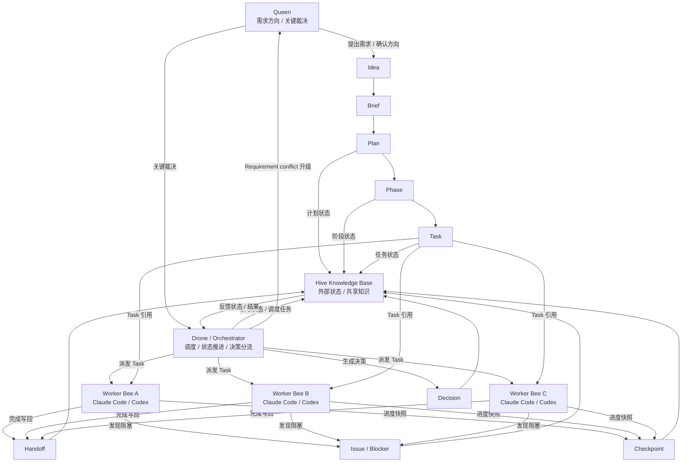

# 00 文档地图

## 目的

说明 Hive 设计文档的阅读路径、维护方法、版本治理方式。

## 总览架构图

### Hive Overall Architecture

图示要点：

- Queen 提供需求方向与关键决策。
- Drone 负责读取 Hive Knowledge Base、派发任务、推进状态、分流冲突。
- Worker Bees 执行具体 Task，并写回 Handoff、Issue、Checkpoint。
- Hive Knowledge Base 承载 Plan、Phase、Task 及其运行结果，是系统外部状态来源。

## 读者角色

- 产品/业务决策者（关注目标与边界）
- 架构设计者（关注状态模型与约束）
- 执行代理开发者（关注任务输入输出）
- 运营维护者（关注恢复与可观测性）

## 版本策略

- 主版本：架构原则变化（例如 v1.0 -> v2.0）
- 次版本：章节结构或关键规则增强（例如 v0.1 -> v0.2）
- 修订版本：文字澄清、示例补充（例如 v0.2.1）

## 维护原则

- 规则优先于示例
- 状态优先于叙述
- 变更必须可追溯（Decision + Checkpoint）
