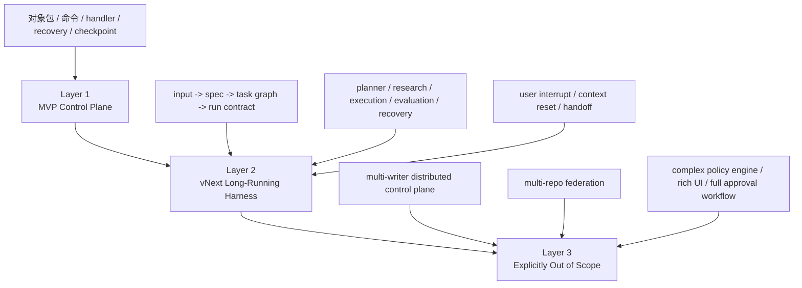

# 00 文档地图

## Purpose

- 说明 Hive 设计文档的阅读路径、维护方式和分层边界。
- 帮助读者先看当前 MVP 控制平面，再看 vNext 长期自治多-agent harness。

## Current Stage

- 当前文档包同时覆盖两个层次：
  - `Layer 1`：`MVP Implementation Package`
  - `Layer 2`：`vNext Long-Running Agent Harness Design`
- 当前实现收敛重点仍然是 Layer 1。
- Layer 2 本次补齐的是总纲、规划流水线、角色拓扑、context reset 和用户插话协议。

## Mermaid

### 文档分层总览

## Rules

### 推荐进入路径

先读当前 MVP 控制平面：

1. `01-Hive-Overall-Architecture.md`
2. `02-Reference-Architecture.md`
3. `03-MVP-Implementation-Blueprint.md`
4. `04-Phased-Implementation-Plan.md`
5. `03-state-model/07-MVP-Object-Package.md`
6. `05-execution/11-Control-Plane-API-Contract.md`
7. `05-execution/14-Command-Handler-Blueprint.md`
8. `07-reliability/07-Runtime-Directive-Handling.md`

再读 vNext 长期自治多-agent harness：

1. `05-Hive-vNext-Long-Running-Agent-Harness.md`
2. `04-planning/09-Input-to-Spec-and-TaskGraph-Pipeline.md`
3. `05-execution/15-Agent-Role-Topology-and-Run-Contract.md`
4. `07-reliability/14-Context-Reset-and-Session-Handoff-Protocol.md`
5. `07-reliability/15-User-Interrupt-Replan-and-Preemption-Protocol.md`

### 维护原则

- 规则优先于示例。
- 状态优先于叙述。
- 协议优先于 prompt。
- 当前事实优先于历史事件。
- 派生长文档不得反向成为事实源。

## Acceptance Criteria

- 新读者能从本文快速进入正确阅读顺序。
- 读者能明确区分当前 MVP 与 vNext 目标。
