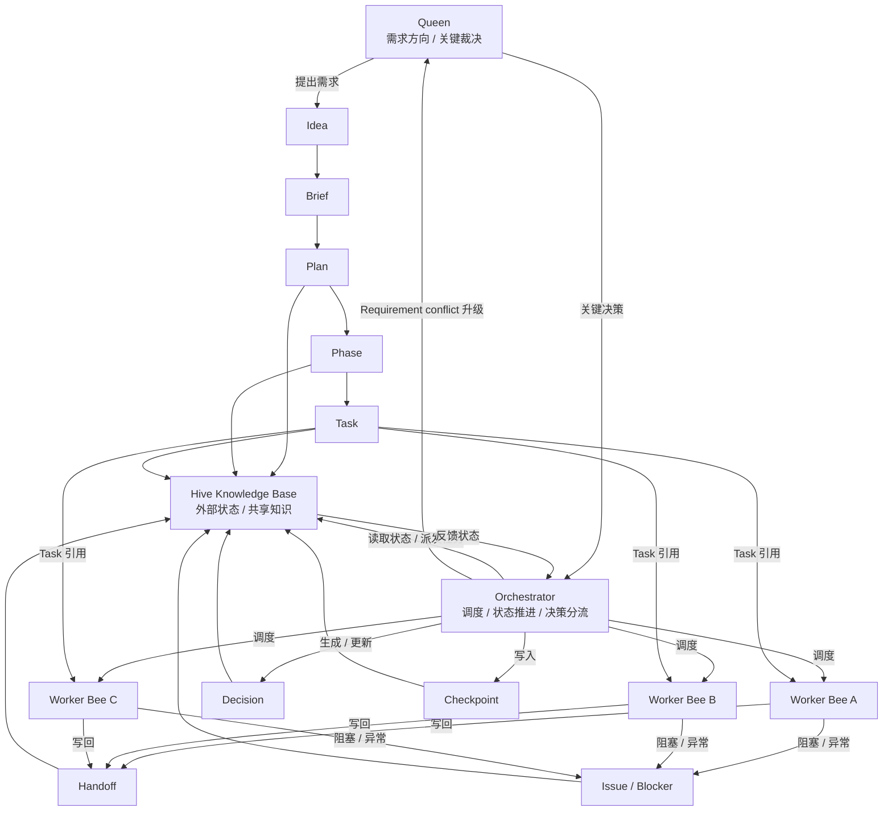

# 01 Hive Overall Architecture

## Purpose

- 用一张图说明 Hive 的整体运行方式。
- 让读者快速理解调度、执行、状态回写、冲突升级链路。

## Mermaid Diagram

### Hive Overall Architecture

## Rules

- Queen 提供需求与关键决策。
- Orchestrator 负责调度、状态推进、决策分流。
- Worker Bees 执行具体 Task。
- Hive Knowledge Base 承载外部状态与共享知识。
- Worker 完成后必须写回 Handoff、Issue 与 Artifact。
- Orchestrator 基于运行结果写出 Checkpoint。
- Orchestrator 根据结果更新状态并决定下一步。

## Acceptance Criteria

- 读者应能在 30 秒内理解 Hive 的主运行链路。
- 图中必须能看出需求输入、任务派发、结果回写、状态更新、冲突升级。

> Hive 连续性来自外部状态，不是来自 agent context。
