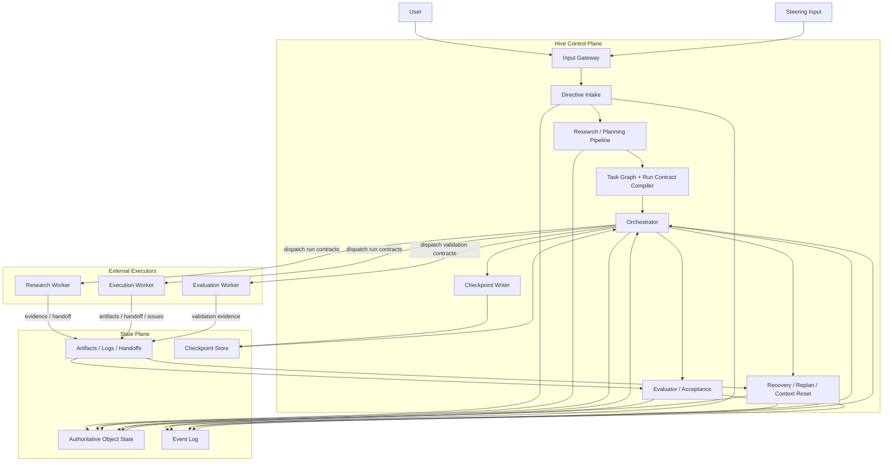

# 01 Hive Overall Architecture

## Purpose

- 用一张高层图说明 Hive 的主运行链路。
- 明确 Hive 是协调外部执行器的控制平面，而不是一个会长期保有上下文的大 agent。
- 让读者快速区分用户输入、规划、执行、验收、恢复、checkpoint 和 context reset 的关系。

## Scope

- 本文提供总体架构总览。
- 详细组件拆分见 `02-Reference-Architecture.md`。
- 当前 MVP 与目标 vNext 的关系见 `05-Hive-vNext-Long-Running-Agent-Harness.md`。

## Definitions

- `User`：提出目标、补充约束、运行中插话的输入源。
- `Steering Input`：运行中对目标、约束、优先级、范围的新增输入。
- `Orchestrator`：事件驱动、非常驻的控制平面状态推进器。
- `Worker`：被 Hive 派发的外部执行器角色实例。
- `Evaluator`：独立于执行 worker 的验收与验证角色。
- `Checkpoint`：恢复快照，不是当前事实源。

## Rules

### 总体边界

- Hive 是 `control plane`，不是通用 agent。
- Hive 不直接“自己做任务”，而是把工作拆成可派发的外部执行单元。
- 用户一句话不能直接扔给执行 worker，必须先进入 `Directive -> Research / Planning -> Task Graph -> Run Contract`。
- 连续性来自状态、checkpoint 和 handoff artifacts，不来自超长上下文记忆。
- evaluator / acceptance 必须独立于 execution worker。

### 角色边界

- `Orchestrator` 负责输入收敛、状态推进、调度、异常处理、重规划、context reset 决策。
- `Planner / Research / Execution / Evaluator` 可以由外部执行器承担，但只能通过 Hive 协议与状态写回参与系统。
- `Recovery / Reconciliation` 的最终状态决策属于控制平面，而不是 adapter 或 worker。
- 如果旧文档出现 `Queen`，只表示升级/裁决职责，不表示一个魔法角色或长驻大模型会话。

## Protocol Steps

1. 用户输入进入 `Input Gateway`，被结构化为 `Directive`。
2. `Research / Planning Pipeline` 决定是否先做 research，并把输入扩展为 evidence、spec、execution plan、task graph 和 run contracts。
3. `Orchestrator` 基于 authoritative state、事件、checkpoint 和 ready backlog 决定下一步派发。
4. 外部 workers 执行 research、implementation、validation 等工作，并写回 handoff、artifacts、logs 和 issues。
5. `Evaluator / Acceptance` 独立判定工作是否通过，必要时创建 followup task 或 blocker。
6. `Recovery / Replan / Context Reset` 处理 timeout、异常、用户插话、supersession、session handoff 和下一轮恢复。
7. `Checkpoint Writer` 在稳定边界写出恢复快照，供下一轮 Orchestrator 或新 session 重建。

## Mermaid

### Hive 高层运行图

## Anti-patterns

- 把 Hive 写成会读代码、会自由发挥、会自己完成项目的大 agent。
- 用户一句话直接进入执行器，不经过 `Directive` 和 planning pipeline。
- 让执行 worker 自己宣布完成并直接推进项目状态。
- 把连续性寄托在长对话上下文，而不是结构化状态与 handoff。

## Acceptance Criteria

- 读者能在 30 秒内理解 Hive 的主链是 `输入 -> 规划 -> 派发 -> 验收 -> 恢复 -> checkpoint`。
- 读者能明确知道 Hive 协调外部执行器，而不是把所有智能塞进自己内部。
