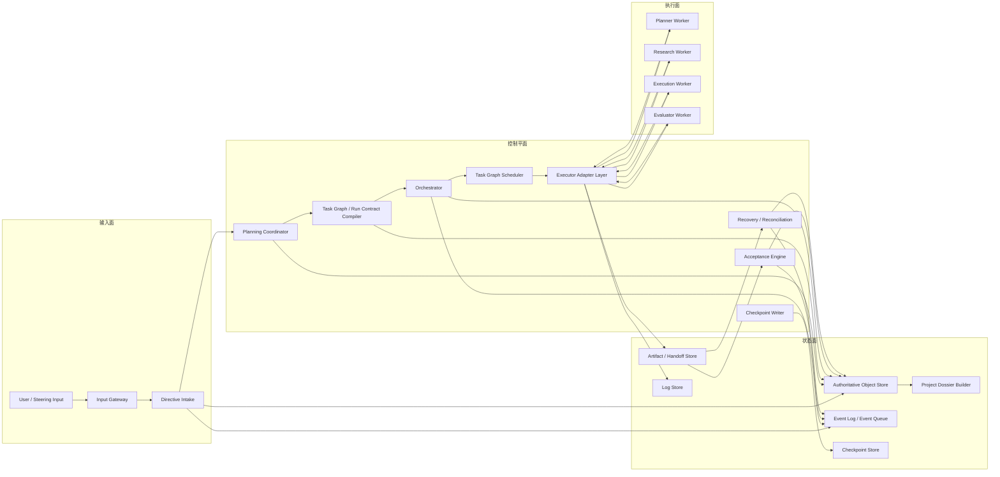

# 02 Reference Architecture

## Purpose

- 给出 Hive 的 repo 级参考架构。
- 明确控制平面、执行面、状态面之间的关系。
- 在不破坏当前 MVP 边界的前提下，展示 Hive 如何扩展为长期自治多-agent harness。

## Scope

- 本文描述参考架构与组件责任边界。
- 当前实现蓝图见 `03-MVP-Implementation-Blueprint.md`。
- 目标 vNext 总纲见 `05-Hive-vNext-Long-Running-Agent-Harness.md`。
- 详细规划流水线、run contract、context reset、用户插话协议见对应分卷。

## Definitions

- `Control Plane`：Hive 内部负责 intake、规划编译、调度、验收、恢复、replan、context reset 的组件集合。
- `Execution Plane`：外部执行器及其会话运行时，负责实际执行 research、planning、execution、evaluation 等工作单元。
- `State Plane`：对象状态、事件历史、checkpoint、artifacts、logs 所在的持久化层。
- `Planning Coordinator`：控制平面中负责驱动 Research Sprint、Evidence Pack、spec、execution package、task graph 和 run contracts 的组件。
- `Run Contract`：派发给外部 worker 的标准化执行包。
- `Project Dossier / Project Book`：从结构化对象编译出的可读长文档，不是运行时事实源。

## Rules

### Plane Boundary

#### 控制平面

- `Input Gateway`
- `Directive Intake`
- `Planning Coordinator`
- `Task Graph / Run Contract Compiler`
- `Orchestrator`
- `Task Graph Scheduler`
- `Acceptance Engine`
- `Recovery / Reconciliation`
- `Checkpoint Writer`
- `Executor Adapter Layer`

#### 执行面

- `Planner Worker`
- `Research Worker`
- `Execution Worker`
- `Evaluator Worker`
- 未来其他外部执行器角色实例

#### 状态面

- `Authoritative Object Store`
- `Event Log / Event Queue`
- `Checkpoint Store`
- `Artifact / Handoff Store`
- `Log Store`
- `Project Dossier Builder`

### 组件职责规则

| 组件 | 所属平面 | 主要输入 | 主要输出 | 禁止事项 |
|---|---|---|---|---|
| `Input Gateway` | 控制平面 | 用户输入、系统回调、operator trigger | raw input record、`UserInputReceived` | 不直接改 `Task` |
| `Directive Intake` | 控制平面 | raw input、当前 active state | `Directive`、impact analysis request | 不直接改任务文件 |
| `Planning Coordinator` | 控制平面 | `Directive`、当前 `PlanRevision`、开放问题、evidence refs | planning work items、`Research Sprint`、`Evidence Pack`、`Product Spec`、`Execution Plan` 编译请求 | 不直接启动 run |
| `Task Graph / Run Contract Compiler` | 控制平面 | spec、execution package、ledger、phase constraints | `TaskGraph`、`Task`、`Run Contract` | 不直接决定任务通过 |
| `Orchestrator` | 控制平面 | authoritative objects、事件、checkpoint、ledger、active runs | 调度决策、preemption 决策、replan trigger、recovery trigger | 不读源码，不执行 task |
| `Task Graph Scheduler` | 控制平面 | `TaskGraph`、`Requirement Ledger`、锁状态、executor capability | `DispatchIntent`、candidate run contract selection | 不发明未计划任务 |
| `Acceptance Engine` | 控制平面 | `Task`、`Handoff`、`Requirement Ledger`、validation evidence | `Acceptance`、followup task、blocker issue | 不直接执行任务 |
| `Recovery / Reconciliation` | 控制平面 | `Event Queue`、`Checkpoint`、open `Issue`、stale `AgentRun`、user steering input | `RecoveryAction`、pause / cancel / supersede / replan / reset decisions | 不绕过 guard check |
| `Executor Adapter` | 控制平面边界 | `DispatchIntent`、`Run Contract`、workspace plan | normalized run lifecycle、logs、artifacts、handoff refs | 不宣称未验证能力，不直接决定任务完成 |
| `Planner / Research / Execution / Evaluator Worker` | 执行面 | `Run Contract`、workspace、session bootstrap inputs | evidence、artifacts、logs、validation outputs、handoff | 不拥有项目真相 |
| `Object Store` | 状态面 | change-set | authoritative current state | 不保存自由文本真相 |
| `Event Log / Queue` | 状态面 | outbox events、runtime events | replay input、consumer cursor | 不当当前事实源 |
| `Checkpoint Store` | 状态面 | stable state summary + event cursor | reset / recovery baseline | 不反向覆盖对象状态 |
| `Project Dossier Builder` | 状态面派生 | `Brief`、`Charter`、`PlanRevision`、`Requirement Ledger`、spec refs | `Project Book` | 不作为运行时事实源 |

### current MVP vs target vNext vs explicit non-goals

| 维度 | 当前 MVP | 目标 vNext | 明确不在当前阶段 |
|---|---|---|---|
| 规划入口 | `Directive -> PlanRevision -> Task` 最小链路 | `Directive -> Research -> Evidence -> Product Spec -> Execution Plan -> Task Graph -> Run Contract` | 直接把一句话扔给执行器 |
| 角色 | Orchestrator、Worker、Acceptance、Recovery | Planner、Research、Execution、Evaluator、Recovery 多角色 | 单一大 agent 承担全部角色 |
| 连续性 | checkpoint + handoff + recovery | reset gate + session handoff + partial handoff recovery | 靠长上下文记忆续航 |
| 状态层 | object state + event log + checkpoint | 保持同一事实层级，补齐更多 planning / handoff artifacts | 让文档或对话成为事实源 |
| 部署边界 | 单 writer、单 repo、单 adapter、SQLite + filesystem | 先在同一边界下验证长期自治 harness 语义 | multi-writer、multi-repo、复杂 policy engine、rich UI |

### 入口闭环规则

1. 用户输入必须先经过 `Input Gateway` 和 `Directive Intake`。
2. 用户一句话不能直接触发 execution worker，必须先进入 planning pipeline。
3. `Directive` 只能通过 impact analysis 影响当前运行，不得直接修改任务文件。
4. `Task` 完成与 `AgentRun` 退出必须分离。
5. acceptance 必须独立于 worker 完成声明。
6. 长文档只允许作为 `Project Dossier / Project Book` 一类派生视图，不得替代结构化对象。

## Protocol Steps

1. 用户输入进入 `Input Gateway`，形成 raw input record 与 `UserInputReceived`。
2. `Directive Intake` 将输入编译为 `Directive`，并发起 impact analysis。
3. `Planning Coordinator` 决定是先 research 还是直接 planning，并收敛为 spec / execution package。
4. `Task Graph / Run Contract Compiler` 把计划编译为可调度任务与标准化 run contracts。
5. `Task Graph Scheduler` 基于依赖、锁、ledger、executor capability 选择 ready contracts。
6. `Executor Adapter` 启动外部 worker，回写 lifecycle、artifacts、logs 和 handoff refs。
7. `Acceptance Engine` 独立根据 evidence、validation 和 ledger 更新验收状态。
8. `Recovery / Reconciliation` 处理 timeout、异常、用户插话、supersession、replan 和 context reset。
9. `Checkpoint Store` 写出恢复基线；`Project Dossier Builder` 只编译面向人的长文档视图。

## State / Schema

```yaml
reference_architecture_profile:
  control_plane:
    - input_gateway
    - directive_intake
    - planning_coordinator
    - task_graph_run_contract_compiler
    - orchestrator
    - task_graph_scheduler
    - acceptance_engine
    - recovery_reconciliation
    - checkpoint_writer
    - executor_adapter_layer
  execution_plane:
    - planner_worker
    - research_worker
    - execution_worker
    - evaluator_worker
  state_plane:
    - authoritative_object_store
    - event_log
    - checkpoint_store
    - artifact_handoff_store
    - log_store
    - project_dossier_builder
truth_hierarchy:
  current_truth: authoritative_object_store
  history: event_log
  recovery_baseline: checkpoint_store
  human_readable_projection: project_dossier
```

## Mermaid

### 参考架构总图



## Anti-patterns

- 把 Hive 写成会读源码、会直接决定方向的长驻 agent。
- 把一句高层输入直接发给 execution worker。
- 让 adapter 直接宣布任务完成。
- 让长设计文档或聊天记录替代 authoritative object state。
- 把多执行器并行写成已经证明成立的现实，而不是需要协议与实验验证的方向。

## Acceptance Criteria

- 读者能明确区分控制平面、执行面、状态面。
- 读者能明确看到用户输入如何进入 planning pipeline，而不是直接进入 execution。
- 读者能明确知道 acceptance、recovery、context reset 属于控制平面职责。
- 读者能明确知道当前 MVP 与目标 vNext 的差异与边界。
