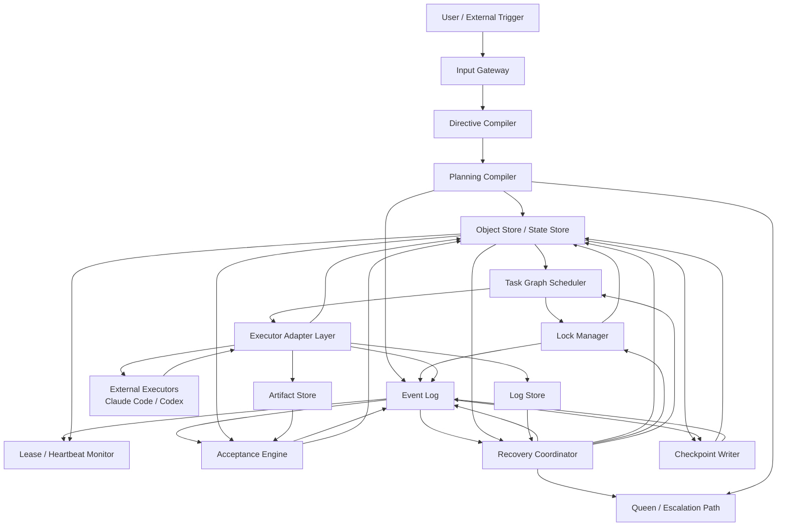
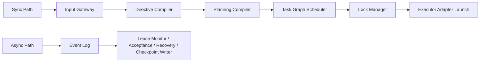

# 02 Reference Architecture

## Purpose

- 将 Hive 从协议集合收敛为控制平面参考架构。
- 明确运行时核心组件、同步路径、异步路径、数据边界。
- 说明哪些模块属于硬设计，哪些仍是 v1 假设。

## Scope

- 本文描述 Hive 控制平面的运行时组件与交互关系。
- 本文不定义业务代码实现，不替代对象协议、执行协议和恢复协议。

## Definitions

- `Control Plane`：Hive 的调度、状态推进、验收、恢复与重规划层。
- `Synchronous Path`：单次控制回合内必须按顺序完成的调用链。
- `Asynchronous Path`：由事件驱动、可延迟消费的后台处理链。
- `Authoritative State`：系统当前事实，以对象状态为准。

## Component Boundary

### 组件清单

| Component | Path Type | 主要职责 | 输入 | 输出 | 禁止事项 |
|---|---|---|---|---|---|
| `Input Gateway` | Sync | 接收用户输入、系统回调、外部触发 | 用户消息、定时器、外部 webhook | `UserInputReceived`、原始输入记录 | 不直接修改 Plan / Task |
| `Directive Compiler` | Sync | 将输入结构化为 `Directive`，触发 impact analysis | 原始输入、当前对象状态 | `Directive`、`RuntimeDirectiveCreated` | 不直接派发 Task |
| `Planning Compiler` | Sync | 编译 `Research Sprint`、`Evidence Pack`、`Brief`、`Charter`、`Execution Plan`、revision | `Directive`、`Evidence Pack`、当前 Plan | `PlanCompiled`、`PlanRevised`、`TaskCreated` | 不直接启动 `AgentRun` |
| `Task Graph Scheduler` | Sync | 选择 ready task、做依赖/容量/冲突判定、生成 dispatch intent | `Task Graph`、Phase、Issue、Executor capability、Lock state | `DispatchPrepared`、任务排序结果 | 不读源码，不自由发明任务 |
| `Lock Manager` | Sync + Async | 统一管理 repo/module/path lock、续约、回收 | Lock 请求、Task 路径元数据、Run 状态 | `LockAcquired`、`LockConflictDetected`、`LockReleased` | 不由 Worker 自治实现 |
| `Executor Adapter Layer` | Sync + Async | 屏蔽 Claude Code / Codex 差异，负责 launch / restore / cancel / kill / collect | dispatch intent、executor profile、workspace | `AgentRunStarted`、`AgentRunExited`、artifacts、logs | 不直接修改 Task 完成状态 |
| `Lease / Heartbeat Monitor` | Async | 观察活跃 run 的 lease、heartbeat、start SLA、timeout | `AgentRun`、adapter poll、time source | `AgentRunHeartbeatMissed`、`AgentRunTimedOut`、`AgentRunStartFailed` | 不直接验收任务 |
| `Acceptance Engine` | Async | 独立验收 `Handoff` 与 evidence | `Task`、`Handoff`、artifacts、validation results | `AcceptancePassed`、`AcceptanceRejected`、`AcceptanceNeedsFollowup`、`AcceptancePartiallyAccepted` | 不执行 Task |
| `Recovery Coordinator` | Async | 处理 timeout、stale run、stale lock、replay 后对账 | `Issue`、失败事件、Checkpoint、开放对象 | `RecoveryStarted`、`RecoveryCompleted`、reassign / replan action | 不跳过 guard check 直接推进 Phase |
| `Checkpoint Writer` | Async | 基于当前 authoritative state 写恢复快照 | 对象状态、事件位置、恢复摘要 | `Checkpoint`、`CheckpointWritten` | 不把 Checkpoint 当事实源 |
| `Event Log` | Async Store | 保存不可变事件日志、支持幂等与重放 | change-set outbox、运行事件 | append-only event stream | 不存当前事实状态 |
| `Object Store / State Store` | Sync Store | 保存 `Directive`、Plan、Task、AgentRun、Issue、Lock 等当前状态 | 所有控制面 change-set | 当前 authoritative state | 不存 raw terminal logs |
| `Artifact Store` | Async Store | 保存补丁、报告、截图、测试结果等结构化产物 | Worker / Adapter 输出 | artifact refs | 不承载 Task 当前状态 |
| `Log Store` | Async Store | 保存原始命令输出、终端日志、执行轨迹 | Adapter / runner 输出 | log refs | 不承载业务完成结论 |

### 非组件边界

- `Queen` 不是默认常驻运行时组件。
- Queen 是高阶裁决职责与升级路径。
- v1 中 Queen 可以由 human、policy engine 或 strategic planner 承担。

## Main Call Chains

### 同步主链

1. `Input Gateway -> Directive Compiler`
2. `Directive Compiler -> Planning Compiler`
3. `Planning Compiler -> Object Store / Event Log(outbox)`
4. `Task Graph Scheduler -> Lock Manager`
5. `Task Graph Scheduler -> Executor Adapter Layer`
6. `Executor Adapter Layer -> Object Store / Event Log(outbox)`

### 异步主链

1. `Executor Adapter Layer -> Event Log`
2. `Lease / Heartbeat Monitor -> Event Log`
3. `Acceptance Engine <- HandoffSubmitted / Artifact Refs`
4. `Recovery Coordinator <- timeout / conflict / replay anomaly`
5. `Checkpoint Writer <- authoritative state + event offsets`

## Data Boundary

### 事实层级

1. `Object Store / State Store`：当前事实来源
2. `Event Log`：不可变事实历史、重放输入、审计链
3. `Checkpoint`：恢复快照，派生对象，不是事实源

### 存储职责

- `Object Store / State Store` 负责当前状态。
- `Event Log` 负责事件历史与去重。
- `Artifact Store` 负责结构化产物。
- `Log Store` 负责原始执行日志。
- `Checkpoint Writer` 负责生成快照，不负责最终状态判定。

## Protocol Steps

1. `Input Gateway` 接收输入并写出 `UserInputReceived`。
2. `Directive Compiler` 生成 `Directive` 并触发 impact analysis。
3. `Planning Compiler` 根据需要编译研究、证据包、Plan Revision 与 Task Graph。
4. `Task Graph Scheduler` 选择 ready task，并向 `Lock Manager` 申请锁。
5. 锁与 dispatch intent 持久化后，`Executor Adapter Layer` 启动外部执行器。
6. 执行期间，`Lease / Heartbeat Monitor` 持续观察运行状态。
7. Worker 退出并提交 `Handoff` 后，`Acceptance Engine` 独立给出结果。
8. 如遇失败或不一致，由 `Recovery Coordinator` 发起恢复与对账。
9. `Checkpoint Writer` 在关键边界写出恢复快照。
10. Orchestrator 控制回路完成当前轮后退出。

## Mermaid Diagram

### Hive Reference Architecture

### Sync vs Async Paths

## v1 Hard Design vs v1 Assumptions

### 已收敛的硬设计

- 当前事实以对象状态为准。
- Event Log 必须不可变且支持幂等消费。
- Checkpoint 是派生快照。
- Worker 不直接完成 Task。
- 验收独立于执行。
- 锁必须由控制平面统一管理。

### 仍属 v1 假设

- 是否需要独立事件总线，而不是从状态库轮询 outbox。
- 多执行器并发的最优调度策略。
- 锁粒度默认策略是否应按仓库类型动态调整。
- Checkpoint 的最优写频率与压缩策略。

## Anti-patterns

- 把 Hive 实现成一个长驻、会读代码、会自由决定方向的大 agent。
- 组件边界不清，导致 Scheduler、Acceptance、Recovery 相互写状态。
- Event Log、Object Store、Checkpoint 同时被当作事实源。
- 让 Executor Adapter 自己决定 Task 是否完成。

## Acceptance Criteria

- 读者能明确知道运行时有哪些核心组件。
- 读者能明确知道同步路径与异步路径的边界。
- 读者能明确知道 Event Log、Object Store、Artifact Store、Log Store、Checkpoint Writer 各自职责。
- 读者能明确知道 Queen 不是默认第二控制器。
