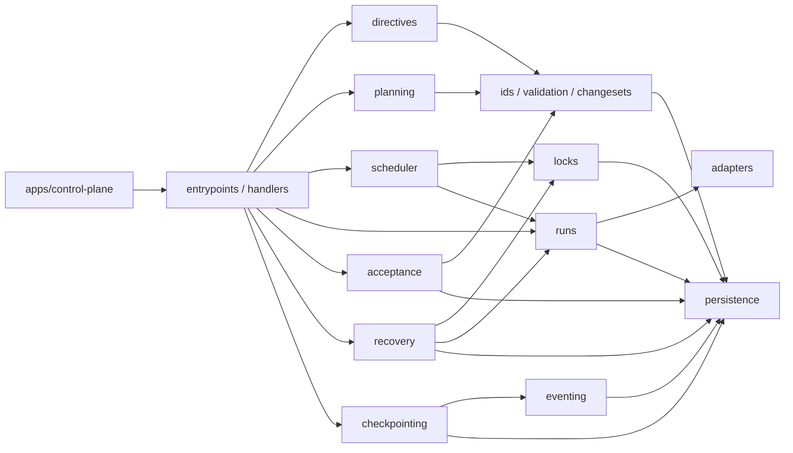
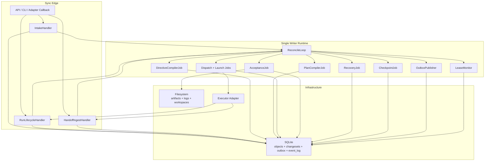

# 03 MVP Implementation Blueprint

## Purpose

- 把已收敛的协议整理成首个 Hive 控制平面原型仓可直接开工的实现蓝图。
- 明确首版真正要实现什么，以及哪些内容仍停留在 vNext 设计层。
- 保证文档升级到长期自治 harness 之后，不会把当前 MVP 边界重新做散。

## Scope

- 本文只约束 `Layer 1 / MVP Control Plane`。
- 本文不引入 multi-writer、multi-repo、复杂 policy engine、rich UI 等扩展范围。
- vNext 目标架构见 `05-Hive-vNext-Long-Running-Agent-Harness.md`。
- 对象字段见 `../03-state-model/07-MVP-Object-Package.md`。
- handler ownership 见 `../05-execution/14-Command-Handler-Blueprint.md`。

## Definitions

- `First Implementation`：第一个可运行、可恢复、可验收、可回放的 Hive 控制平面原型。
- `Single Writer Runtime`：同一时刻只有一个写入路径提交 authoritative state change-set。
- `Sync Edge`：处理用户输入、adapter 回调、operator 命令的同步入口。
- `Async Runtime`：由 reconcile loop 驱动的异步状态推进路径。
- `Design-Only Artifact`：在 vNext 中有明确语义，但当前 MVP 不作为一等实现目标的对象或协议。

## Rules

### First Implementation Goal

首版必须稳定跑通以下五条链，而不是继续扩张概念边界：

1. `submit_user_input -> compile_directive -> compile_plan -> qualify_task`
2. `prepare_dispatch -> launch_run -> acknowledge_run_started -> report_run_exit`
3. `submit_handoff -> run_acceptance -> write_checkpoint`
4. `start_recovery -> reconcile_once -> requeue / re-dispatch`
5. `ChangeSet + Outbox + Event Log + Checkpoint` 在失败情况下仍保持一致

只要这五条链路可稳定跑通，Hive 就已经具备 first implementation 的控制平面价值。

### MVP Included vs Design-Only vs Excluded

| 分类 | 内容 |
|---|---|
| 当前 MVP 必须真做 | `Directive`、`PlanRevision`、`Task`、`AgentRun`、`Handoff`、`Acceptance`、`Issue`、`Lock`、`Checkpoint`、`DispatchIntent`、`RecoveryAction`、`ChangeSet / Outbox / Event Log` |
| 当前 MVP 可作为 stub 或 fixture | `Research Sprint`、`Evidence Pack`、`Product Spec`、`Run Contract` 的完整持久化与自动编译链 |
| 明确不进入当前阶段 | multi-writer distributed control plane、multi-repo federation、复杂 policy engine、rich UI / dashboard、完整人工审批工作流 |

### 当前 MVP 与 vNext 的关系

- 当前 MVP 先证明控制平面闭环成立。
- vNext 再把“一句话输入 -> spec -> task graph -> run contract -> multi-role dispatch”做完整。
- vNext 不会推翻 MVP 的事实层级：
  - `authoritative object state` 仍是当前事实来源
  - `Event Log` 仍是历史与 replay 输入
  - `Checkpoint` 仍是恢复快照
  - `launch_run` 仍只能写 side effect token / launch markers

### 首版运行边界

| 维度 | 首版纳入 | 首版不纳入 |
|---|---|---|
| 仓库边界 | 单仓库 | multi-repo federation |
| 写入者 | 单 writer runtime | 多 writer 并发提交 |
| 执行器 | 单 adapter profile | 多 adapter 动态选择与策略优化 |
| 存储 | `SQLite + filesystem` | Postgres + MQ + object storage |
| 调度 | 单 active plan revision、串行 writer、有限并发 run | 分布式调度、全局多队列 |
| 验收 | canonical evidence + basic rules | 高级 policy engine / rich scoring |
| 恢复 | rehydrate + reassign | live restore hard dependency |

### 代码级核心组件分层

1. `apps/control-plane`
   - bootstrap、配置加载、runtime loop、sync ingress 注册
2. `packages/entrypoints`
   - sync edge handlers、runtime jobs、operator commands
3. `packages/domain`
   - directives、planning、scheduler、runs、locks、acceptance、recovery、checkpointing
4. `packages/foundation`
   - ids-and-enums、schema-validation、changesets、eventing、persistence
5. `packages/adapters`
   - executor adapter contract、codex first adapter、fake adapter

### 核心组件输入输出接口

| 组件 | 主要输入 | 主要输出 | 首版要求 |
|---|---|---|---|
| `IntakeHandler` | `submit_user_input` | intake journal append、`UserInputReceived` outbox | 真做 |
| `DirectiveCompiler` | raw input ref、active plan summary | `Directive` change-set、`RuntimeDirectiveCreated` | 真做 |
| `PlanCompiler` | `Directive`、current `PlanRevision` | `PlanRevision`、`Phase`、`Task` drafts、supersession mapping | 真做 |
| `Requirement Ledger Service` | `Brief` / `PlanRevision` / `Acceptance` | requirement entries、coverage state、uncovered set | 真做 |
| `TaskQualificationService` | `Task`、`Phase`、plan constraints | `TaskQualified` 或 `TaskBlocked` | 真做 |
| `DispatchPreparationService` | ready `Task`、lock request set、executor profile | `DispatchIntent`、`AgentRun(created)`、reserved `Lock` | 真做 |
| `RunLaunchService` | prepared `DispatchIntent`、workspace plan | side effect token、adapter launch request | 真做 |
| `RunLifecycleHandler` | adapter ack / exit / heartbeat callback | `AgentRun`、`Task`、`Lock` 状态推进 | 真做 |
| `AcceptanceService` | `Task`、`AgentRun`、`Handoff`、artifact refs | `Acceptance`、followup `Task` 或 `Issue` | 真做 |
| `RecoveryService` | timeout / ambiguity markers、latest `Checkpoint` | `RecoveryAction`、`Task` requeue/block、lock recovery hold | 真做 |
| `CheckpointWriter` | state snapshot、event cursor | `Checkpoint`、`CheckpointWritten` | 真做 |
| `Planning Pipeline for Research / Spec` | research / evidence / spec automation | 完整 input-to-spec 编译链 | 设计层，首版可 stub |
| `Run Contract Compiler` | spec / task source / executor role | 标准化 run contract | 设计层，首版先折叠进 `Task` 字段 |

### 模块依赖方向

- `entrypoints -> domain -> foundation`
- `runs -> adapters`
- `checkpointing / acceptance / recovery -> persistence + eventing`
- `adapters` 不依赖 `planning`、`acceptance`、`checkpointing`
- `eventing` 不推导业务决策，只发布 outbox

### Sync 路径 / Async 路径落点

#### Sync Edge

- `submit_user_input`
- `acknowledge_run_started`
- `report_heartbeat`
- `report_run_exit`
- `submit_handoff`
- operator-triggered `start_recovery`

#### Async Runtime

- `compile_directive`
- `compile_plan`
- `qualify_task`
- `prepare_dispatch`
- `launch_run`
- `run_acceptance`
- `write_checkpoint`
- auto-triggered `start_recovery`
- `reconcile_once`
- `request_context_reset`

### 哪些模块必须真做，哪些可先 stub

| 模块 | 首版要求 | 原因 |
|---|---|---|
| `ids-and-enums` | 真做 | 所有对象、事件、命令和状态迁移都依赖它 |
| `schema-validation` | 真做 | 没有 validator，change-set 与 fixture 无法稳定收敛 |
| `persistence` | 真做 | authoritative state、event log、outbox 都在这里 |
| `changesets` | 真做 | 是控制平面一致性边界本身 |
| `eventing` | 真做 | outbox append / publish / dedup 是 MVP 主链 |
| `intake` | 真做 | 所有任务生命周期起点 |
| `directives` | 真做 | 需要把用户输入收敛成结构化指令 |
| `planning` | 真做 | 没有 `PlanRevision / Task` 就没有可派发对象 |
| `locks` | 真做 | 必须先防重复派发和路径冲突 |
| `runs` | 真做 | `DispatchIntent / AgentRun` 是执行链主轴 |
| `acceptance` | 真做 | `Handoff != 完成` 的边界必须落地 |
| `recovery` | 真做 | 首版必须处理 launch ambiguity / timeout / stale lock |
| `checkpointing` | 真做 | 恢复基线必须可写 |
| `adapters/codex` | 真做 | 需要至少一个真实执行器 |
| `adapters/fake` | 真做 | conformance / e2e 需要确定性回放 |
| `research / evidence / spec automation` | stub | vNext 目标明确，但不阻塞当前控制平面闭环 |
| `run-contract persistence` | stub | 首版先折叠进 `Task` 与 `TaskSpec` 字段 |
| `dashboard / UI` | stub | 首版重点不是操作台 |

## Mermaid

### 首版运行时组件图

## Anti-patterns

- 把 vNext 的规划自动化目标直接塞回 MVP，导致首版无法收敛。
- 因为要支持长期自治，就把 authoritative state、event log、checkpoint 的层级关系改乱。
- 在 `prepare_dispatch` 之前就触发外部 side effect。
- 让 `launch_run` 直接伪造 `running` 或 `success` 状态。

## Acceptance Criteria

- 实现方能明确知道当前 MVP 要做什么、什么仍然是设计层。
- 读者能明确知道 vNext 是在 MVP 之上增量升级，而不是推翻当前蓝图。
- 文档仍保持与对象包、command model、change-set / outbox 设计一致。
