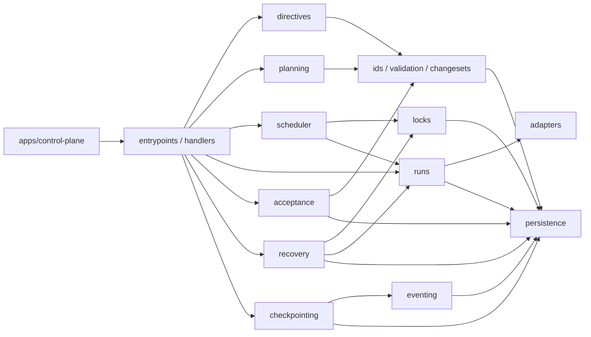
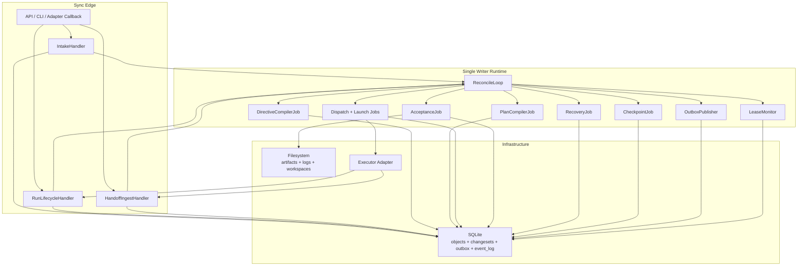
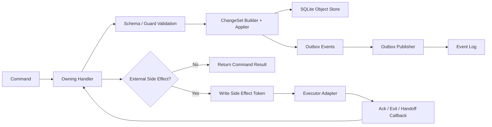

# 03 MVP Implementation Blueprint

## Purpose

- 把现有协议文档收敛成 first implementation 可直接开工的代码蓝图。
- 回答首版系统最小代码结构、核心组件接口、同步/异步路径和模块依赖方向。
- 为工程团队提供“先建什么目录、先写什么 schema、哪些模块必须真做”的统一基线。

## Scope

- 本文只约束首个 Hive 控制平面原型仓。
- 本文不引入新的哲学边界，不推翻既有对象模型、事件模型、change-set / outbox、reconcile / recovery 语义。
- 本文默认首版实现遵循单仓库、单 active plan revision、单 writer、单 executor adapter、SQLite + filesystem。
- 详细对象字段见 `../03-state-model/07-MVP-Object-Package.md`。
- 详细命令到 handler 的落点见 `../05-execution/14-Command-Handler-Blueprint.md`。
- 详细分阶段开工计划见 `./04-Phased-Implementation-Plan.md`。

## Definitions

- `First Implementation`：第一个可运行、可恢复、可验收、可回放的 Hive 控制平面原型。
- `Single Writer Runtime`：同一时刻只有一个写入路径提交 authoritative state change-set。
- `Sync Edge`：处理用户输入、adapter 回调和运维命令的同步入口。
- `Async Runtime`：由 reconcile loop 驱动的异步状态推进路径。
- `Stub Module`：首版需要占位接口和测试夹具，但不承载完整业务语义的模块。
- `Real Module`：首版必须提供真实持久化、真实状态推进或真实外部接入能力的模块。

## Rules

### First Implementation Goal

首版必须验证以下闭环，而不是继续扩展概念边界：

1. `submit_user_input -> compile_directive -> compile_plan -> qualify_task`
2. `prepare_dispatch -> launch_run -> acknowledge_run_started -> report_run_exit`
3. `submit_handoff -> run_acceptance -> write_checkpoint`
4. `start_recovery -> reconcile_once -> requeue / re-dispatch`
5. `ChangeSet + Outbox + Event Log + Checkpoint` 在失败情况下仍保持一致

如果上述五条链路可稳定跑通，Hive 就已经具备 first implementation 的控制平面价值。

### 首版运行边界

| 维度 | 首版纳入 | 首版不纳入 |
|---|---|---|
| 仓库边界 | 单仓库 | multi-repo federation |
| 写入者 | 单 writer runtime | 多 writer 并发提交 |
| 执行器 | 单 adapter profile | 多 adapter 动态选择与策略优化 |
| 存储 | SQLite + filesystem | Postgres + MQ + object storage |
| 调度 | 单 active plan revision、串行 writer、有限并发 run | 分布式调度、全局多队列 |
| 锁 | path lock | 复杂 repo/module 组合锁策略 |
| 验收 | canonical evidence + basic rules | 高级 policy engine / rich scoring |
| 恢复 | rehydrate + reconcile + requeue | live restore hard dependency |

### 代码级核心组件分层

首版代码必须按以下 5 层组织，而不是围绕“今天谁来写”堆 service：

1. `apps/control-plane`
   - bootstrap、配置加载、runtime loop、sync ingress 注册
2. `packages/entrypoints`
   - sync edge handlers、runtime jobs、operator commands
3. `packages/domain`
   - directives、planning、scheduler、runs、locks、acceptance、recovery、checkpointing
4. `packages/foundation`
   - ids-and-enums、schema-validation、changesets、eventing、persistence
5. `packages/adapters`
   - executor adapter contract、codex first adapter、fake adapter

### 核心组件输入输出接口

| 组件 | 主要输入 | 主要输出 | 首版要求 |
|---|---|---|---|
| `IntakeHandler` | `submit_user_input` command envelope | intake journal append、`UserInputReceived` outbox | 真做 |
| `DirectiveCompiler` | raw input ref、active plan summary | `Directive` change-set、`RuntimeDirectiveCreated` | 真做 |
| `PlanCompiler` | `Directive`、current `PlanRevision`、open `Task` set | `PlanRevision`、`Phase`、`Task` drafts、supersession mapping | 真做 |
| `TaskQualificationService` | `Task`、`Phase`、plan constraints | `TaskQualified` 或 `TaskBlocked` | 真做 |
| `DispatchPreparationService` | ready `Task`、lock request set、executor profile | `DispatchIntent`、`AgentRun(created)`、reserved `Lock` | 真做 |
| `RunLaunchService` | prepared `DispatchIntent`、workspace plan | side effect token、adapter launch request | 真做 |
| `RunLifecycleHandler` | adapter ack / exit / heartbeat callback | `AgentRun`、`Task`、`Lock` 状态推进 | 真做 |
| `AcceptanceService` | `Task`、`AgentRun`、`Handoff`、artifact refs | `Acceptance`、followup `Task` 或 `Issue` | 真做 |
| `RecoveryService` | timeout / ambiguity markers、latest `Checkpoint` | `RecoveryAction`、`Task` requeue/block、lock recovery hold | 真做 |
| `CheckpointWriter` | state snapshot、event cursor | `Checkpoint`、`CheckpointWritten` | 真做 |
| `Read API` | object queries | 只读视图 | 先 stub |
| `Policy Engine` | acceptance/recovery policy requests | policy decision | 先 stub |

### 推荐目录结构

首版推荐目录如下，详细 layout 见 `../08-appendix/14-MVP-Repo-Layout.md`：

```text
hive-control-plane/
├── apps/
│   └── control-plane/
├── packages/
│   ├── ids-and-enums/
│   ├── schema-validation/
│   ├── persistence/
│   ├── changesets/
│   ├── eventing/
│   ├── intake/
│   ├── directives/
│   ├── planning/
│   ├── scheduler/
│   ├── locks/
│   ├── runs/
│   ├── acceptance/
│   ├── recovery/
│   ├── checkpointing/
│   ├── adapters/
│   │   ├── base/
│   │   ├── codex/
│   │   └── fake/
│   └── conformance/
├── migrations/
│   └── sqlite/
├── tests/
│   ├── fixtures/
│   ├── integration/
│   ├── conformance/
│   └── e2e/
└── var/
    ├── state/
    ├── artifacts/
    ├── logs/
    ├── workspaces/
    └── exports/
```

### 模块依赖方向

- `entrypoints -> domain -> foundation`
- `runs -> adapters`
- `checkpointing / acceptance / recovery -> persistence + eventing`
- `persistence` 不反向依赖任何业务模块
- `adapters` 不依赖 `planning`、`acceptance`、`checkpointing`
- `eventing` 不推导业务决策，只发布 outbox



### Sync 路径 / Async 路径在代码中的落点

#### Sync Edge

这些命令必须落在同步 handler 中，只负责 durable commit，不跑长链路状态推进：

- `submit_user_input`
- `acknowledge_run_started`
- `report_heartbeat`
- `report_run_exit`
- `submit_handoff`
- operator-triggered `start_recovery`

推荐代码落点：

- `packages/intake/handlers/submit_user_input.ts`
- `packages/runs/handlers/acknowledge_run_started.ts`
- `packages/runs/handlers/report_heartbeat.ts`
- `packages/runs/handlers/report_run_exit.ts`
- `packages/runs/handlers/submit_handoff.ts`
- `packages/recovery/handlers/start_recovery.ts`

#### Async Runtime

这些命令必须落在 reconcile loop 驱动的异步路径中：

- `compile_directive`
- `compile_plan`
- `qualify_task`
- `prepare_dispatch`
- `launch_run`
- `run_acceptance`
- `write_checkpoint`
- auto-triggered `start_recovery`
- `reconcile_once`
- `request_context_reset`

推荐代码落点：

- `packages/directives/jobs/compile_directive.ts`
- `packages/planning/jobs/compile_plan.ts`
- `packages/planning/jobs/qualify_task.ts`
- `packages/runs/jobs/prepare_dispatch.ts`
- `packages/runs/jobs/launch_run.ts`
- `packages/acceptance/jobs/run_acceptance.ts`
- `packages/checkpointing/jobs/write_checkpoint.ts`
- `packages/recovery/jobs/start_recovery.ts`
- `packages/runtime/jobs/reconcile_once.ts`
- `packages/runtime/jobs/request_context_reset.ts`

### 首版运行时组件图



### 哪些模块必须先 stub，哪些模块必须真做

| 模块 | 首版要求 | 原因 |
|---|---|---|
| `ids-and-enums` | 真做 | 所有对象、事件、命令和状态迁移都依赖它 |
| `schema-validation` | 真做 | 没有 validator，change-set 和 fixture 无法稳定收敛 |
| `persistence` | 真做 | authoritative state、event log、outbox 都在这里 |
| `changesets` | 真做 | 是控制平面一致性边界本身 |
| `eventing` | 真做 | outbox append / publish / dedup 是 MVP 主链 |
| `intake` | 真做 | 所有任务生命周期起点 |
| `directives` | 真做 | 需要把用户输入收敛成结构化指令 |
| `planning` | 真做 | 没有 `PlanRevision / Task` 就没有可派发对象 |
| `locks` | 真做 | 必须先防重复派发和路径冲突 |
| `runs` | 真做 | `DispatchIntent / AgentRun` 是执行链主轴 |
| `acceptance` | 真做 | `Handoff != 完成` 的边界必须落地 |
| `recovery` | 真做 | 首版必须处理 launch ambiguity / timeout / stale lock |
| `checkpointing` | 真做 | 恢复基线必须可写 |
| `adapters/codex` | 真做 | 需要至少一个真实执行器 |
| `adapters/fake` | 真做 | conformance / e2e 需要确定性回放 |
| `read api` | stub | 首版可直接查 SQLite，不阻塞闭环 |
| `policy engine` | stub | 先用固定规则，不引入高级策略层 |
| `research/evidence compiler` | stub | 先以引用输入或 fixture 替代，不阻塞控制平面 |
| `dashboard / UI` | stub | 首版重点不是操作台 |

### command -> service -> store / event / adapter 流向



### 与现有协议文档的映射关系

| 实现问题 | 优先文档 | 本文作用 |
|---|---|---|
| 对象和字段最小集 | `../03-state-model/07-MVP-Object-Package.md` | 定义代码模块与对象落点 |
| 事件与枚举命名 | `../03-state-model/03-event-model.md`、`../03-state-model/06-Canonical-Enums-and-Identifiers.md` | 约束模块输入输出命名 |
| 计划编译链 | `../04-planning/05-plan-compilation-protocol.md`、`../04-planning/06-task-graph-compilation.md` | 确定 `directives` / `planning` 模块边界 |
| command surface | `../05-execution/11-Control-Plane-API-Contract.md` | 映射到 handler 与 runtime 落点 |
| command handler 细节 | `../05-execution/14-Command-Handler-Blueprint.md` | 细化读写集合、事件和恢复 ownership |
| change-set / outbox | `../06-coordination/03-Change-Set-and-Outbox-Contract.md` | 落成统一提交路径 |
| storage profile | `../06-coordination/04-MVP-Storage-Backend-Profile.md` | 决定 SQLite + filesystem |
| reconcile / recovery | `../07-reliability/06-Orchestrator-Reconcile-Loop.md`、`../07-reliability/03-Failure-Recovery-Protocol.md` | 决定 async runtime 执行顺序 |
| e2e 场景 | `../07-reliability/09-End-to-End-Sequence-Scenarios.md` | 反向验证目录和 handler 是否足够 |
| phased delivery | `./04-Phased-Implementation-Plan.md` | 决定实际开工顺序 |

## Design Notes

### 首版推荐进程装配

- 只启动一个 `control-plane` 进程。
- 该进程内部维护一个 serialized command executor。
- 所有 authoritative write 都通过同一个 `ChangeSet Applier`。
- `OutboxPublisher`、`LeaseMonitor`、`ReconcileLoop` 可以是同进程内不同 worker，但必须共享同一 writer gate。

### 为什么首版不拆微服务

- 当前最关键风险是状态推进是否正确，而不是部署拓扑。
- 多进程会引入第二层一致性问题，掩盖 `ChangeSet + Outbox + Recovery` 是否正确。
- 单 writer 单进程更容易把 command、event、state、artifact 的因果链跑通，并形成 conformance fixture。

### 代码组织的硬性原则

- handler 负责业务判断，不直接写 SQL。
- repository 负责持久化，不做业务决策。
- adapter 负责外部执行器差异，不决定 `Task` 是否完成。
- `Checkpoint` 是派生快照，不反向覆盖对象状态。

## Anti-patterns

- 在 `apps/control-plane` 里混写 handler、SQL、业务判断、adapter 调用。
- 在 `launch_run` 中直接把 `Task` 改成 `accepted` 或 `completed`。
- 让 adapter 直接写 `Acceptance`、`Checkpoint`、`Issue`。
- 先实现 read API / UI / 策略层，再补 change-set / outbox。
- 为“以后可能要扩展”先做多 writer、多队列、多仓 federation。

## Acceptance Criteria

- 工程师能据本文搭出首版仓目录、模块依赖和 runtime assembly。
- 工程师能明确哪些命令走 sync edge，哪些命令由 async runtime 消费。
- 工程师能明确哪些模块必须真做，哪些模块只需 stub 接口和 fixture。
- 工程师能把本文与对象包、handler mapping、golden path、phased plan 组成一套可实施实现包。

## MVP 落地检查表

- [x] 已明确 first implementation 的目标不是继续泛化，而是验证控制平面闭环。
- [x] 已明确首版运行边界：单仓库、单 writer、单 adapter、SQLite + filesystem。
- [x] 已给出代码级核心组件分层、推荐目录结构和依赖方向。
- [x] 已给出 sync path / async path 在代码中的推荐落点。
- [x] 已明确哪些模块必须真做，哪些模块允许先 stub。
- [ ] 仍需后续 ADR / spike 验证：具体语言选型、SQLite migration 工具、adapter 进程模型细节。
- [ ] 明确不进入首版实现：multi-repo、multi-writer、advanced policy engine、rich UI、distributed bus。
