# 04 Phased Implementation Plan

## Purpose

- 把首个 Hive 控制平面原型仓拆成工程团队可执行的阶段计划。
- 明确当前 MVP 实现顺序、MVP 之后的 vNext 补强方向，以及明确不做的范围。
- 避免文档升级到长期自治 harness 后，团队误把 vNext 目标回流为 MVP 阶段工作。

## Scope

- 本文的 `Phase 0..6` 只覆盖 `Layer 1 / MVP Control Plane`。
- 本文额外给出 `Post-MVP Design Track`，说明下一阶段应优先补什么。
- 本文不替代详细协议文档。

## Definitions

- `Phase 0..6`：按依赖关系分层推进的 MVP 实现阶段，不是业务 `Phase` 对象。
- `Post-MVP Design Track`：MVP 稳定后优先补的 vNext 设计与实现主题。
- `Done`：阶段完成后，下一阶段不再需要反复回填基础语义。

## Rules

### 总体节奏

1. 先把 Layer 1 做实，再扩 Layer 2。
2. MVP 阶段的完成标准是闭环稳定，不是概念更大。
3. vNext 阶段的重点是补 planning / run contract / reset / interrupt 协议，不是直接上分布式控制平面。
4. multi-writer、multi-repo、复杂 policy engine、rich UI、完整人工审批工作流明确不进入当前阶段。

### 阶段依赖图

```mermaid
flowchart LR
    P0["Phase 0\nregistry + validator + fixtures"]
    P1["Phase 1\nstate store + changeset + outbox + event append"]
    P2["Phase 2\ndirective / plan / qualification"]
    P3["Phase 3\ndispatch / lock / agentrun lifecycle"]
    P4["Phase 4\nhandoff / acceptance / checkpoint"]
    P5["Phase 5\nrecovery / reconcile loop"]
    P6["Phase 6\nexecutor harness + conformance tests"]
    V1["Post-MVP\ninput-to-spec pipeline"]
    V2["Post-MVP\nrole topology + run contract"]
    V3["Post-MVP\nuser interrupt + context reset"]

    P0 --> P1 --> P2 --> P3 --> P4 --> P5 --> P6
    P6 --> V1 --> V2 --> V3
```

## Design Notes

### 当前已收敛 / 下一阶段 / 明确不做

| 类别 | 内容 |
|---|---|
| 当前已收敛 | single writer、single repo、single adapter、`SQLite + filesystem`、acceptance 独立于 worker、`launch_run` 只写 side effect token、Orchestrator 非常驻 |
| 下一阶段要补 | input-to-spec pipeline、Planner / Research / Execution / Evaluator role topology、run contract、user interrupt protocol、context reset handoff protocol |
| 明确不做 | distributed multi-writer、multi-repo federation、complex policy engine、rich UI / dashboard、full approval workflow |

### 推荐团队分工

- 一条基础设施线：`ids-and-enums`、`schema-validation`、`persistence`、`changesets`、`eventing`
- 一条控制平面线：`directives`、`planning`、`scheduler`、`runs`
- 一条可靠性线：`acceptance`、`checkpointing`、`recovery`、`conformance`
- MVP 完成后再新增一条 vNext 规划线：`research / spec / run contract / interrupt / reset`

### Phase 0：canonical registry + schema validator + test fixtures

- 目标
  - 固化 ID、枚举、事件名、命令名和最小 schema。
- Done
  - `Directive / PlanRevision / Task / AgentRun / Handoff / Acceptance / Issue / Lock / Checkpoint / DispatchIntent / RecoveryAction / Event / ChangeSet` 具备可执行 validator。
  - canonical fixture 可被测试稳定加载。

### Phase 1：state store + changeset + outbox + event append

- 目标
  - 建立 authoritative state 的 durable 边界。
- Done
  - SQLite migration 建好对象表、`changesets`、`outbox_events`、`event_log`、`idempotency_keys`。
  - `ChangeSet Applier` 能原子提交对象 delta 与 outbox events。
  - `OutboxPublisher` 能稳定发布并去重。

### Phase 2：directive / plan / task qualification

- 目标
  - 打通从用户输入到可调度 `Task` 的最小 planning 链。
- Done
  - `submit_user_input -> compile_directive -> compile_plan -> qualify_task` 可跑通。
  - Requirement Ledger 初稿随 planning 生成。
- 说明
  - 这里仍是 MVP 最小规划链，不是 vNext 的完整 input-to-spec pipeline。

### Phase 3：dispatch / lock / agentrun lifecycle

- 目标
  - 建立从 `Task.ready` 到 `AgentRun.running / exited` 的调度与执行主链。
- Done
  - `prepare_dispatch` 在同一 change-set 中写入 `Task.dispatching`、`DispatchIntent.prepared`、`AgentRun.created`、`Lock.reserved`。
  - `launch_run` 只写 side effect token / launch marker。
  - `acknowledge_run_started` 才推进到 `running / dispatched`。

### Phase 4：handoff / acceptance / checkpoint

- 目标
  - 建立执行完成后的证据闭环和恢复基线。
- Done
  - `submit_handoff` 能稳定记录 handoff、artifact refs、validation refs。
  - `run_acceptance` 产出 `accepted / rejected / needs_followup / partial_accepted`。
  - `write_checkpoint` 基于 event cursor 与 open object summary 写出 checkpoint。

### Phase 5：recovery / reconcile loop

- 目标
  - 让控制平面在 launch ambiguity、timeout、stale lock、acceptance reject 下自动收敛。
- Done
  - `reconcile_once` 以固定顺序处理 events、acceptance、recovery、dispatch、checkpoint。
  - `start_recovery` 能创建 `RecoveryAction` 并冻结相关对象。
  - 超时、无 ack、验收失败三类场景都能 requeue、block 或 followup。

### Phase 6：executor harness + conformance tests

- 目标
  - 形成可持续回归的质量门。
- Done
  - fake adapter 和 first real adapter 都能跑通 golden path。
  - conformance suite 覆盖 schema、idempotency、duplicate dispatch、replay safety、stale lock recovery。

### Post-MVP Design Track A：一句话输入到 spec / task graph

- 目标
  - 补齐 `Directive -> Research Sprint -> Evidence Pack -> Product Spec -> Execution Plan -> Task Graph -> Run Contract` 编译链。
- 进入条件
  - Phase 0..6 已经稳定，MVP 闭环可重复验证。
- 产出
  - `04-planning/09-Input-to-Spec-and-TaskGraph-Pipeline.md` 对应的对象与协议实现设计。

### Post-MVP Design Track B：角色拓扑与 run contract

- 目标
  - 明确 Planner、Research、Execution、Evaluator、Recovery 各自的控制平面角色与外部执行器角色分工。
- 产出
  - 标准 `Run Contract` 模板和 role-aware dispatch 规则。

### Post-MVP Design Track C：用户插话与 context reset

- 目标
  - 把运行中用户插话、preemption、supersession、replan、context reset 做成一等协议。
- 产出
  - impact analysis、partial handoff recovery、reset gate、handoff artifact、next-session recovery 规则。

## Anti-patterns

- 在 `Phase 0` 之前就开始写 handler，导致命名和字段来回漂移。
- `Phase 1` 还没稳定就并行做复杂 recovery / UI / policy engine。
- 把 Post-MVP Design Track 偷偷塞回 MVP，导致首版永远完不成。
- 因为要“长期自治”就过早引入 multi-writer 或 multi-repo。

## Acceptance Criteria

- 工程团队能按 `Phase 0 -> Phase 6` 逐步开工，而不是继续抽象讨论。
- 团队能看懂哪些是 MVP 当前实现范围，哪些是下一阶段要补的 harness 语义。
- 文档明确排除了当前阶段不做的方向，不会在实现中悄悄回流。
