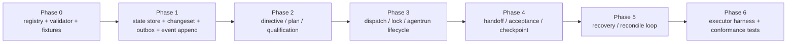

# 04 Phased Implementation Plan

## Purpose

- 把 first implementation 拆成工程团队可以直接执行的阶段计划。
- 给出每个阶段的目标、完成标准、输入输出、依赖前置、暂不处理范围和建议测试项。
- 避免继续围绕抽象边界讨论，而不开始建 schema、handler、store 和场景测试。

## Scope

- 本文只覆盖首个 Hive 控制平面原型仓的实现阶段。
- 本文不替代详细协议文档；每个阶段都要回链到对象包、handler mapping 和 golden path 场景。
- 本文默认团队先构建单 writer、单 adapter、SQLite + filesystem 的 MVP。

## Definitions

- `Phase 0..6`：按依赖关系分层推进的实现阶段，不是业务 `Phase` 对象。
- `Done`：阶段完成后，下一阶段不再需要反复回填概念边界。
- `Fixture`：用于 schema、change-set、事件、e2e 的稳定测试输入。
- `Conformance Gate`：验证实现是否仍遵循协议的自动化检查。

## Rules

### 开工原则

1. 每个阶段必须产出可运行代码和可执行测试，而不只是设计说明。
2. 每个阶段结束时，都必须能明确说明“下一阶段读什么、写什么、依赖什么”。
3. 任何需要跨阶段回退的协议问题，必须记录 ADR 或 spike 结论，不能口头悬置。
4. 没有 fixture 和 golden path 的模块，不算完成。

### 阶段依赖图

## Design Notes

### 推荐团队分工

- 一条基础设施线：`ids-and-enums`、`schema-validation`、`persistence`、`changesets`、`eventing`
- 一条控制平面线：`directives`、`planning`、`scheduler`、`runs`
- 一条可靠性线：`acceptance`、`checkpointing`、`recovery`、`conformance`

建议在 `Phase 1` 完成后再并行展开 `Phase 2` 与 `Phase 3` 的部分实现；在此之前不要并行写 domain handler。

### Phase 0：canonical registry + schema validator + test fixtures

- 目标
  - 固化 ID、枚举、事件名、命令名和最小 schema，给所有后续模块提供统一输入输出约束。
- 完成标准
  - `Directive / PlanRevision / Phase / Task / AgentRun / Handoff / Acceptance / Issue / Lock / Checkpoint / DispatchIntent / RecoveryAction / Event / ChangeSet` 的 required fields 有可执行 validator。
  - fixture loader 能加载 canonical object sample、event sample、change-set sample。
  - 任意非法状态枚举、非法 ID prefix、缺失 required fields 都能被测试拦住。
- 输入
  - `../03-state-model/06-Canonical-Enums-and-Identifiers.md`
  - `../03-state-model/07-MVP-Object-Package.md`
  - `../08-appendix/11-Schema-Catalog.md`
- 输出
  - `packages/ids-and-enums`
  - `packages/schema-validation`
  - `tests/fixtures/schema`
  - `tests/fixtures/canonical`
- 依赖前置
  - 无
- 暂不处理的范围
  - 任何数据库写入逻辑
  - 任何 adapter 集成
  - 任何 runtime loop
- 建议测试项
  - schema happy path
  - invalid enum / invalid prefix
  - missing required field
  - cross-object fixture load

### Phase 1：state store + changeset + outbox + event append

- 目标
  - 建立 authoritative state 的 durable 边界。
- 完成标准
  - SQLite migration 可创建对象表、`changesets`、`outbox_events`、`event_log`、`idempotency_keys`。
  - `ChangeSet Applier` 能原子提交对象 delta、lock delta、outbox events。
  - `OutboxPublisher` 能把 `pending` outbox append 到 `event_log` 并去重。
  - 基础 object repository 能按 ID / status / correlation 查询。
- 输入
  - Phase 0 registry 与 validator
  - `../06-coordination/03-Change-Set-and-Outbox-Contract.md`
  - `../06-coordination/04-MVP-Storage-Backend-Profile.md`
- 输出
  - `packages/persistence`
  - `packages/changesets`
  - `packages/eventing`
  - `migrations/sqlite/*`
- 依赖前置
  - Phase 0
- 暂不处理的范围
  - planning / dispatch / acceptance 业务规则
  - 外部 side effect
- 建议测试项
  - change-set commit 原子性
  - outbox publish 幂等
  - event append dedup
  - object repository read-after-write

### Phase 2：directive / plan / task qualification

- 目标
  - 打通从用户输入到可调度 `Task` 的最小 planning 链。
- 完成标准
  - `submit_user_input` 能写 intake journal 和 `UserInputReceived`。
  - `compile_directive` 能生成 `Directive`。
  - `compile_plan` 能生成一个 active `PlanRevision`、至少一个 `Phase`、至少一个 `Task(draft)`。
  - `qualify_task` 能把合法任务推进到 `ready`，非法任务进入 `blocked` 或生成 `Issue`。
- 输入
  - Phase 1 state store / change-set / outbox
  - `../04-planning/05-plan-compilation-protocol.md`
  - `../04-planning/06-task-graph-compilation.md`
  - `../05-execution/01-任务准入规则.md`
- 输出
  - `packages/intake`
  - `packages/directives`
  - `packages/planning`
  - `tests/integration/planning`
- 依赖前置
  - Phase 1
- 暂不处理的范围
  - 真正的外部执行器
  - 验收与恢复
- 建议测试项
  - duplicate input idempotency
  - compile_directive 幂等
  - compile_plan supersession mapping
  - qualify_task rule gate

### Phase 3：dispatch / lock / agentrun lifecycle

- 目标
  - 建立从 `Task.ready` 到 `AgentRun.running / exited` 的调度与执行主链。
- 完成标准
  - `prepare_dispatch` 在同一 change-set 中写入 `Task.dispatching`、`DispatchIntent.prepared`、`AgentRun.created`、`Lock.reserved`。
  - `launch_run` 能写 side effect token 并通过 fake adapter / first adapter 发起启动。
  - `acknowledge_run_started` 能把 `Task`、`AgentRun`、`Lock` 推进到运行态。
  - `report_heartbeat`、`report_run_exit` 能稳定写回 lifecycle 状态。
- 输入
  - Phase 1 基础设施
  - Phase 2 产生的 ready task
  - `../05-execution/04-agentrun-lease-heartbeat-protocol.md`
  - `../05-execution/10-Lock-Manager-and-Stale-Lock-Recovery.md`
  - `../05-execution/05-executor-adapter-contract.md`
- 输出
  - `packages/locks`
  - `packages/runs`
  - `packages/adapters/base`
  - `packages/adapters/fake`
- 依赖前置
  - Phase 2
- 暂不处理的范围
  - acceptance 结论
  - recovery automation
- 建议测试项
  - duplicate dispatch guard
  - lock conflict path
  - launch ambiguity marker
  - heartbeat dedup
  - exit ingest

### Phase 4：handoff / acceptance / checkpoint

- 目标
  - 建立执行完成后的证据闭环和恢复基线。
- 完成标准
  - `submit_handoff` 能记录 handoff、artifact refs、validation refs。
  - `run_acceptance` 能产生 `accepted / rejected / needs_followup / partial_accepted`。
  - `write_checkpoint` 能基于 event cursor 和 open object summary 写出 checkpoint。
  - `Artifact` 虽不作为一等对象，但其 refs 能被 acceptance 稳定读取。
- 输入
  - Phase 3 run lifecycle
  - `../05-execution/08-handoff-artifact-contract.md`
  - `../07-reliability/05-Acceptance-Engine.md`
  - `../07-reliability/01-Checkpoint-与恢复机制.md`
- 输出
  - `packages/acceptance`
  - `packages/checkpointing`
  - `tests/integration/acceptance`
- 依赖前置
  - Phase 3
- 暂不处理的范围
  - 高级 acceptance scoring
  - 多级 checkpoint export strategy
- 建议测试项
  - handoff schema validation
  - acceptance outcome matrix
  - checkpoint supersession
  - artifact ref resolution

### Phase 5：recovery / reconcile loop

- 目标
  - 让控制平面可以在 launch ambiguity、timeout、stale lock、acceptance reject 下自动收敛。
- 完成标准
  - `reconcile_once` 以固定顺序处理 events、acceptance、recovery、dispatch、checkpoint。
  - `start_recovery` 能创建 `RecoveryAction` 并冻结相关 `Task / Run / Lock`。
  - 超时、无 ack、验收失败三类场景都能 requeue、block 或 followup。
  - `request_context_reset` 能在 checkpoint 可用时发出 reset request。
- 输入
  - Phase 4 e2e 主链
  - `../07-reliability/03-Failure-Recovery-Protocol.md`
  - `../07-reliability/06-Orchestrator-Reconcile-Loop.md`
  - `../07-reliability/09-End-to-End-Sequence-Scenarios.md`
- 输出
  - `packages/recovery`
  - `packages/runtime`
  - `tests/e2e/recovery`
- 依赖前置
  - Phase 4
- 暂不处理的范围
  - live restore hard dependency
  - 跨进程 leader election
- 建议测试项
  - dispatch change-set 成功但无 ack
  - run timeout -> recovery -> requeue
  - acceptance rejected -> followup task
  - context reset gate

### Phase 6：executor harness + conformance tests

- 目标
  - 形成可持续回归的实现质量门，而不是依赖手工演示。
- 完成标准
  - fake adapter 和 first real adapter 都能跑通 golden path。
  - conformance suite 覆盖 schema、idempotency、duplicate dispatch、replay safety、stale lock recovery。
  - 至少 4 个 golden path / failure path 场景可一键运行。
- 输入
  - 前五阶段全部产出
  - `../07-reliability/10-Invariants-and-Conformance-Rules.md`
  - `../07-reliability/13-Conformance-Test-Strategy.md`
- 输出
  - `packages/conformance`
  - `tests/conformance`
  - `tests/e2e`
- 依赖前置
  - Phase 5
- 暂不处理的范围
  - 多 adapter A/B 比较
  - 多节点压测
- 建议测试项
  - event replay safety
  - no duplicate active run
  - no blind dual-write
  - checkpoint restore baseline

## Anti-patterns

- 在 `Phase 0` 之前就开始写 handler，导致命名和字段来回漂移。
- `Phase 1` 还没稳定就并行写 acceptance / recovery，最后全靠手工补胶水。
- 把阶段完成定义成“文档写完”，而不是“测试跑通”。
- 每个阶段都偷偷扩范围，把 multi-writer、MQ、policy engine 带进来。

## Acceptance Criteria

- 工程团队能按 Phase 0 到 Phase 6 逐步开工，而不是继续抽象讨论。
- 每个阶段都有明确输入输出和 done 定义。
- 每个阶段都能对应到本仓已有协议文档，不会另起炉灶。
- 阶段顺序能直接指导创建目录、DDL、handler、runtime loop 和测试夹具。

## MVP 落地检查表

- [x] 已拆出 Phase 0 到 Phase 6 的明确实施顺序。
- [x] 每阶段都定义了目标、完成标准、输入输出、依赖前置、暂不处理范围和建议测试项。
- [x] 已把开工顺序收敛到先 registry/validator，再 state store，再 planning，再 dispatch，再 acceptance/recovery。
- [ ] 仍需后续 ADR / spike 验证：语言生态下的 migration runner、测试运行器、first adapter 的进程封装。
- [ ] 明确不进入首版实现：多 writer、复杂策略引擎、multi-repo 编排、分布式总线。
