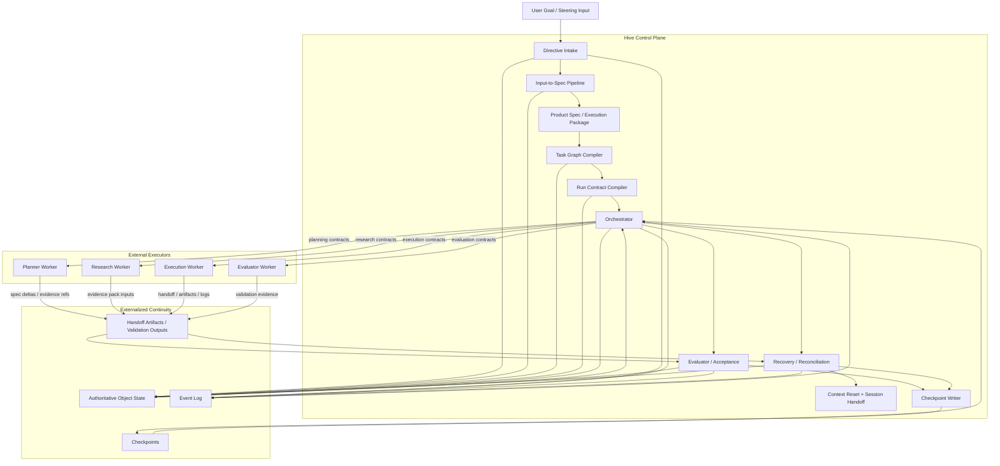

# 05 Hive vNext Long-Running Agent Harness

## Purpose

- 定义 Hive 从当前 `MVP implementation package` 演进到长期自治多-agent 调度控制平面的目标架构。
- 明确 vNext 的核心不是把 Hive 变成一个大 agent，而是把连续性、治理和恢复外置到状态与协议。
- 将研究、规划、执行、验收、恢复、context reset 组织成长期可接力的 harness。

## Scope

- 本文描述 vNext 目标架构与关键协议主线。
- 本文不改变当前 MVP 的对象事实层级、change-set / outbox 语义、acceptance 边界和单 writer 约束。
- 具体规划流水线见 `../04-planning/09-Input-to-Spec-and-TaskGraph-Pipeline.md`。
- vNext durable compiled artifact package 见 `../03-state-model/08-vNext-Compiled-Artifact-Package.md`。
- benchmark repo research 见 `../04-planning/10-Benchmark-Repo-Research-Protocol.md`。
- `Project Dossier / Project Book` 的编译协议见 `../04-planning/11-Project-Dossier-Compilation-Protocol.md`。
- 编译顺序、freshness gate 与 selective recompile 见 `../04-planning/12-Compilation-Lifecycle-and-Freshness-Protocol.md`。
- 具体角色拓扑与 run contract 见 `../05-execution/15-Agent-Role-Topology-and-Run-Contract.md`。
- session scaffold artifact set 见 `../05-execution/16-Executor-Session-Scaffold-Profile.md`。
- 具体 context reset 与用户插话协议见 `../07-reliability/14-*` 和 `../07-reliability/15-*`。
- run termination / reassignment 的统一矩阵见 `../07-reliability/16-Run-Termination-and-Reassignment-Matrix.md`。

## Definitions

- `Long-Running Harness`：面向外部执行器的长期自治编排系统。长期运行的是状态与协议，不是单个长驻模型会话。
- `Initializer / Planner`：将一句高层需求扩展成 spec、execution package、task graph 和 run contracts 的角色链。
- `Compiled Artifact Set`：围绕同一轮 planning / dispatch 绑定的一组 durable derived artifacts。
- `Compilation Batch`：由 planning / replan / recovery 触发的一轮 artifact 编译记录，用于 freshness、lineage 与 pointer 切换。
- `Session Scaffold Artifact Set`：供新 session 启动时快速 get bearings 的派生脚手架产物集合。
- `Structured Handoff`：由 handoff artifacts、validation outputs、checkpoint 共同构成的可接力连续性包。
- `Independent Evaluation`：执行完成后必须由独立 evaluator / acceptance 进行验证，不接受 worker 自报完成直接生效。
- `Context Reset Discipline`：把 reset 视为正常控制机制，并要求 reset 前后有完整 handoff 与恢复协议。

## Rules

### vNext 核心定位

- Hive 仍然是 `control plane`，不是通用 agent。
- 外部 agent 仍然是 `Codex`、`Claude Code` 等执行器。
- Hive 的价值在于把一句需求扩展成长期可治理的工作流，并在运行中持续保持：
  - 输入收敛
  - 结构化规划
  - 多角色派发
  - 独立验收
  - 异常恢复
  - 重规划
  - context reset

### vNext 七条设计主线

1. `Initializer / Planner discipline`
   - 用户一句话不能直接扔给 execution worker。
   - 必须先形成 spec、execution package、task graph、run contracts。
   - 当实现模式未知时，应先通过 benchmark repo research 补齐 evidence，而不是直接让 worker 试错。
2. `Compiled artifact and freshness discipline`
   - `Product Spec / Execution Package / Task Graph / Run Contract / Session Scaffold / Dossier` 可以持久化为 durable derived artifacts。
   - active pointers 必须挂在 `PlanRevision / DispatchIntent` 等 authoritative objects 上，而不是让 artifact 反向主导 runtime truth。
   - 任何下游复用都必须经过 freshness gate；若上游 stale，必须 selective recompile 或 supersede。
3. `Incremental progress discipline`
   - worker 不能“一口气做完整项目”。
   - 必须按小步、可验证、可回收、可接力的工作单元推进。
4. `Structured artifact handoff`
   - 连续性来自 handoff artifacts + checkpoint + object state。
   - 不能依赖超长上下文记忆。
   - `Project Dossier / Project Book` 只作为面向人的 compiled view，不得替代结构化对象。
5. `Independent evaluation`
   - execution worker 不能自判完成。
   - evaluator / acceptance 必须独立存在，并尽量把 done 变成可验证标准。
6. `Context reset discipline`
   - reset 是一等机制，不是异常补丁。
   - reset 要有触发条件、禁止条件、handoff artifact 和恢复最小上下文。
7. `Session scaffold discipline`
   - 每轮新 session 都应获得 coverage view、progress digest、workspace bootstrap、smoke-check、read-first refs。
   - scaffold 用于 bootstrap，不得升级为事实源。

### 分层边界

| 主题 | 当前 MVP | 目标 vNext | 明确不在当前阶段 |
|---|---|---|---|
| 输入处理 | `Directive -> PlanRevision -> Task` 最小链路 | `Directive -> Research -> Evidence -> Product Spec -> Execution Plan -> Task Graph -> Run Contract` 完整链路 | 自由对话即事实源 |
| 角色拓扑 | 单 adapter、worker 与 acceptance 分离 | Planner / Research / Execution / Evaluator / Recovery 多角色协同 | 让单一 agent 承担所有角色 |
| 连续性 | checkpoint + handoff + recovery baseline | session handoff、context reset、partial handoff recovery 成体系 | 长驻大模型会话保存全部上下文 |
| 验收 | basic acceptance engine | independent evaluation lane + run-contract level validation | worker 自报 done 即完成 |
| 恢复 | timeout / ambiguity / stale lock recovery | preemption、supersession、replan、context reset recovery | adapter 直接宣布任务完成 |
| 部署边界 | 单 writer、单 repo、单 active plan revision、单 adapter | 先在同一边界下补齐 harness 语义 | multi-writer、multi-repo、复杂 policy engine、rich UI |

### 升级方式

- vNext 是在当前 MVP 之上增量升级，不推翻现有事实层级。
- `authoritative object state`、`Event Log`、`Checkpoint` 的层级关系不变。
- `launch_run` 仍然只能写 side effect token / launch markers。
- adapter 仍然不能直接决定任务完成。
- Orchestrator 仍然必须事件驱动、非常驻、可退出、从外部状态重建。

## Protocol Steps

1. 用户提交一句高层目标。
2. Hive 将其结构化为 `Directive`，并决定是 `research_first` 还是 `planning_direct`。
3. Planner / Research lane 生成 `Research Sprint`、`Evidence Pack`、`Product Spec`、`Execution Plan`。
4. 若需要参考实现，对应 `Research Sprint` 可受控地拉起 benchmark repo research，并将观察编译进 `Evidence Pack`。
5. compile batch 对当前 artifact set 执行 freshness-check，决定 `reuse / selective recompile / supersede / block and escalate`。
6. 规划结果被编译为 `TaskGraphArtifact`、多个标准化 `RunContractArtifact`，并在 `PlanRevision / DispatchIntent` 上切换 active pointers。
7. 可选地把稳定层、演进层、evidence 与当前进展编译成 `Project Dossier / Project Book` 供人类阅读。
8. Orchestrator 按依赖、优先级、用户 steering input、恢复状态派发不同角色的外部 workers，并绑定 session scaffold refs。
9. workers 按小步推进，持续写回 handoff、artifacts、validation outputs、issues。
10. evaluator / acceptance 独立判断 done、partial、reject、followup。
11. Recovery / Reconciliation 处理 timeout、异常、无响应、启动歧义、用户插话、supersession、replan，并按 termination / reassignment matrix 选择保守路径。
12. 在稳定边界与污染边界上触发 context reset，并通过 checkpoint + handoff artifacts + session scaffold 继续下一轮。

## Mermaid

### vNext 总架构图

## Anti-patterns

- 把 vNext 写成“让 Hive 自己变成超级 agent”。
- 直接把一句高层目标塞给 execution worker。
- 把 benchmark repo、Project Dossier 或 session scaffold 当成 runtime truth。
- 让执行器自己决定项目是否完成。
- 用越来越长的上下文替代 checkpoint、handoff 和 object state。
- 为了“高级”而提前引入 multi-writer、multi-repo、复杂 policy engine。

## Acceptance Criteria

- 读者能明确看到 Hive vNext 仍然是控制平面，而不是通用 agent。
- 读者能明确看到从输入、研究、spec、task graph、run contract 到执行、验收、恢复、reset 的完整主线。
- 读者能明确看到 compiled artifacts 只是 durable derived state，而不是新的 runtime truth。
- 读者能明确区分当前 MVP、目标 vNext 和明确不做的方向。
