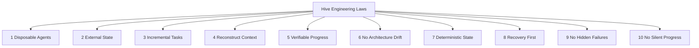

# Hive Engineering Laws

## Purpose

- 固化 Hive 的工程执行法则。
- 统一 session、task、validation、recovery 的底层约束。

## Rules

### Law 1

- Agents are disposable：Worker 必须可替换，不得成为单点连续性来源。

### Law 2

- State must be external：项目状态必须写入外部对象，不能只存在于对话中。

### Law 3

- Tasks must be incremental：Task 必须可拆分、可分步推进、可局部完成。

### Law 4

- Every session reconstructs context：每个 Worker Session 都必须先重建上下文。

### Law 5

- Progress must be verifiable：任何进度都必须附带验证证据。

### Law 6

- Workers cannot change architecture：Worker 不得修改架构、Plan 或需求边界。

### Law 7

- Deterministic state over agent memory：系统连续性优先依赖显式状态，不依赖 agent 记忆。

### Law 8

- Recovery over conversation continuity：恢复能力优先于长对话连续性。

### Law 9

- No hidden failures：所有失败都必须显式记录并可追溯。

### Law 10

- No silent progress：没有验证证据的进度不得推进状态。

## Mermaid Diagram

### Hive Engineering Laws Map

## Anti-patterns

- 依赖单个长上下文 Worker 持续推进。
- 让关键状态只存在于一次对话里。
- 允许 Worker 越权改架构或需求。
- 失败不记录，进度不验证。

## Acceptance Criteria

- 所有协议文档都不得违反上述 10 条法则。
- 所有运行规则都必须体现可替换、可验证、可恢复。
