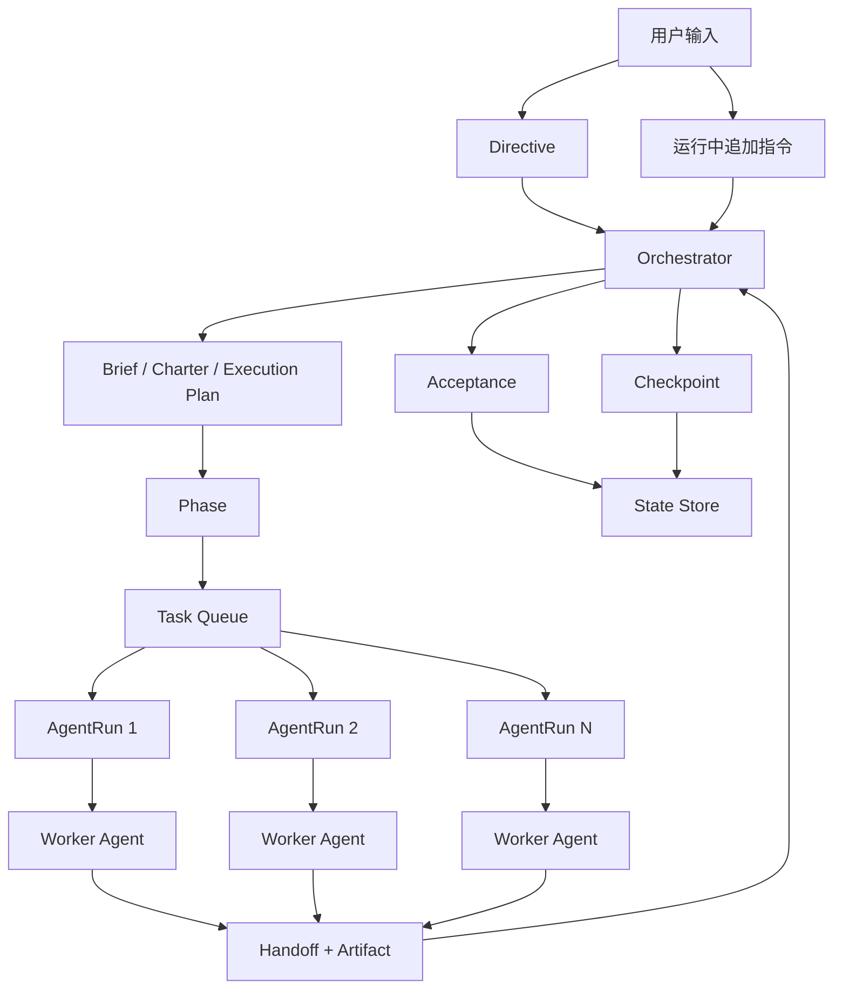

# 04 系统总体思想框架

## 一句话定义

Hive 是一个围绕 `用户意图 -> 研究与规划 -> 任务派发 -> 交接与验收 -> 状态更新 -> 再派发` 闭环运行的长期自主工作调度系统。

## 五层结构

### 1. 输入层（Input Layer）

- 接收用户初始目标
- 接收运行中追加指令
- 接收系统内部事件（超时、失败、验收结果、阻塞）

### 2. 控制层（Control Layer）

- 由 Orchestrator 负责 intake、研究编排、计划生成、任务派发、监控、验收、重规划
- Queen 负责需求方向、范围取舍和高阶冲突裁决

### 3. 执行层（Execution Layer）

- Worker Agent 是一次性执行单元
- Worker 由外部执行器承载，例如 Claude Code、Codex
- Worker 只处理边界清晰、输入明确、退出条件明确的任务

### 4. 状态层（State Layer）

- 项目真实状态必须落在结构化对象中
- 最小核心对象包括：Directive、Brief、Project Charter、Execution Plan、Phase、Task、AgentRun、Handoff Record、Acceptance Record、Artifact、Decision、Issue、Checkpoint

### 5. 恢复层（Recovery Layer）

- Orchestrator 可定期清理当前上下文
- 系统依赖 Checkpoint 和开放状态对象恢复，而不依赖长对话历史

## 控制闭环

1. 用户输入被转为 Directive。
2. Orchestrator 触发调研、生成 Brief，并落出稳定规则与执行计划。
3. Execution Plan 被拆成 Phase 与 Task。
4. Task 被派发为一个或多个 AgentRun。
5. Worker 完成工作后提交 Handoff 与 Artifact 并退出。
6. Orchestrator 对 Handoff 进行验收，决定接受、重派、阻塞或取消。
7. 状态更新后，系统继续派发下一批任务，并周期性写入 Checkpoint。

## 总体关系图

## 硬规则

- Worker 的结束不等于 Task 的完成。
- Handoff 先提交给 Orchestrator，再进入 Acceptance 流程。
- Task 是否完成，是系统判定，不是 Worker 自我声明。
- Orchestrator 可以替换失效 Worker，但不能绕过状态对象直接“靠对话继续”。
