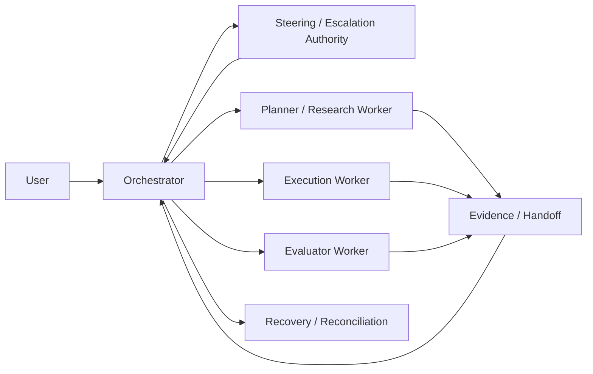

# 01 角色职责矩阵

| 角色 | 核心职责 | 禁止事项 |
|---|---|---|
| `User` | 提出目标、运行中追加 steering input、确认方向变更 | 直接修改运行态对象，绕过治理边界 |
| `Steering / Escalation Authority` | 方向裁决、范围取舍、冲突确认 | 直接向 worker 下发未编译的任务 |
| `Orchestrator` | intake、状态推进、派发、验收路由、恢复、重规划、context reset 决策 | 以长对话替代状态对象，长期承担具体实现工作 |
| `Planner / Research / Execution / Evaluator Worker` | 执行限定 run contract、产出 evidence / handoff / validation output、上报阻塞后退出 | 改全局架构、改计划结构、自行宣布任务最终通过 |
| `Recovery / Reconciliation Actor` | 处理 timeout、ambiguity、stale lock、supersession、partial handoff recovery | 越过 authoritative state 直接伪造成功结论 |

## 说明

- 后续文档统一使用 `Orchestrator`，不再单独使用 `Drone` 术语。
- 如果旧文档出现 `Queen`，应理解为 `Steering / Escalation Authority`，只是升级/裁决职责，不是长驻魔法角色。
- Worker 是可丢弃、可替换、可扩缩的一次性执行单元。
- acceptance 必须独立于 execution worker。

## Mermaid

## Acceptance Criteria

- 读者能明确区分控制平面角色与外部执行器角色。
- 读者能明确知道 `Queen` 只是历史路径中的升级职责别名。
