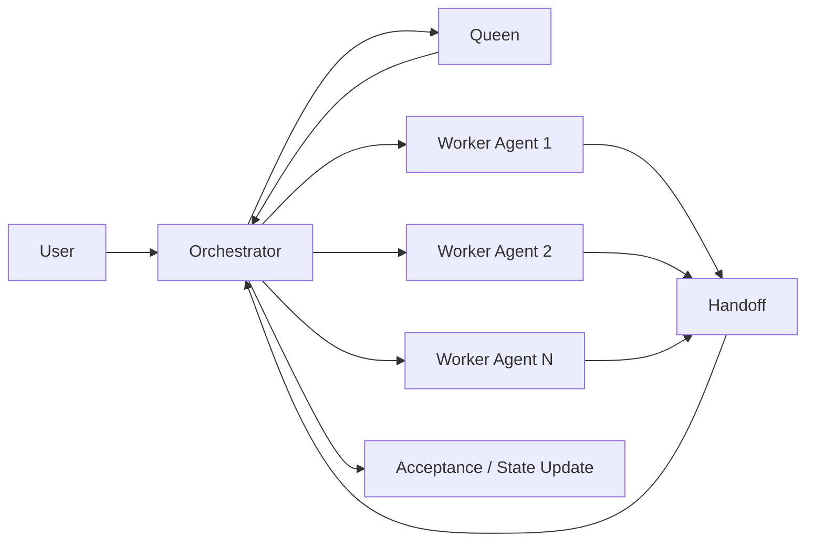

# 01 角色职责矩阵

| 角色 | 核心职责 | 禁止事项 |
|---|---|---|
| User | 提出目标、运行中追加指令、确认方向变更 | 直接修改运行态对象，绕过治理边界 |
| Queen | 需求方向、范围取舍、冲突裁决 | 直接下发不合格任务到 Worker |
| Orchestrator | intake、研究编排、计划生成、任务派发、状态迁移、验收、重规划 | 以长对话替代状态对象，长期承担具体实现工作 |
| Worker Agent | 执行限定任务、产出 Handoff、上报阻塞后退出 | 改全局架构、改计划结构、引入重大依赖、自行宣布任务最终通过 |

## 说明

- 后续文档统一使用 `Orchestrator`，不再单独使用 `Drone` 术语。
- Orchestrator 是运行时控制平面，不是自由漂移的执行者。
- Worker Agent 是可丢弃、可替换、可扩缩的一次性执行单元。

## 角色协作图

图示重点：

- User 不直接操作运行态对象，而是通过 Orchestrator 进入系统。
- Queen 负责方向与裁决，不直接承担具体执行。
- Worker Agent 完成工作后回交 Handoff，由 Orchestrator 负责验收与状态更新。
