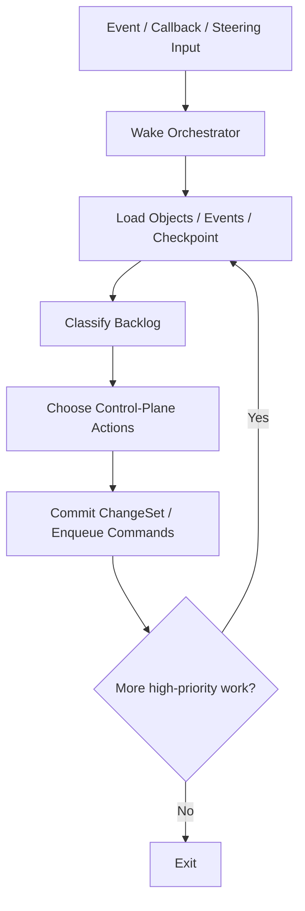
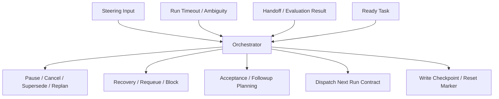

# 03 Orchestrator Operating Model（保留旧文件名）

## Purpose

- 定义 Orchestrator 的真实运行方式。
- 明确 Orchestrator 是事件驱动的控制平面状态推进器，不是长驻 AI agent。
- 说明在 vNext 中 Orchestrator 如何协调 Planner、Research、Execution、Evaluator、Recovery 等角色，而不把这些职责吞进自己内部。

## Scope

- 本文覆盖 Orchestrator 的职责、生命周期、优先级规则与退出规则。
- 运行时用户纠偏见 `../07-reliability/07-Runtime-Directive-Handling.md` 与 `../07-reliability/15-User-Interrupt-Replan-and-Preemption-Protocol.md`。
- context reset 见 `../07-reliability/14-Context-Reset-and-Session-Handoff-Protocol.md`。

## Definitions

- `Orchestrator`：从 authoritative state、事件、checkpoint 和 backlog 重建控制决策的状态机执行器。
- `Steering Input`：用户运行中追加的目标、约束、优先级或纠偏输入。
- `Active Workline`：当前正在运行或等待验收的一组任务与 runs。
- `Control-Plane Action`：由 Orchestrator 触发的 planning、dispatch、acceptance、recovery、reset 类命令。

## Rules

### Orchestrator Definition

- Orchestrator 是事件驱动的调度器。
- Orchestrator 是非常驻的状态机执行器。
- Orchestrator 的输入是状态对象、事件、checkpoint、ledger、handoff refs，而不是源码。
- Orchestrator 不读代码。
- Orchestrator 不执行 task。
- Orchestrator 不直接修改架构设计。
- Orchestrator 不用长对话代替状态对象。
- Orchestrator 每次唤醒都必须从外部状态重建。

### Core Responsibilities

Orchestrator 负责：

1. `Directive` intake 后的状态推进
2. planning / task qualification / dispatch 顺序控制
3. acceptance backlog 推进
4. timeout / ambiguity / stale lock / rejection 的恢复决策
5. 用户插话后的 impact analysis、preemption、replan、supersession 路由
6. context reset gate 与下一轮恢复准备

Orchestrator 不负责：

- 阅读源码
- 修改代码
- 执行 research / implementation / evaluation 任务
- 把一句话直接变成自由执行
- 用 prompt 自由发挥代替协议与状态机

### Lifecycle

- Wake
- Load state
- Classify backlog
- Choose next control-plane actions
- Commit change-set or enqueue commands
- Exit

规则：

- Orchestrator 不保持长时间运行。
- Orchestrator 不依赖持续 context。
- 连续性来自外部状态与 handoff artifacts。
- 没有待处理高优先级事件时应退出。

### Scheduling Priority

推荐优先级：

1. `Steering Input / Runtime Directive`
2. `Recovery / ambiguity / timeout / stale lock`
3. `Acceptance backlog / evaluation result`
4. `Planning gaps / qualification gaps`
5. `Ready task dispatch`
6. `Checkpoint / maintenance work`

规则：

- 用户输入优先级高于普通 ready task 调度。
- 恢复问题优先级高于新增执行。
- acceptance 未闭环时，不得把 worker 完成声明直接视为完成事实。

## Protocol Steps

1. 事件、用户输入、adapter 回调或 operator trigger 到达，唤醒 Orchestrator。
2. 读取最新 `Directive`、`PlanRevision`、Requirement Ledger、open tasks、active runs、locks、issues、checkpoint。
3. 分类 backlog：
   - steering / interrupt
   - recovery
   - acceptance
   - planning
   - dispatch
4. 按优先级选择下一批 control-plane actions。
5. 通过 owning handler 提交 change-set 或排队异步命令。
6. 若需要派发 external worker，则只生成 `DispatchIntent / Run Contract`，不直接伪造完成状态。
7. 若 backlog 已收敛到稳定边界，则写 checkpoint 或 reset marker，并退出。

## Mermaid

### Orchestrator Lifecycle

### Orchestrator Event Routing

## Anti-patterns

- Orchestrator 变成一个会读代码的大 agent。
- Orchestrator 直接执行 research、implementation 或 evaluation。
- Orchestrator 持续运行并累积上下文。
- 用户插话到来后仍继续按普通 ready task 优先级调度。
- Orchestrator 绕过 owning handler，直接写最终业务状态。

## Acceptance Criteria

- 读者能明确知道 Orchestrator 的输入是状态与事件，而不是源码。
- 读者能明确知道用户 steering input 在调度中优先级最高。
- 读者能明确知道 Orchestrator 何时退出，以及为何可从外部状态重建。
