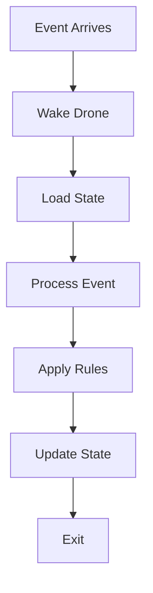
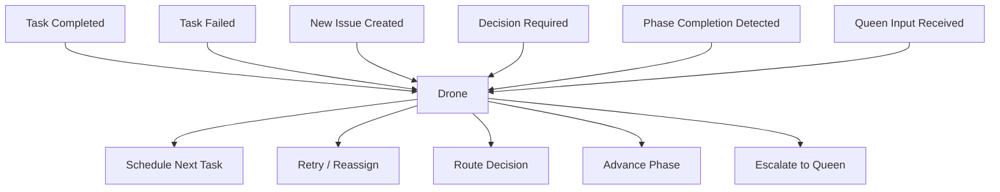
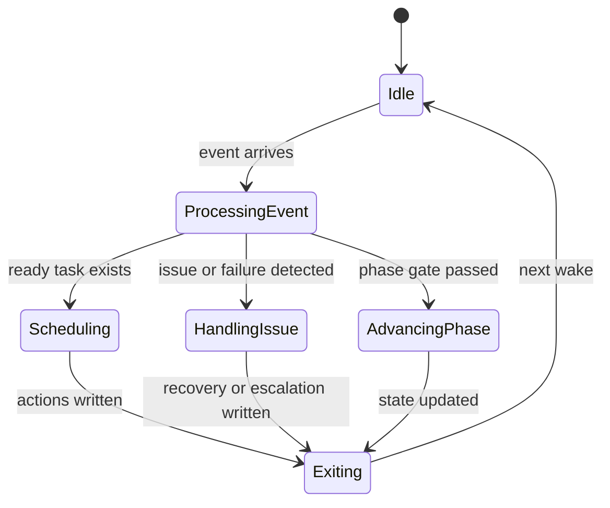
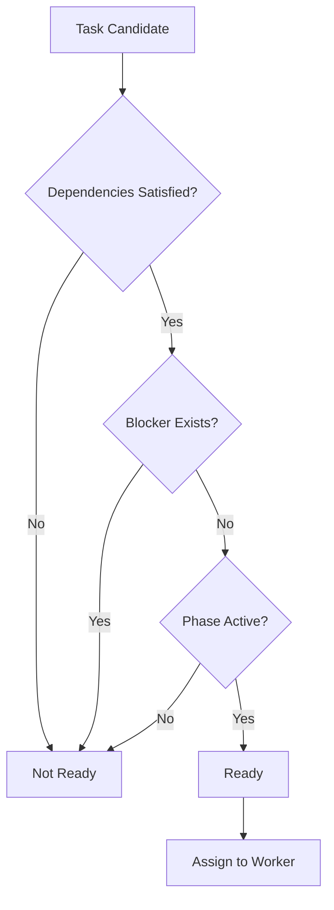

# 03 Drone Operating Model

## Purpose

- 定义 Drone 的真实运行方式。
- 明确 Drone 是状态推进器，不是长驻 AI agent。
- 本文中的 Drone 对应现有文档中的调度控制职责，不新增角色。

## Rules

### Drone Definition

- Drone 是事件驱动的调度器。
- Drone 是非常驻的状态机执行器。
- Drone 的输入是状态对象与事件，不是源码。
- Drone 不看代码。
- Drone 不执行任务。
- Drone 不修改架构。
- Drone 只负责状态推进、任务分配、决策分流、异常处理。

### Drone Core Responsibilities

Drone 只负责：

1. State progression
2. Task scheduling
3. Decision routing
4. Failure handling

Drone 不负责：

- 阅读源码
- 修改代码
- 执行 task
- 重写 Plan
- 改需求

### Drone Lifecycle

- Wake
- Load state
- Process events
- Apply transition rules
- Schedule next actions
- Update state
- Exit

规则：

- Drone 不保持长时间运行。
- Drone 不依赖持续 context。
- Drone 的连续性来自外部状态。

## Protocol Steps

1. 接收事件并唤醒 Drone。
2. 读取最新状态对象、开放事件、当前 Phase、ready task、Issue、Decision。
3. 逐个处理事件并匹配状态迁移规则。
4. 选择下一批可调度动作。
5. 写回状态更新、Issue、Decision、Checkpoint 或任务分配结果。
6. 无待处理即时事件时退出。

## Mermaid Diagram

### Drone Lifecycle

### Drone Event Routing

### Drone State Machine

### Task Scheduling Decision Flow

## Event Model

### Task completed

- 触发源：Worker Handoff + completion claim
- Drone 动作：校验是否进入 acceptance / evaluation / phase gate
- 状态变更：Task、Phase、Checkpoint、后续调度队列

### Task failed

- 触发源：Worker failure / validation failure / timeout
- Drone 动作：分类失败、选择 retry / reassign / recover
- 状态变更：Issue、Task、AgentRun、Checkpoint

### New issue created

- 触发源：Worker、validation、恢复流程
- Drone 动作：识别 blocker、决定继续、挂起或升级
- 状态变更：Issue、Task、Phase

### Decision required

- 触发源：设计冲突、路径冲突、约束冲突
- Drone 动作：生成候选路径、路由到决策层或记录 Decision
- 状态变更：Decision、Plan 引用、Phase / Task 状态

### Phase completion detected

- 触发源：Phase gate 条件满足
- Drone 动作：推进到下一 Phase 或进入 completion
- 状态变更：Phase、Plan、Checkpoint

### Queen input received

- 触发源：需求调整、范围修正、关键裁决
- Drone 动作：写入 Directive、评估影响范围、重排队列或升级 planning 工作
- 状态变更：Directive、Plan、Task、Decision、Checkpoint

## Scheduling Rules

### Ready Task Rule

Drone 只能调度 `ready task`。

Ready task 至少满足：

- task status = ready
- dependencies satisfied
- no blocker
- current phase active

### Scheduling Priority

推荐优先级：

1. Blocking issues
2. Failed tasks needing recovery
3. Ready tasks
4. Phase transitions
5. New planning work

### Scheduling Discipline

- Drone 不应自由想象“下一个任务是什么”。
- Drone 必须基于 task graph、依赖关系、状态字段、当前 phase 做确定性选择。
- Drone 不得绕过 blocker 或 phase gate 强行派发任务。

## Decision Routing Rules

### Execution failure

- 局部执行失败由 Drone 执行 retry / reassign / recover
- 不能静默跳过失败

### Design conflict

- 设计冲突由 Drone 先处理影响评估
- 超出局部边界时升级到决策层

### Requirement conflict

- 需求冲突必须升级给 Queen
- Worker 不得越权做全局决策

### Routing Discipline

- Worker 只上报问题，不做全局裁决。
- Drone 负责把问题送到正确层级。

## Exit Rules

- 当本轮事件已处理完成，且没有新的待处理事件需要立即推进时，Drone 必须退出。
- Drone 不是常驻 agent。
- Drone 不应该保留长 context。
- Drone 每次被唤醒都应重新读取状态。

## Anti-patterns

- Drone 变成一个会读代码的大 agent
- Drone 直接重写 task 内容
- Drone 自己修改架构
- Drone 持续运行并累积 context
- Drone 用模糊 prompt 替代状态机规则
- Drone 忽略 blocker 直接推进 phase

## Acceptance Criteria

- 读者能明确知道 Drone 不执行代码任务。
- 读者能明确知道 Drone 的输入是状态与事件，而不是源码。
- 读者能明确知道 Drone 如何调度 task。
- 读者能明确知道 Drone 什么时候退出。
- 读者能明确知道 Drone 如何处理失败和升级。
