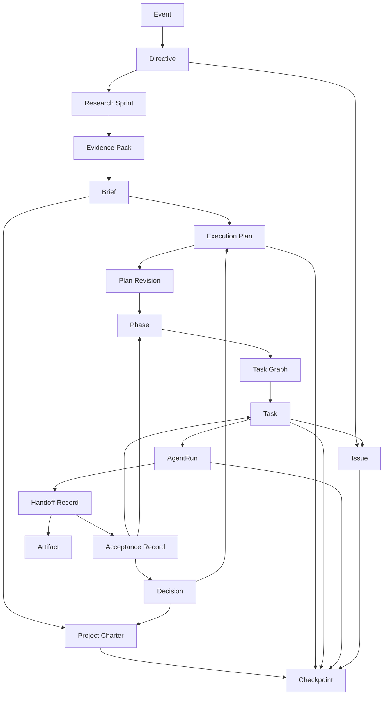

# 01 核心对象模型

Hive 的最小核心对象集合应同时覆盖“项目状态对象”和“运行时执行对象”。

## 最小核心对象集合（当前框架草案）

- Event
- Directive
- Research Sprint
- Evidence Pack
- Brief
- Project Charter
- Execution Plan
- Plan Revision
- Phase
- Task
- Task Graph
- AgentRun
- Handoff Record
- Acceptance Record
- Artifact
- Decision
- Issue
- Checkpoint

## 对象分层

### 1. 输入与规划对象

- `Directive`：用户初始目标或运行中追加指令的结构化表示
- `Research Sprint`：有边界的调研单元
- `Evidence Pack`：调研输出的标准化证据载体
- `Brief`：对目标、场景、约束和预期产出的整理结果
- `Project Charter`：稳定规则层
- `Execution Plan`：演进执行层
- `Plan Revision`：Execution Plan 的增量修订链节点
- `Phase`：计划中的阶段切片

### 2. 执行与验收对象

- `Task`：可派发、可验证、可重试的最小执行单元
- `Task Graph`：由 Task 节点和依赖、冲突边构成的可调度图
- `AgentRun`：某次 Task 派发对应的具体运行实例
- `Handoff Record`：Worker 退出前提交给 Orchestrator 的交接包
- `Acceptance Record`：Orchestrator 对 Handoff 的验收结果
- `Artifact`：代码、文档、报告、截图、日志等产出物引用

### 3. 治理与恢复对象

- `Event`：驱动状态推进的不可变运行事实
- `Decision`：高阶决策与裁决记录
- `Issue`：异常、阻塞、风险或待处理问题
- `Checkpoint`：用于恢复系统连续性的快照

## 对象关系图

图示重点：

- `Event` 负责驱动状态推进，但当前对象状态仍是事实来源。
- `Task` 是业务工作单元，`AgentRun` 是一次具体执行实例，两者不是同一个对象。
- `Handoff Record` 和 `Acceptance Record` 共同构成“执行结束”到“任务真正确认”的桥梁。
- `Checkpoint` 聚合的是恢复所需的关键状态摘要，而不是完整执行历史。

## 建议写法

每个对象独立小节，固定结构：

1. 定义（Definition）
2. 最小字段（Required Fields）
3. 状态（Status）
4. 生命周期（Lifecycle）
5. 与其他对象关系（Relations）

## 关键实体说明

### Orchestrator

- 运行时控制实体
- 负责 intake、规划、派发、监控、验收、重规划
- 它本身不是事实来源，事实必须落在结构化对象中

### Worker Agent

- 外部执行器承载的一次性执行实体
- 只消费 Task 上下文并产出 Handoff
- Worker 退出后是否需要补派，由 Orchestrator 决定

## Task（建议字段草案）

- task_id
- phase_id
- parent_task
- objective
- scope
- constraints
- allowed_paths
- forbidden_paths
- required_context_refs
- done_criteria
- validation_criteria
- output_schema
- retry_policy
- escalation_policy
- acceptance_policy
- dispatch_policy

## AgentRun（建议字段草案）

- run_id
- task_id
- worker_kind
- executor_name
- assigned_context_refs
- started_at
- lease_expires_at
- last_heartbeat_at
- exit_status
- handoff_ref
- logs_ref

## Handoff Record（建议字段草案）

- handoff_id
- task_id
- run_id
- self_report_result
- summary
- artifact_refs
- validation_results
- deviations_from_plan
- assumptions_made
- unresolved_questions
- suggested_next_steps

## Acceptance Record（建议字段草案）

- acceptance_id
- task_id
- handoff_id
- accepted_by
- result
- reason
- followup_actions
- accepted_at
