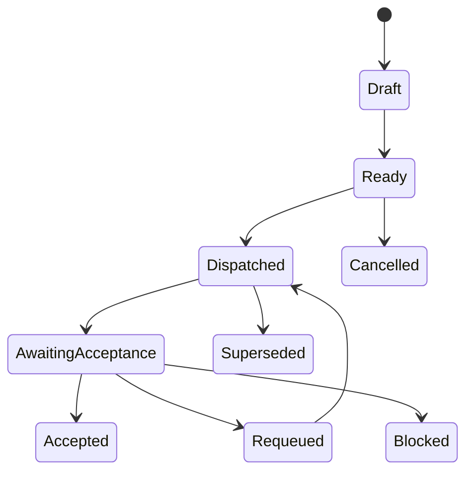
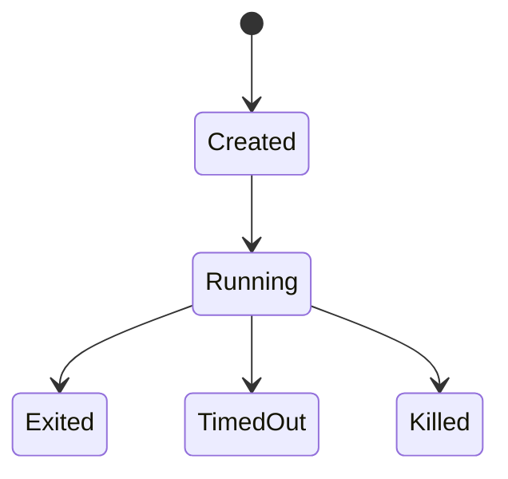

# 02 对象状态迁移

## Purpose

- 定义项目级与对象级的状态迁移协议。
- 保证 Phase 推进依赖 gate，而不是依赖叙述。

## Rules

### General Rules

- 所有状态变化必须显式记录。
- 禁止通过文件名或“看起来完成”推断状态。
- Worker 运行状态与 Task 业务状态必须分离建模。

### Project State Machine

- 抽象迁移链：`Idea → Brief → Plan → Phase → Task → Execution → Validation → Completion`
- 当前对象模型映射：`Directive → Brief → Execution Plan → Phase → Task → AgentRun / Handoff → Acceptance → Completion`

### Phase Transition Gate

Phase 迁移必须同时满足：

- Exit criteria met
- Evaluation passed
- No blocking issues

规则：

- Orchestrator 不得绕过 gate 推进 Phase。
- 未通过 evaluation 的 Task 结果不得用于 Phase completion。
- 存在 blocking issue 时，Phase 必须停留在当前状态。

### Task State Machine

规则：

- `Dispatched` 表示已创建一个或多个 AgentRun。
- `AwaitingAcceptance` 表示 Worker 已退出并提交 Handoff。
- `Accepted` 之前，Task 不得视为最终完成。

### AgentRun State Machine

规则：

- `Exited` 只表示该次 Worker 运行结束。
- `TimedOut`、`Killed` 必须触发恢复或重派动作。
- AgentRun 的结束不直接决定 Task 状态。

### Acceptance States

- Pending
- Accepted
- Rejected
- NeedsFollowup

### Guard Conditions

每次迁移至少检查：

- 输入完整性
- 前置条件满足
- 目标状态合法
- 审计字段齐全（时间、操作者、原因）

## Anti-patterns

- Worker 一退出就把 Task 标成完成。
- 未通过验证就推进 Phase。
- 有 blocking issue 仍继续推进计划。
- 仅凭总结或直觉判断“应该差不多完成了”。

## Acceptance Criteria

- 每次 Phase 迁移都必须能提供 exit criteria、evaluation、issue 状态证据。
- 每次 Task 迁移都必须能追溯到 actor、time、reason。
- 每次 AgentRun 异常都必须映射到显式状态，而不是静默丢失。
