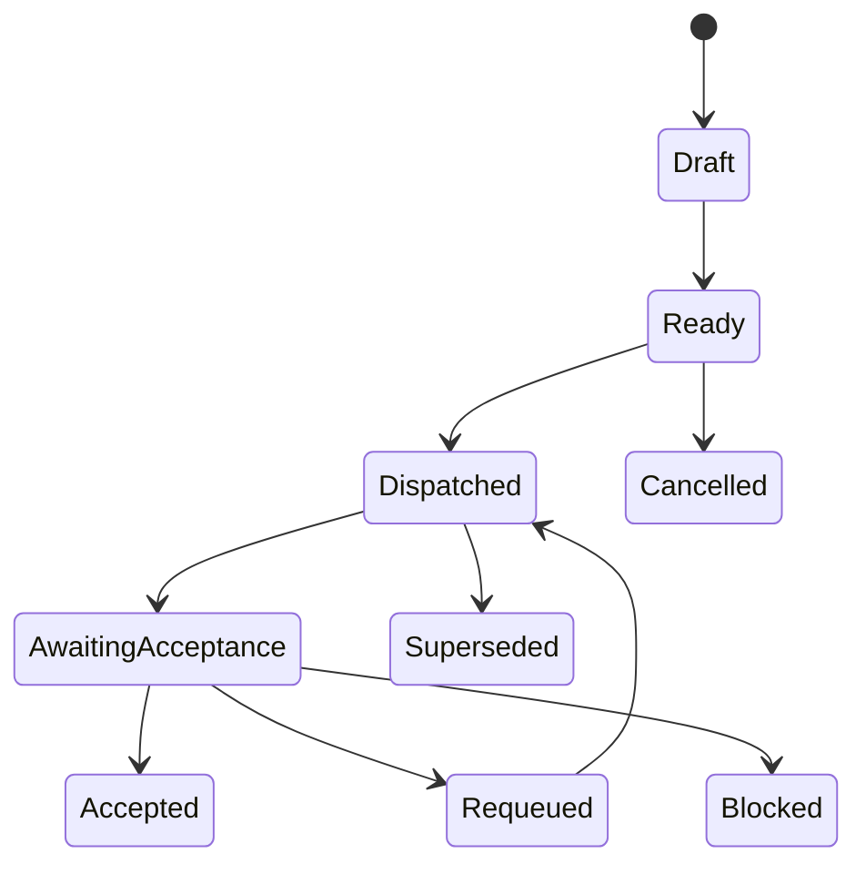
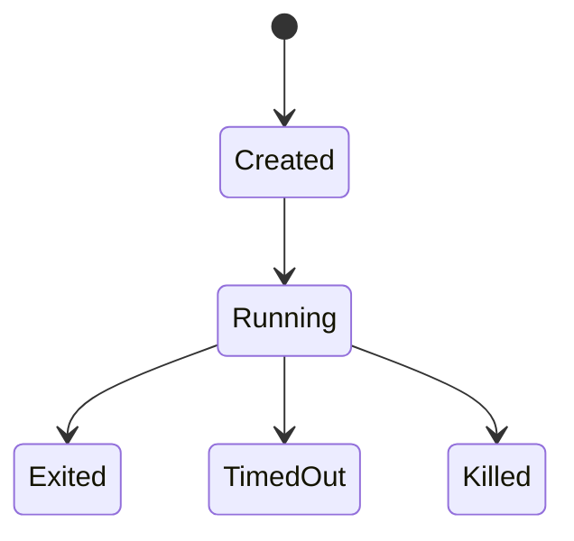

# 02 对象状态迁移

## 总则

- 所有状态变化必须显式记录。
- 禁止通过文件名或“看起来完成”推断状态。
- Worker 运行状态与 Task 业务状态必须分离建模。

## 关键迁移链

- Directive → Brief → Project Charter / Execution Plan
- Execution Plan → Phase → Task
- Task 与 AgentRun 分别维护各自状态机

## Task 状态机（建议）

说明：

- `Dispatched` 表示已经为 Task 创建了一个或多个 AgentRun。
- `AwaitingAcceptance` 表示 Worker 已退出并提交 Handoff，但任务尚未验收。
- `Accepted` 之前，Task 不能被视为最终完成。

## AgentRun 状态机（建议）

说明：

- `Exited` 只表示该次 Worker 运行正常结束。
- `TimedOut` 和 `Killed` 表示该次运行需要由 Orchestrator 接管后续处理。
- AgentRun 的结束不直接决定 Task 的完成状态。

## Acceptance 状态（建议）

- Pending
- Accepted
- Rejected
- NeedsFollowup

## 守卫条件（Guard Conditions）

每次迁移至少检查：

- 输入完整性
- 前置条件满足
- 目标状态合法
- 审计字段齐全（时间、操作者、原因）
