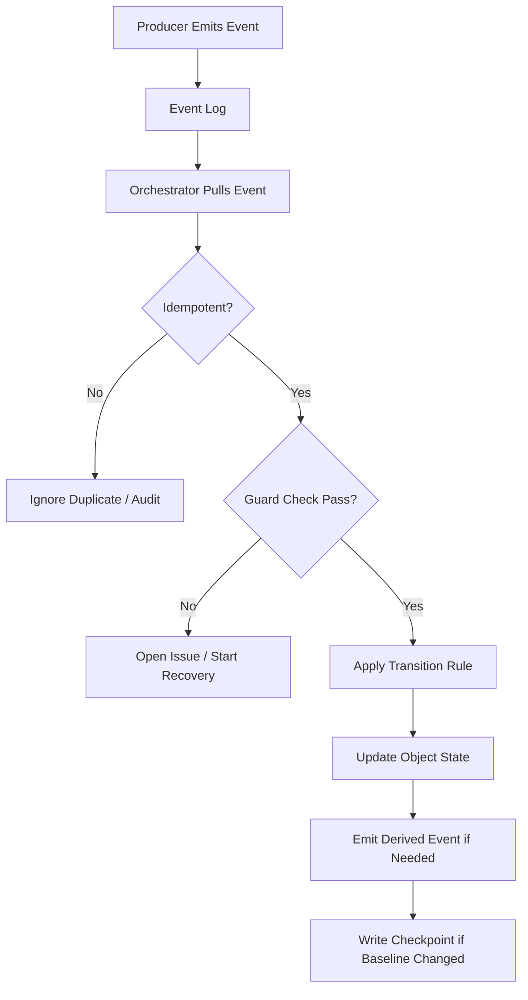

# 03 Event Model

## Purpose

- 定义 Hive 运行时事件协议。
- 约束事件、对象状态、状态迁移三者的关系。
- 为 Orchestrator 的控制回路提供确定性输入。

## Scope

- 本文只定义运行时事件，不定义最终存储实现。
- 事件用于驱动状态推进，不替代对象状态本身。

## Definitions

- `Event`：一次已发生事实的结构化记录。
- `Producer`：生成事件的对象或角色。
- `Consumer`：消费事件并据此采取动作的对象或角色。
- `Transition Event`：会触发对象状态迁移的事件。
- `Derived Event`：由其他事件或状态变化派生出的事件。

## Rules

### Event Discipline

- 事件必须不可变。
- 事件必须带唯一 `event_id`。
- 事件只记录“发生了什么”，不记录“应该怎么想”。
- 对象状态仍是事实来源，事件是状态推进输入。
- 任一关键状态迁移都必须能追溯到事件。

### Event Minimum Schema

```yaml
event_id: evt_20260410_001
event_type: TaskDispatched
object_ref:
  object_type: Task
  object_id: task_backend_auth_01
producer:
  role: Orchestrator
  ref: orchestrator/main
consumers:
  - role: Orchestrator
  - role: StateStore
caused_by:
  event_id: evt_20260410_000
correlation_id: corr_plan_rev_12
occurred_at: 2026-04-10T10:00:00Z
payload:
  task_id: task_backend_auth_01
  phase_id: phase_backend
  run_id: run_codex_003
idempotency_key: task_backend_auth_01:dispatch:v12
transition_effect:
  task_status_from: ready
  task_status_to: dispatched
```

### Idempotency, Dedup, Replay

- 同一 `idempotency_key` 的事件必须视为同一事实。
- 消费者必须支持按 `event_id` 或 `idempotency_key` 去重。
- 事件重放不得生成重复状态迁移。
- 重放时应以对象当前状态做 guard check。
- 事件日志允许追加，不允许就地改写历史。

### Event and Object State Relationship

- 事件记录“事实发生”。
- 对象记录“当前状态”。
- 事件可触发状态迁移，但不能绕过对象校验规则直接改状态。
- 当事件与对象状态冲突时，必须写出 `Issue` 或 `RecoveryStarted`，不得静默覆盖。

## Event Catalog

| Event Type | Producer | Consumer | Transition Effect |
|---|---|---|---|
| `UserInputReceived` | User Input Adapter | Orchestrator | 创建或更新 `Directive` |
| `RuntimeDirectiveCreated` | Orchestrator | Orchestrator / Planning Layer | 进入 impact analysis |
| `ResearchRequested` | Orchestrator | Planning Layer | 创建 `Research Sprint` |
| `PlanCompiled` | Planning Layer | Orchestrator / State Store | 生成新 `Execution Plan` |
| `PlanRevised` | Orchestrator | Planning Layer / State Store | 创建 Plan Revision |
| `TaskCreated` | Plan Compiler | Orchestrator / State Store | 生成 `Task` |
| `TaskQualified` | Orchestrator | Scheduler | `Task.draft -> ready` |
| `DispatchPrepared` | Orchestrator | Executor Adapter / Lock Manager / State Store | `Task.ready -> dispatching`，创建 `AgentRun(created)`，预留锁 |
| `TaskDispatched` | Orchestrator | Executor Adapter / State Store | `Task.dispatching -> dispatched` |
| `AgentRunStarted` | Executor Adapter | Orchestrator / State Store | `AgentRun.starting -> running` |
| `AgentRunStartFailed` | Executor Adapter / Recovery | Orchestrator / State Store | `AgentRun.created / starting -> start_failed` |
| `AgentRunHeartbeatMissed` | Lease Monitor | Orchestrator | 标记 heartbeat 风险 |
| `AgentRunTimedOut` | Lease Monitor | Orchestrator / Recovery | `AgentRun.running -> timed_out` |
| `AgentRunKilled` | Orchestrator / Adapter | State Store / Recovery | `AgentRun.running -> killed` |
| `AgentRunExited` | Executor Adapter | Orchestrator / State Store | `AgentRun.running -> exited` |
| `HandoffSubmitted` | Worker / Adapter | Orchestrator / Acceptance Engine | `Task.dispatched -> awaiting_acceptance` |
| `AcceptancePassed` | Acceptance Engine | Orchestrator / State Store | `Task.awaiting_acceptance -> accepted` |
| `AcceptanceRejected` | Acceptance Engine | Orchestrator / Recovery | `Task.awaiting_acceptance -> requeued / blocked` |
| `AcceptanceNeedsFollowup` | Acceptance Engine | Orchestrator / Recovery | 生成 followup action |
| `AcceptancePartiallyAccepted` | Acceptance Engine | Orchestrator / Recovery | 记录 partial accept 与后续动作 |
| `IssueOpened` | Worker / Orchestrator / Acceptance | Orchestrator / Queen | 创建或更新 `Issue` |
| `IssueEscalated` | Orchestrator | Queen / Decision Layer | 触发裁决流 |
| `LockAcquired` | Lock Manager | Orchestrator / Scheduler / State Store | `Lock.requested/reserved -> reserved/active` |
| `LockConflictDetected` | Lock Manager | Orchestrator / Scheduler | 任务进入 blocked 或等待 |
| `LockRecoveryHeld` | Recovery Coordinator / Lock Manager | Orchestrator / Recovery | `Lock.active -> recovery_hold` |
| `LockReleased` | Lock Manager / Recovery | Orchestrator / State Store | `Lock.active/recovery_hold -> released` |
| `CheckpointWritten` | Orchestrator | Recovery Layer / State Store | 更新恢复基线 |
| `ContextResetRequested` | Orchestrator / Policy | Orchestrator / Recovery | 触发控制回合结束与重建 |
| `RecoveryStarted` | Orchestrator | Recovery Layer | 进入恢复流程 |
| `RecoveryCompleted` | Recovery Layer | Orchestrator / State Store | 恢复完成并回到调度流 |

## Protocol Steps

1. Producer 生成事件并写入事件流。
2. Consumer 按类型、相关对象和优先级拉取事件。
3. Consumer 做幂等检查与状态 guard check。
4. 若事件合法，则执行状态迁移或生成派生事件。
5. 若事件非法或重复，则记录审计结果，不得静默丢弃。
6. 对会影响恢复基线的事件，必须在适当时机触发 `CheckpointWritten`。
7. 具体 change-set 顺序与失败补偿见 `../06-coordination/02-Consistency-and-Transaction-Boundaries.md`。

## Mermaid Diagram

### Event Flow and State Update



## Anti-patterns

- 直接把对话文本当事件事实。
- 用事件日志替代对象当前状态。
- 同一事件重复消费并重复改状态。
- 事件触发后不写审计字段。
- 发生冲突时直接覆盖对象状态。

## Acceptance Criteria

- 任一关键状态迁移都能定位到来源事件。
- 任一事件都具备 `event_id`、`event_type`、`object_ref`、`producer`、`occurred_at`。
- 事件重复投递时不会造成重复状态迁移。
- 恢复流程能基于事件日志与对象状态重建控制回合。
