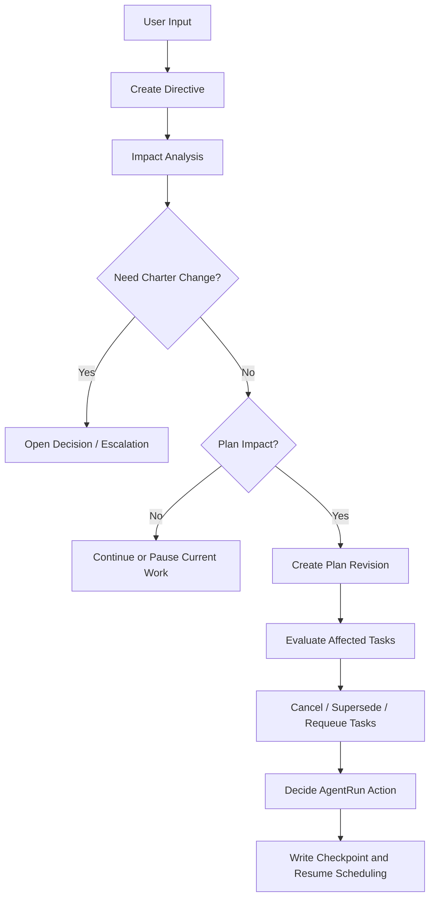
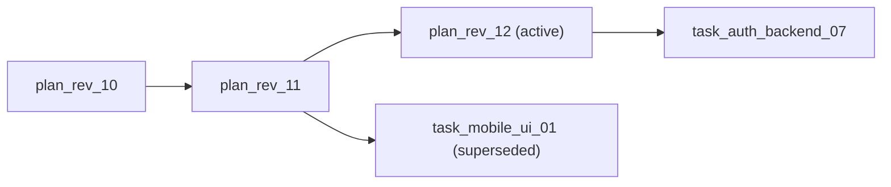

# 04 Plan Versioning and Supersession

## Purpose

- 定义运行中用户纠偏如何进入 Hive。
- 定义 `Directive`、Plan Revision、Task Supersession 的处理协议。
- 保证 Charter、Execution Plan、Task 三层边界不混乱。

## Scope

- 本文覆盖运行中追加输入、计划修订、任务替换、任务取消、运行中回收。
- 不覆盖具体研究内容和执行器实现细节。

## Definitions

- `Runtime Directive`：运行中新增的结构化用户指令。
- `Impact Analysis`：评估某条 Directive 对 Charter、Plan、Phase、Task、AgentRun 的影响。
- `Plan Revision`：Execution Plan 的一次有版本号的增量修订。
- `Superseded Task`：因新计划替换而停止作为当前事实的 Task。
- `Soft Stop`：允许 AgentRun 完成当前最小步骤后退出。
- `Hard Kill`：立即结束 AgentRun。
- `Finish Current Step`：在不扩展范围的前提下，收尾当前已开始的局部动作。

## Rules

### Runtime Directive Intake

- 用户运行中新增输入必须先落成 `Directive`。
- `Directive` 不得直接改写 `Execution Plan`、`Task` 或 `AgentRun` 状态。
- 每条 `Directive` 必须带影响范围、优先级、来源和处理结论。

### Charter and Execution Plan Separation

- `Charter` 是稳定层，定义目标边界、不可违反约束、关键原则。
- `Execution Plan` 是演进层，定义阶段、任务图、验证路径和调度次序。
- 运行中纠偏默认优先修改 `Execution Plan`。
- 只有当方向、边界或硬约束变化时，才允许触发 `Charter` 修订。

### Plan Revision Rule

- 每次 `Execution Plan` 修改必须生成新 revision。
- 新 revision 必须引用前一 revision。
- 任一 `Task` 必须记录它依附的 `plan_revision_id`。
- 旧 revision 不可覆盖删除，只能标记为 superseded 或 archived。

### Supersession Rule

- 只有 `Orchestrator` 可以判定 `Task` 进入 `superseded`。
- `Task` 被 supersede 时，必须同时评估相关 `AgentRun` 的处置方式。
- `Task` 进入 `superseded` 不等于 `AgentRun` 自动失效；必须显式决定 `soft_stop`、`finish_current_step` 或 `hard_kill`。
- `Handoff` 若来自 superseded run，仍可被回收为 `partial artifact`，但默认不得直接作为 `accepted completion`。

### Allowed Outcomes of Impact Analysis

- `continue`：无状态影响，继续当前执行。
- `pause`：暂停某一工作线，保留恢复点。
- `cancel`：取消未开始或不再需要的工作。
- `supersede`：用新任务或新 revision 替换旧任务。
- `replan`：需要重新编译 `Execution Plan` 或部分任务图。

## Protocol Steps

1. `UserInputReceived`。
2. `Orchestrator` 创建 `Runtime Directive`。
3. 执行 impact analysis，识别受影响的 `Charter / Execution Plan / Phase / Task / AgentRun`。
4. 产出处理结论：`continue / pause / cancel / supersede / replan`。
5. 若需改计划，则生成新的 `plan_revision_id` 并建立 revision chain。
6. 更新受影响 `Task` 的状态与替代关系。
7. 对活跃 `AgentRun` 决定 `soft_stop / finish_current_step / hard_kill`。
8. 写入 `Decision`、`Issue`、`Checkpoint`，然后恢复调度。

## State / Schema

### Runtime Directive Minimum Schema

```yaml
directive_id: dir_20260410_02
source: user
created_at: 2026-04-10T11:00:00Z
content: 暂停移动端界面，优先补登录链路与权限模型
impact_scope:
  charter: false
  execution_plan: true
  phases:
    - phase_ui
    - phase_auth
  tasks:
    - task_mobile_ui_01
    - task_auth_backend_03
decision: supersede
required_actions:
  - create_plan_revision
  - supersede_task
  - finish_current_step
status: applied
```

### Plan Revision Minimum Schema

```yaml
plan_revision_id: plan_rev_12
execution_plan_id: plan_main
previous_revision_id: plan_rev_11
directive_refs:
  - dir_20260410_02
change_summary:
  - deprioritize mobile ui
  - prioritize auth capability
affected_phase_ids:
  - phase_ui
  - phase_auth
superseded_task_ids:
  - task_mobile_ui_01
new_task_ids:
  - task_auth_backend_07
status: active
```

## Mermaid Diagram

### Runtime Directive to Plan Revision Flow



### Plan Revision Chain



## Anti-patterns

- 用户一句话直接改 `Task` 文件，不经过 `Directive`。
- 用新 revision 覆盖旧 revision。
- 让 Worker 自行决定是否 supersede 其他任务。
- 运行中有方向变化，却不记录影响范围。
- 将 superseded handoff 直接当作 accepted completion。

## Acceptance Criteria

- 任一运行中纠偏都能追溯到 `Directive` 和 `plan_revision_id`。
- 任一 superseded task 都能找到替代关系或取消原因。
- 任一活跃 `AgentRun` 都能找到 soft-stop、finish-current-step 或 hard-kill 的明确决策。
- `Charter` 与 `Execution Plan` 的修改路径明确分层。
