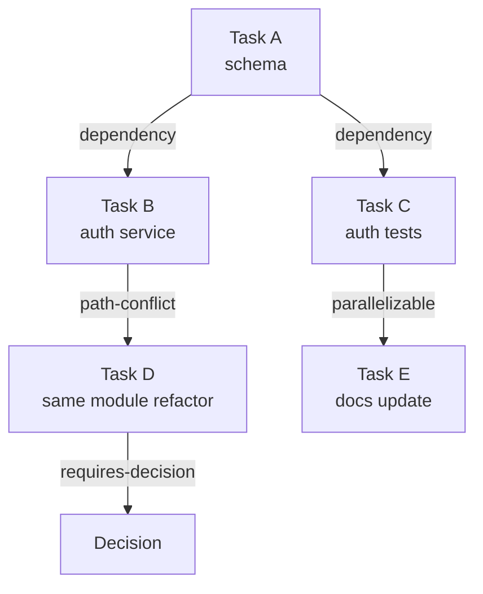
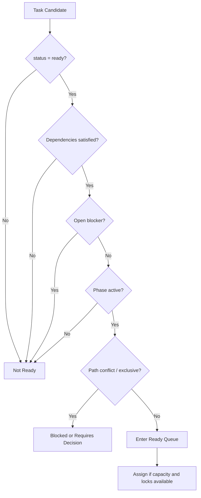

# 05 Task Graph Model

## Purpose

- 把 `Task` 从单个对象提升为可调度的任务图。
- 定义依赖、冲突、并发与 ready queue 的判定规则。
- 为 Orchestrator 的确定性调度提供基础。

## Scope

- 本文定义任务图语义与调度元数据。
- 具体派发协议见执行层与可靠性层文档。

## Definitions

- `Task Graph`：由 `Task` 节点和关系边构成的执行图。
- `Dependency`：目标 Task 必须等待前置 Task 完成。
- `Blocker`：阻止 Task 进入 ready 状态的显式问题。
- `Parallelizable`：可与其他 Task 并行执行。
- `Mutually Exclusive`：两个 Task 不允许同时执行。
- `Path Conflict`：两个 Task 的写路径发生冲突。
- `Compensating Task`：用于回滚、修复或补偿失败结果的 Task。

## Rules

### Task Graph Edge Types

- `dependency`
- `prerequisite`
- `blocker`
- `parallelizable`
- `mutually-exclusive`
- `path-conflict`
- `requires-decision`
- `requires-human-confirmation`
- `retryable`
- `compensating-task`
- `replan-needed`

### Ready Queue Rule

`Task` 进入 ready queue 至少满足：

- `task.status = ready`
- 所有 `dependency` 与 `prerequisite` 已满足
- 无开放 `blocker`
- 所属 `phase.status = active`
- 不处于 `requires-decision`
- 不处于 `requires-human-confirmation`
- 无未解决 `path-conflict` 或 `mutually-exclusive` 冲突

### Concurrent Dispatch Rule

只有同时满足以下条件，Orchestrator 才能并发派发多个 Task：

- 任务之间不存在 `mutually-exclusive`
- 任务写路径不冲突
- 任务不争抢同一 repo-level lock
- 当前执行器池容量足够
- 阶段策略允许并发

### Conflict Detection Rule

- 冲突检测必须基于显式元数据，不得靠 Worker 自行猜测。
- 任何路径冲突必须在派发前发现并记录。
- 发现冲突时，Task 应进入 `blocked` 或 `requires-decision`，而不是继续并发执行。

## Protocol Steps

1. 从 `Execution Plan` 生成 Task 节点。
2. 为每个 Task 填写依赖、路径、验证、升级字段。
3. 生成任务图边。
4. Orchestrator 周期性评估 ready queue。
5. 对 ready queue 做冲突检测与优先级排序。
6. 满足并发条件的 Task 才允许分发到多个 Worker。

## State / Schema

### Task Graph Node Minimum Schema

```yaml
task_id: task_auth_backend_07
phase_id: phase_auth
plan_revision_id: plan_rev_12
status: ready
dependencies:
  - task_auth_schema_01
prerequisites:
  - decision_auth_boundary
blockers: []
parallelizable_with:
  - task_auth_docs_02
mutually_exclusive_with: []
path_locks:
  write:
    - services/auth/**
  read:
    - docs/**
requires_decision: false
requires_human_confirmation: false
retryable: true
compensating_task_ids: []
```

## Mermaid Diagram

### Task Graph and Scheduling Semantics



### Ready Queue Decision Flow



## Anti-patterns

- 把 Task 当成互相无关的平面列表。
- 未记录依赖就按直觉并发派发。
- 两个 Worker 同时写同一路径而不加锁。
- 用 free-form prompt 代替任务图元数据。
- 失败后不生成 compensating task 或 recovery path。

## Acceptance Criteria

- 任一 ready task 都能说明为何 ready。
- 任一 blocked task 都能定位阻塞来源。
- 任一并发派发都能证明不存在路径冲突或互斥关系。
- 任一 supersede 或 retry 都能在任务图中追溯到替代关系。
