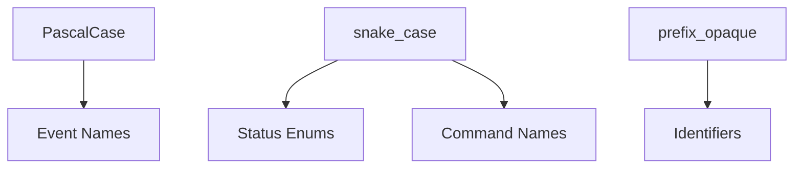

# 06 Canonical Enums and Identifiers

## Purpose

- 提供 Hive 的单一 canonical registry。
- 统一状态枚举、事件名、标识符前缀与字段命名。
- 消除实现前的命名漂移。

## Scope

- 本文是对象状态、事件名、ID 命名和字段风格的 canonical source。
- 若其他章节与本文冲突，以本文为准，并应回填修正。

## Definitions

- `Canonical`：在 Hive 文档体系中唯一推荐的正式写法。
- `Legacy Form`：历史文档中出现过但不再推荐的写法。
- `Opaque Suffix`：不承载业务状态语义的唯一后缀，可为时间戳、序号、ULID 或其他稳定唯一值。

## Rules

### Naming Style Rules

- 对象状态枚举统一使用 `snake_case`。
- 事件名统一使用 `PascalCase`。
- 命令名统一使用 `snake_case`。
- 布尔字段统一使用 `is_*`、`has_*`、`supports_*`。
- 时间字段统一使用 `*_at`。
- 引用字段统一使用 `*_ref` 或 `*_id`。
- 列表字段统一使用复数名，如 `artifact_refs`、`open_issue_ids`。

### Identifier Rules

- 所有 ID 必须小写、稳定、可序列化。
- 所有 ID 必须包含固定前缀与 opaque suffix。
- ID 不得编码可变状态，不得把 `done`、`blocked` 等状态嵌进 ID。

### ID Prefix Registry

| Identifier | Canonical Prefix | Example |
|---|---|---|
| `directive_id` | `dir_` | `dir_20260410_01` |
| `brief_id` | `brief_` | `brief_auth_01` |
| `charter_id` | `charter_` | `charter_main` |
| `execution_plan_id` | `plan_` | `plan_main` |
| `plan_revision_id` | `plan_rev_` | `plan_rev_12` |
| `phase_id` | `phase_` | `phase_auth` |
| `task_id` | `task_` | `task_auth_backend_07` |
| `run_id` | `run_` | `run_codex_003` |
| `handoff_id` | `handoff_` | `handoff_20260410_03` |
| `acceptance_id` | `acceptance_` | `acceptance_20260410_01` |
| `issue_id` | `issue_` | `issue_auth_timeout_01` |
| `lock_id` | `lock_` | `lock_auth_write_07` |
| `checkpoint_id` | `checkpoint_` | `checkpoint_20260410_01` |
| `event_id` | `evt_` | `evt_20260410_001` |
| `changeset_id` | `cs_` | `cs_20260410_0001` |
| `dispatch_intent_id` | `dispatch_` | `dispatch_task_auth_backend_07_01` |
| `recovery_action_id` | `recovery_` | `recovery_run_codex_003_01` |
| `research_sprint_id` | `rs_` | `rs_20260411_01` |
| `evidence_pack_id` | `ep_` | `ep_20260411_02` |
| `product_spec_id` | `spec_` | `spec_20260411_01` |
| `execution_package_id` | `exec_pkg_` | `exec_pkg_20260411_01` |
| `task_graph_id` | `tg_` | `tg_20260411_01` |
| `run_contract_id` | `rc_` | `rc_20260411_04` |
| `dossier_id` | `dossier_` | `dossier_20260411_01` |
| `scaffold_id` | `scaffold_` | `scaffold_20260411_04` |
| `compilation_batch_id` | `compile_` | `compile_20260411_07` |

### Legacy Forms to Avoid

| Legacy Form | Canonical Form |
|---|---|
| `needs-followup` | `needs_followup` |
| `partial-accept` | `partial_accepted` |
| `acc_001` | `acceptance_001` |
| `cp_20260410_01` | `checkpoint_20260410_01` |
| `start-failed` | `start_failed` |

## Canonical Status Enums

### Directive.status

- `created`
- `assessing`
- `applied`
- `escalated`
- `superseded`
- `archived`

### PlanRevision.status

- `draft`
- `compiled`
- `active`
- `superseded`
- `archived`

### Phase.status

- `draft`
- `active`
- `blocked`
- `completed`
- `cancelled`
- `superseded`
- `archived`

### Task.status

- `draft`
- `ready`
- `dispatching`
- `dispatched`
- `awaiting_acceptance`
- `accepted`
- `requeued`
- `blocked`
- `cancelled`
- `superseded`
- `archived`

### AgentRun.status

- `created`
- `starting`
- `running`
- `exited`
- `start_failed`
- `timed_out`
- `killed`
- `archived`

### AgentRun.exit_status

- `succeeded`
- `failed`
- `blocked`
- `timed_out`
- `cancelled`
- `killed`
- `unknown`

### Handoff.status

- `draft`
- `submitted`
- `ingested`
- `linked_to_acceptance`
- `archived`

### Handoff.result_claim

- `complete`
- `partial`
- `failed`
- `blocked`

### Acceptance.status

- `pending`
- `accepted`
- `rejected`
- `needs_followup`
- `partial_accepted`
- `archived`

### Issue.status

- `open`
- `triaged`
- `escalated`
- `resolved`
- `archived`

### Issue.type

- `execution_failure`
- `design_conflict`
- `requirement_conflict`
- `lock_conflict`
- `recovery_anomaly`

### Lock.status

- `requested`
- `reserved`
- `active`
- `recovery_hold`
- `released`
- `force_released`
- `expired`

### Lock.scope_type

- `repo`
- `module`
- `path`

### Lock.mode

- `read`
- `write`

### Checkpoint.status

- `written`
- `superseded`
- `archived`

### CompiledArtifact.status

- `compiled`
- `active`
- `superseded`
- `stale`
- `failed`
- `archived`

### CompilationBatch.status

- `compiled`
- `partial`
- `failed`
- `archived`

## Canonical Event Registry

### Input and Planning Events

- `UserInputReceived`
- `RuntimeDirectiveCreated`
- `ResearchRequested`
- `ResearchSprintCompiled`
- `EvidencePackCompiled`
- `ProductSpecCompiled`
- `ExecutionPackageCompiled`
- `PlanCompiled`
- `PlanRevised`
- `TaskCreated`
- `TaskQualified`
- `TaskGraphCompiled`

### Dispatch and Run Events

- `DispatchPrepared`
- `RunContractCompiled`
- `SessionScaffoldCompiled`
- `TaskDispatched`
- `TaskRequeued`
- `TaskBlocked`
- `TaskSuperseded`
- `TaskCancelled`
- `AgentRunStarted`
- `AgentRunHeartbeatReported`
- `AgentRunHeartbeatMissed`
- `AgentRunStartFailed`
- `AgentRunTimedOut`
- `AgentRunKilled`
- `AgentRunExited`

### Handoff and Acceptance Events

- `HandoffSubmitted`
- `AcceptancePassed`
- `AcceptanceRejected`
- `AcceptanceNeedsFollowup`
- `AcceptancePartiallyAccepted`

### Issue and Lock Events

- `IssueOpened`
- `IssueEscalated`
- `LockAcquired`
- `LockConflictDetected`
- `LockRecoveryHeld`
- `LockReleased`

### Recovery and Checkpoint Events

- `ProjectDossierCompiled`
- `CheckpointWritten`
- `ContextResetRequested`
- `RecoveryStarted`
- `RecoveryCompleted`

## Field Naming Rules

### Required Core Reference Fields

- `directive_id`
- `plan_revision_id`
- `phase_id`
- `task_id`
- `run_id`
- `handoff_id`
- `acceptance_id`
- `issue_id`
- `lock_id`
- `checkpoint_id`
- `dispatch_intent_id`
- `recovery_action_id`
- `compilation_batch_id`
- `event_id`
- `changeset_id`

### Canonical Common Fields

- `status`
- `artifact_type`
- `created_at`
- `updated_at`
- `occurred_at`
- `compiled_at`
- `correlation_id`
- `caused_by_event_id`
- `payload_ref`
- `compiled_from_refs`
- `superseded_by_ref`
- `artifact_refs`
- `log_refs`
- `validation_results`
- `followup_actions`
- `idempotency_key`

## Mermaid Diagram

### Canonical Naming Layers

## Anti-patterns

- 在不同章节混用 `needs-followup` 和 `needs_followup`。
- 在同一对象上同时出现 `result` 和 `status` 但语义不区分。
- 用缩写 ID 前缀导致可读性不稳定。
- 将事件名写成 `snake_case` 或状态写成 `PascalCase`。

## Acceptance Criteria

- 任一状态、事件、ID 写法都能在本文找到 canonical form。
- 读者不需要再跨章猜测 `partial-accept` 与 `partial_accepted` 是否同义。
- 实现方可以据此直接生成 enum、validator、ID helper。
