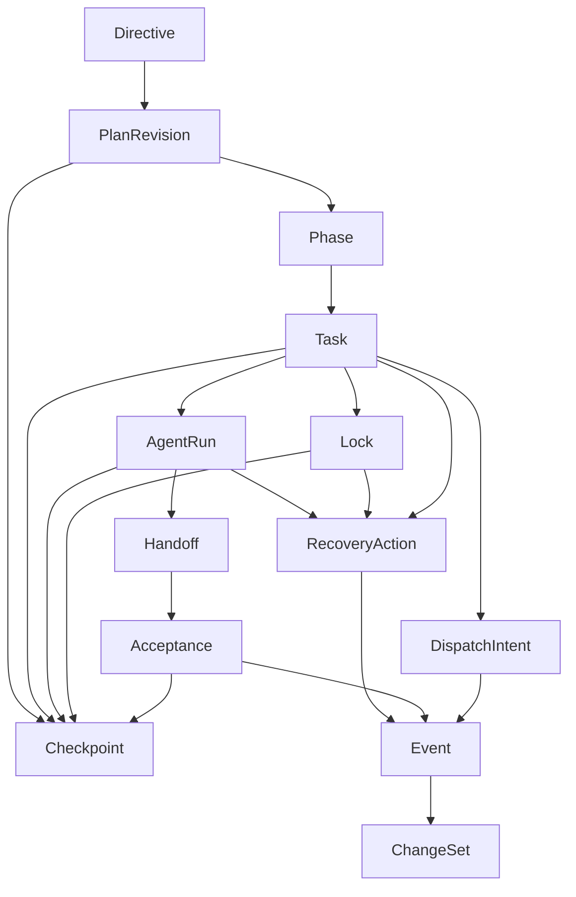

# 07 MVP Object Package

## Purpose

- 把首版真正要落地的对象集合收敛成可实现的数据模型包。
- 明确每个对象在 MVP 中的 required fields、deferred fields、存储形态和引用完整性要求。
- 让工程师可以直接开始写 schema、repository、fixture 和 referential integrity 校验。

## Scope

- 本文只覆盖 first implementation 的对象包。
- 本文不重写全量对象模型；Research Sprint、Evidence Pack、Brief、Decision、Artifact 等保留在协议层，但不进入首版核心对象包。
- vNext 中新增的 `Product Spec`、`Run Contract`、更完整的 planning artifacts 仍先作为协议层或编译产物存在；即使下一阶段把它们持久化，也不会替代当前 `PlanRevision / Task / AgentRun` 这一组 authoritative runtime objects。
- vNext compiled artifact package 的落位方式见 `08-vNext-Compiled-Artifact-Package.md`。
- canonical 命名、状态枚举、ID 前缀以 `./06-Canonical-Enums-and-Identifiers.md` 为准。
- change-set / event 语义以 `../06-coordination/03-Change-Set-and-Outbox-Contract.md` 与 `./03-event-model.md` 为准。

## Definitions

- `Authoritative State`：当前事实来源，读取当前状态必须以对象表为准。
- `Derived State`：由 authoritative state 和 event cursor 派生出的快照或汇总。
- `Deferred Field`：协议允许存在，但首版可不持久化或只保留占位结构的字段。
- `Referential Integrity`：对象间引用在提交 change-set 时必须通过存在性与一致性校验。

## Rules

### MVP 对象包范围

首版必须落地以下对象：

- `Directive`
- `PlanRevision`
- `Phase`
- `Task`
- `AgentRun`
- `Handoff`
- `Acceptance`
- `Issue`
- `Lock`
- `Checkpoint`
- `DispatchIntent`
- `RecoveryAction`
- `Event`
- `ChangeSet`

首版明确不作为一等对象落地：

- `Research Sprint`
- `Evidence Pack`
- `Brief`
- `Product Spec`
- `Execution Plan` 独立实体
- `Run Contract`
- `Decision`
- `Artifact`

这些对象或概念在首版中只作为输入引用、fixture 或嵌套字段存在，不单独建 authoritative table。

补充说明：

- 这不表示 vNext 不需要它们，而是表示当前 MVP 不把这些 planning / handoff artifacts 作为一等 runtime truth tables。
- 下一阶段若为 `Product Spec` 或 `Run Contract` 增加 durable compiled artifact，也必须保持当前事实层级不变：
  - 当前事实仍读对象表
  - Event Log 仍是历史
  - Checkpoint 仍是恢复快照

- `Requirement Ledger` 是首轮闭环必需的协议结构，但在当前 MVP object package 中可先作为 `PlanRevision` 附属结构或独立 ledger 文档引用实现。
- 也就是说，ledger 在语义上是 authoritative planning state 的一部分，但首版不强制要求把它拆成独立一等对象表。

### 对象依赖图



### 对象依赖表

| 对象 | 直接依赖 | 依赖原因 |
|---|---|---|
| `Directive` | 无 | 从 intake 生成，作为 planning 输入 |
| `PlanRevision` | `Directive` | 一个 revision 至少要能回溯到触发它的 directive 集 |
| `Phase` | `PlanRevision` | phase 属于某个 revision |
| `Task` | `PlanRevision`、`Phase` | task 既归属 plan revision，也归属 phase |
| `DispatchIntent` | `Task`、`AgentRun` | intent 是 task 派发准备对象，并绑定 run |
| `AgentRun` | `Task` | run 只是 task 的一次执行尝试 |
| `Handoff` | `Task`、`AgentRun` | handoff 必须落到某次 run 的结果 |
| `Acceptance` | `Task`、`Handoff` | acceptance 评估某个 handoff 是否通过 |
| `Issue` | 任一核心对象 | 问题总是附着在某个对象或 change-set 上 |
| `Lock` | `Task`、`AgentRun` | lock 必须知道 owner |
| `RecoveryAction` | `Task` / `AgentRun` / `Lock` / `Issue` | 恢复动作总是处理已有异常对象 |
| `Checkpoint` | `PlanRevision` + event cursor + open object set | checkpoint 是恢复快照 |
| `Event` | 任一对象或 intake journal | event 记录事实发生 |
| `ChangeSet` | command + object delta + outbox | change-set 是统一提交包 |

### authoritative state vs derived state

| 分类 | 对象 | 说明 |
|---|---|---|
| authoritative state | `Directive`、`PlanRevision`、`Phase`、`Task`、`AgentRun`、`Handoff`、`Acceptance`、`Issue`、`Lock`、`DispatchIntent`、`RecoveryAction` | 读取当前事实时必须以这些对象表为准 |
| authoritative history | `Event`、`ChangeSet` | 追加历史、审计与 replay 输入，不替代当前状态 |
| derived state | `Checkpoint` | 由 authoritative state + event cursor 派生 |

### 存储形态约束

| 对象 | 首版存储建议 | 可否 file-backed / json-store | 说明 |
|---|---|---|---|
| `Directive` | SQLite row | 可用 JSON 列承载 `impact_scope` | 当前状态必须可索引 |
| `PlanRevision` | SQLite row | 可用 JSON 列承载 `directive_refs`、`supersession_map` | 必须可按 status / previous_revision 查询 |
| `Phase` | SQLite row | 可用 JSON 列承载 gate 规则 | 当前 phase gate 需要可查询 |
| `Task` | SQLite row | 可用 JSON 列承载 `scope`、`constraints`、`done_criteria` | 不允许纯文件存储 |
| `DispatchIntent` | SQLite row | 可用 JSON 列承载 `lock_request_set`、`workspace_plan` | 需参与重复派发判定 |
| `AgentRun` | SQLite row | 可用 JSON 列承载 `log_refs`、`adapter_payload` | 不允许纯文件存储 |
| `Handoff` | SQLite row + filesystem artifact refs | 可以 file-backed 保存 handoff 附件内容 | authoritative 是 SQLite 中的 handoff record |
| `Acceptance` | SQLite row | 可用 JSON 列承载 `evidence_summary`、`followup_actions` | 不允许纯文件存储 |
| `Issue` | SQLite row | 可用 JSON 列承载 `suggested_actions` | 需参与 reconcile |
| `Lock` | SQLite row | resource ref 可为 JSON | 当前锁状态必须可索引 |
| `RecoveryAction` | SQLite row | `related_object_refs` 可为 JSON | 需参与 recovery backlog |
| `Checkpoint` | SQLite row + 可选 JSON export | 可额外导出到 filesystem | authoritative 仍是 SQLite |
| `Event` | SQLite append-only table | payload 使用 JSON | 可选 JSONL 导出调试 |
| `ChangeSet` | SQLite append-only table | delta、markers 使用 JSON | authoritative commit history |

### 引用完整性规则

提交 change-set 时，至少要做以下校验：

| 关系 | 必须校验 |
|---|---|
| `Phase.plan_revision_id -> PlanRevision.plan_revision_id` | phase 引用的 revision 必须存在 |
| `Task.phase_id -> Phase.phase_id` | task 必须属于现存 phase |
| `Task.plan_revision_id -> PlanRevision.plan_revision_id` | task 的 revision 与 phase 的 revision 必须一致 |
| `DispatchIntent.task_id -> Task.task_id` | intent 不能绑定不存在的 task |
| `DispatchIntent.run_id -> AgentRun.run_id` | intent 与 run 必须一一对应 |
| `AgentRun.task_id -> Task.task_id` | run 不能脱离 task 存在 |
| `Handoff.run_id -> AgentRun.run_id` | handoff 必须指向已存在 run |
| `Handoff.task_id -> Task.task_id` | handoff 必须与 run 的 task 一致 |
| `Acceptance.handoff_id -> Handoff.handoff_id` | acceptance 必须指向已存在 handoff |
| `Acceptance.task_id -> Task.task_id` | acceptance 的 task 必须与 handoff.task_id 一致 |
| `Lock.owner_task_id -> Task.task_id` | lock owner task 存在，且状态允许持锁 |
| `Lock.owner_run_id -> AgentRun.run_id` | owner run 若存在，必须与 owner task 匹配 |
| `RecoveryAction.related_object_refs` | 所有被恢复对象必须存在 |
| `Checkpoint.plan_revision_id` | checkpoint 必须锚定现存 revision |
| `Event.object_ref` | event 必须指向核心对象或合法 intake journal ref |
| `ChangeSet.object_deltas` | delta 中的对象 after/before 类型必须与对象表一致 |

## Design Notes

### 对象逐项收敛

#### `Directive`

- MVP required fields
  - `directive_id`
  - `status`
  - `source`
  - `content`
  - `created_at`
  - `correlation_id`
- Deferred fields
  - `impact_scope`
  - `decision`
  - `superseded_by_directive_id`
- 存储
  - SQLite row
- 必须校验
  - `directive_id` 前缀合法
  - 同一 intake ref 不生成多个 active directive

#### `PlanRevision`

- MVP required fields
  - `plan_revision_id`
  - `status`
  - `created_at`
  - `previous_revision_id`
  - `directive_ids`
  - `active_phase_ids`
  - `supersession_map`
- Deferred fields
  - `execution_plan_id`
  - `charter_refs`
  - `evidence_pack_refs`
- 存储
  - SQLite row，列表和映射可走 JSON 列
- 必须校验
  - `previous_revision_id` 若存在则必须存在
  - 只能有一个 `active` revision

#### `Phase`

- MVP required fields
  - `phase_id`
  - `plan_revision_id`
  - `status`
  - `title`
  - `task_ids`
- Deferred fields
  - `acceptance_criteria`
  - `validation_plan`
  - `blocker_issue_ids`
- 存储
  - SQLite row
- 必须校验
  - `plan_revision_id` 存在
  - `task_ids` 中所有 task 必须属于同一 revision

#### `Task`

- MVP required fields
  - `task_id`
  - `plan_revision_id`
  - `phase_id`
  - `status`
  - `objective`
  - `scope`
  - `constraints`
  - `done_criteria`
  - `validation_method`
  - `acceptance_policy_ref`
- Deferred fields
  - `dependencies`
  - `allowed_paths`
  - `forbidden_paths`
  - `output_expectations`
  - `escalation_rule`
- 存储
  - SQLite row，复杂结构使用 JSON 列
- 必须校验
  - `phase_id` 与 `plan_revision_id` 一致
  - 同一时刻最多一个 active `DispatchIntent`

#### `AgentRun`

- MVP required fields
  - `run_id`
  - `task_id`
  - `executor_name`
  - `status`
  - `workspace_ref`
  - `lease_expires_at`
  - `start_sla_expires_at`
  - `created_at`
- Deferred fields
  - `last_heartbeat_at`
  - `exit_status`
  - `adapter_run_ref`
  - `log_refs`
  - `handoff_ref`
- 存储
  - SQLite row，`log_refs` 为 JSON 列
- 必须校验
  - `task_id` 存在
  - 同一 task 在 `created / starting / running` 范围内最多一个 active run

#### `Handoff`

- MVP required fields
  - `handoff_id`
  - `task_id`
  - `run_id`
  - `status`
  - `result_claim`
  - `artifact_refs`
  - `submitted_at`
- Deferred fields
  - `validation_results`
  - `modified_files`
  - `decisions_made`
  - `assumptions`
  - `risks`
  - `next_steps`
- 存储
  - SQLite row + filesystem artifacts
- 必须校验
  - `run_id` 存在
  - `task_id` 与 `AgentRun.task_id` 一致
  - `artifact_refs` 可解析

#### `Acceptance`

- MVP required fields
  - `acceptance_id`
  - `task_id`
  - `handoff_id`
  - `status`
  - `reason`
  - `evaluated_at`
- Deferred fields
  - `run_id`
  - `input_set`
  - `evidence_summary`
  - `followup_actions`
- 存储
  - SQLite row，证据摘要可为 JSON
- 必须校验
  - `handoff_id` 存在
  - `task_id` 与 handoff 一致
  - 同一 `handoff_id + acceptance_policy_ref` 只有一个最终 acceptance

#### `Issue`

- MVP required fields
  - `issue_id`
  - `type`
  - `status`
  - `source_object_ref`
  - `impact`
  - `created_at`
- Deferred fields
  - `evidence_refs`
  - `suggested_actions`
  - `escalation_path`
- 存储
  - SQLite row
- 必须校验
  - `source_object_ref` 存在
  - open issue 不得静默覆盖为 resolved

#### `Lock`

- MVP required fields
  - `lock_id`
  - `scope_type`
  - `mode`
  - `status`
  - `resource_ref`
  - `owner_task_id`
- Deferred fields
  - `owner_run_id`
  - `lease_expires_at`
  - `last_renewed_at`
  - `recovery_hold_until`
  - `conflict_with`
- 存储
  - SQLite row
- 必须校验
  - `owner_task_id` 存在
  - path lock 同路径 + write 模式不能被两个 active owner 同时持有

#### `Checkpoint`

- MVP required fields
  - `checkpoint_id`
  - `status`
  - `created_at`
  - `plan_revision_id`
  - `event_log_cursor`
  - `active_phase_id`
  - `open_task_ids`
  - `active_run_ids`
  - `active_lock_ids`
  - `open_issue_ids`
- Deferred fields
  - `active_directive_ids`
  - `pending_decision_ids`
  - exported JSON body
- 存储
  - SQLite row，允许附加 filesystem export
- 必须校验
  - `plan_revision_id` 存在
  - `event_log_cursor` 不能回退

#### `DispatchIntent`

- MVP required fields
  - `dispatch_intent_id`
  - `task_id`
  - `run_id`
  - `executor_name`
  - `workspace_ref`
  - `status`
  - `lock_request_set`
  - `created_at`
- Deferred fields
  - `side_effect_token_id`
  - `launch_attempts`
  - `capability_snapshot`
- 存储
  - SQLite row，复杂字段可为 JSON
- 必须校验
  - `task_id` 和 `run_id` 都存在
  - 对同一 task 只能有一个 `prepared / launch_requested / acknowledged` intent

#### `RecoveryAction`

- MVP required fields
  - `recovery_action_id`
  - `status`
  - `reason`
  - `related_object_refs`
  - `created_at`
- Deferred fields
  - `latest_checkpoint_id`
  - `resolution_summary`
  - `resolved_at`
- 存储
  - SQLite row
- 必须校验
  - `related_object_refs` 全部存在
  - 同一 anomaly correlation 不得并发创建多个 active recovery action

#### `Event`

- MVP required fields
  - `event_id`
  - `event_type`
  - `object_ref`
  - `producer`
  - `occurred_at`
  - `idempotency_key`
  - `payload`
- Deferred fields
  - `caused_by_event_id`
  - `correlation_id`
  - `consumer_audit`
- 存储
  - SQLite append-only table，payload 走 JSON
- 必须校验
  - `event_type` 必须在 canonical registry 中
  - `event_id` / `idempotency_key` 去重

#### `ChangeSet`

- MVP required fields
  - `changeset_id`
  - `command_name`
  - `command_id`
  - `idempotency_key`
  - `issued_at`
  - `actor_ref`
  - `object_deltas`
  - `outbox_events`
  - `commit_result`
- Deferred fields
  - `lock_deltas`
  - `external_side_effects`
  - `reconciliation_markers`
  - `retry_markers`
  - `compensation_markers`
  - `correlation_id`
- 存储
  - SQLite append-only table，delta 和 marker 使用 JSON
- 必须校验
  - `object_deltas.before/after` 类型合法
  - `outbox_events` 的 `event_id` / `idempotency_key` 合法

### MVP required fields only：精简 schema 样例

```yaml
Directive:
  directive_id: dir_20260410_01
  status: applied
  source: user_input
  content: 先完成控制平面 MVP
  created_at: 2026-04-10T09:00:00Z
  correlation_id: corr_mvp_bootstrap

PlanRevision:
  plan_revision_id: plan_rev_01
  status: active
  created_at: 2026-04-10T09:01:00Z
  previous_revision_id: null
  directive_ids: [dir_20260410_01]
  active_phase_ids: [phase_mvp_foundation]
  supersession_map: {}

Phase:
  phase_id: phase_mvp_foundation
  plan_revision_id: plan_rev_01
  status: active
  title: Foundation
  task_ids: [task_schema_registry_01]

Task:
  task_id: task_schema_registry_01
  plan_revision_id: plan_rev_01
  phase_id: phase_mvp_foundation
  status: ready
  objective: 建立 canonical registry 和 schema validator
  scope: {module: foundation}
  constraints: [single_writer_only]
  done_criteria: [schema_validates, fixture_loads]
  validation_method: [fixture_tests, schema_tests]
  acceptance_policy_ref: acceptance/default

AgentRun:
  run_id: run_codex_001
  task_id: task_schema_registry_01
  executor_name: codex
  status: running
  workspace_ref: workspaces/run_codex_001
  lease_expires_at: 2026-04-10T09:10:00Z
  start_sla_expires_at: 2026-04-10T09:03:00Z
  created_at: 2026-04-10T09:02:00Z

Handoff:
  handoff_id: handoff_20260410_01
  task_id: task_schema_registry_01
  run_id: run_codex_001
  status: submitted
  result_claim: complete
  artifact_refs: [artifacts/run_codex_001/schema-report.json]
  submitted_at: 2026-04-10T09:12:00Z

Acceptance:
  acceptance_id: acceptance_20260410_01
  task_id: task_schema_registry_01
  handoff_id: handoff_20260410_01
  status: accepted
  reason: required evidence present
  evaluated_at: 2026-04-10T09:13:00Z

Issue:
  issue_id: issue_launch_ambiguity_01
  type: recovery_anomaly
  status: open
  source_object_ref: run_ambiguous_001
  impact: dispatch blocked until reconcile
  created_at: 2026-04-10T09:05:00Z

Lock:
  lock_id: lock_packages_runs_write_01
  scope_type: path
  mode: write
  status: active
  resource_ref: {path: packages/runs}
  owner_task_id: task_schema_registry_01

Checkpoint:
  checkpoint_id: checkpoint_20260410_01
  status: written
  created_at: 2026-04-10T09:14:00Z
  plan_revision_id: plan_rev_01
  event_log_cursor: "42"
  active_phase_id: phase_mvp_foundation
  open_task_ids: []
  active_run_ids: []
  active_lock_ids: []
  open_issue_ids: []

DispatchIntent:
  dispatch_intent_id: dispatch_task_schema_registry_01_01
  task_id: task_schema_registry_01
  run_id: run_codex_001
  executor_name: codex
  workspace_ref: workspaces/run_codex_001
  status: acknowledged
  lock_request_set: [{path: packages/runs, mode: write}]
  created_at: 2026-04-10T09:02:00Z

RecoveryAction:
  recovery_action_id: recovery_run_codex_001_01
  status: open
  reason: launch_ack_missing
  related_object_refs: [run_codex_001, dispatch_task_schema_registry_01_01]
  created_at: 2026-04-10T09:04:00Z

Event:
  event_id: evt_20260410_001
  event_type: DispatchPrepared
  object_ref: {object_type: Task, object_id: task_schema_registry_01}
  producer: {role: Orchestrator, ref: orchestrator/main}
  occurred_at: 2026-04-10T09:02:00Z
  idempotency_key: dispatch:task_schema_registry_01:plan_rev_01
  payload: {run_id: run_codex_001}

ChangeSet:
  changeset_id: cs_20260410_001
  command_name: prepare_dispatch
  command_id: cmd_20260410_001
  idempotency_key: dispatch:task_schema_registry_01:plan_rev_01
  issued_at: 2026-04-10T09:02:00Z
  actor_ref: orchestrator/main
  object_deltas: []
  outbox_events: []
  commit_result: {status: committed}
```

## Anti-patterns

- 把 `Task.status`、`Lock.status`、`AgentRun.status` 放到日志文件或 workspace 元数据里推断。
- 为了省表先把所有对象揉成一个 `records` 大 JSON 表，导致引用和状态无法校验。
- `Handoff` 只存 summary，不存 `artifact_refs`，让 acceptance 无法重放。
- `Checkpoint` 直接覆盖旧记录，而不是 supersede。
- `ChangeSet` 只存 after，不存 before 与 marker。

## Acceptance Criteria

- 工程师能据本文直接建立首版对象表、JSON 列、fixture 和 referential integrity 校验。
- 每个 MVP 对象都明确了 required fields、deferred fields 和推荐存储形态。
- `authoritative state vs derived state` 的边界清楚，不会把 checkpoint 或日志误当事实来源。
- 对象依赖表足以指导 command handler 的读写集合设计。

## MVP 落地检查表

- [x] 已收敛首版必须落地的对象集合。
- [x] 已为每个对象明确 MVP required fields、deferred fields、存储建议和引用完整性要求。
- [x] 已给出对象依赖表、authoritative vs derived 分类表和 required-only schema 样例。
- [x] 已明确哪些对象在首版只保留为嵌套字段或引用，不作为一等对象建表。
- [x] `artifact ref URI` 规范已由 `../06-coordination/05-Compiled-Artifact-and-Compilation-Transaction-Boundaries.md` 收口。
- [ ] 实现层仍需确定：JSON 列细分策略、referential integrity 在 SQLite 中的具体实现方式。
- [x] 已明确不进入首版实现：Research Sprint、Evidence Pack、Decision、Artifact 一等对象化；其 vNext durable compiled artifact 形态另见 `08-vNext-Compiled-Artifact-Package.md`。
