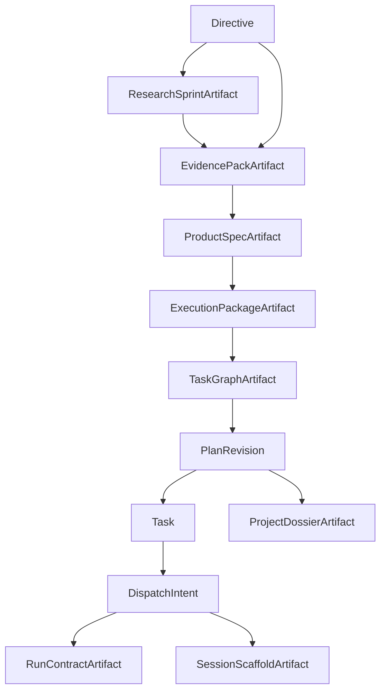

# 08 vNext Compiled Artifact Package

## Purpose

- 把 vNext 中仍停留在“协议层 / 编译产物”的对象收敛成实现前可落地的 artifact package。
- 明确哪些 vNext 产物适合持久化、如何与当前 authoritative runtime objects 建立链接、哪些仍然只是派生视图。
- 保证下一阶段即使增加 durable compiled artifacts，也不会破坏 `PlanRevision / Task / AgentRun` 为核心的当前事实层级。

## Scope

- 本文覆盖 vNext compiled artifacts 的对象范围、链接关系、存储形态、不可变性和 supersession 规则。
- 本文不把这些 artifacts 升级为 authoritative runtime truth tables。
- MVP object package 仍以 `07-MVP-Object-Package.md` 为准。
- 编译顺序与 freshness 规则见 `../04-planning/12-Compilation-Lifecycle-and-Freshness-Protocol.md`。

## Definitions

- `Compiled Artifact`：由 planning、research、dossier 或 session bootstrap 编译器产出的 durable 结果。
- `Artifact Metadata Row`：存放在状态库中的结构化元数据记录，用于索引、引用、版本和新鲜度判断。
- `Artifact Payload`：artifact 的正文或详细内容，通常位于 filesystem artifact root，也可嵌入 JSON 列。
- `Active Artifact Pointer`：指向某个当前生效 compiled artifact 的引用字段。
- `Immutable Artifact`：一旦编译完成，其 payload 不再原地覆盖，只允许生成新版本并移动 active pointer。
- `Artifact Set`：围绕同一轮 planning / dispatch 关联的一组 compiled artifacts。

## Rules

### Truth Hierarchy 不变

即使下一阶段引入 compiled artifacts，事实层级仍保持：

1. `Directive / PlanRevision / Phase / Task / AgentRun / Handoff / Acceptance / Issue / Lock / DispatchIntent / RecoveryAction` 是当前事实来源。
2. compiled artifacts 是 durable derived planning state 或 human-readable views。
3. `Event Log` 仍是历史与 replay 输入。
4. `Checkpoint` 仍是恢复快照。

规则：

- 调度、验收、恢复不能直接把 compiled artifact payload 当成唯一事实源。
- compiled artifact 的作用是：
  - 减少重复编译
  - 提供稳定引用
  - 改善跨 session / 跨角色读取体验
  - 为实现仓提供更清晰的 compiler I/O 边界

### vNext Artifact Classes

下一阶段建议持久化以下 compiled artifacts：

| Artifact | 作用 | 推荐绑定点 | 是否 authoritative |
|---|---|---|---|
| `ResearchSprintArtifact` | 记录边界化 research 请求与结果汇总 | `Directive` / planning request | 否 |
| `EvidencePackArtifact` | 归一化 claims / options / risks / validation candidates | `Directive`、`ProductSpecArtifact` | 否 |
| `ProductSpecArtifact` | 固化目标、范围、不变量、成功标准、已采纳假设 | `PlanRevision` | 否 |
| `ExecutionPackageArtifact` | 固化阶段、工作线、里程碑、replan hooks、ledger slice | `PlanRevision` | 否 |
| `TaskGraphArtifact` | 固化 task nodes、edges、冲突范围、ready 计算输入摘要 | `PlanRevision` | 否 |
| `RunContractArtifact` | 固化单角色 bounded work unit 的派发契约 | `DispatchIntent` | 否 |
| `ProjectDossierArtifact` | 面向人类阅读的长文档视图 | `PlanRevision` / review surface | 否 |
| `SessionScaffoldArtifact` | 供新 session 启动的 bootstrap artifact set | `DispatchIntent` / `RunContractArtifact` | 否 |

### Active Pointer Rule

建议在现有 authoritative objects 上增加仅用于引用的 active pointer，而不是让 artifact 反向成为主对象：

| Pointer Carrier | 推荐字段 |
|---|---|
| `PlanRevision` | `product_spec_ref`、`execution_package_ref`、`task_graph_ref`、`active_dossier_ref` |
| `DispatchIntent` | `run_contract_ref`、`session_scaffold_ref` |
| `Directive` | `evidence_pack_refs`、`research_artifact_refs` |
| `Checkpoint` | `active_artifact_refs`（可选摘要） |

规则：

- active pointer 可以移动。
- artifact payload 不得原地改写。
- 指针切换必须由明确的 compile / accept / supersede 动作驱动。

### Artifact Metadata vs Payload Rule

每个 compiled artifact 应拆成：

- metadata row
  - 用于：
    - ID
    - 类型
    - version / status
    - source refs
    - compilation stamp
    - payload_ref
- payload
  - 用于：
    - 正文
    - 大体积图结构
    - 长文档
    - session scaffold 清单

推荐存储：

- metadata row：SQLite
- payload：filesystem artifacts root

例外：

- 体积很小的 payload 可直接内嵌 JSON 列。
- 但无论 payload 是否内嵌，metadata row 仍建议存在，以便索引和 supersession。

### Immutability and Supersession Rule

- `compiled -> superseded -> archived` 应成为 compiled artifacts 的基本演进路径。
- 重新编译不得覆盖旧 artifact 内容。
- superseded artifact 仍可被：
  - 审计
  - handoff 引用
  - recovery 回看
  - dossier 历史追踪

规则：

- 当前 active pointer 只能指向一个 active artifact，除非该类型天然允许集合，如 `evidence_pack_refs`。
- 同一 `DispatchIntent` 只能绑定一个 canonical `RunContractArtifact`。
- 同一 `PlanRevision` 应只有一个 canonical `TaskGraphArtifact` 和一个 canonical `ExecutionPackageArtifact`。

### Artifact Linking Rule

artifact metadata row 至少要记录：

- `artifact_id`
- `artifact_type`
- `status`
- `compiled_at`
- `compiled_from_refs`
- `compilation_batch_id`
- `payload_ref`
- `superseded_by_ref`

其中 `compiled_from_refs` 应明确回到以下上游：

- `Directive`
- `ResearchSprintArtifact`
- `EvidencePackArtifact`
- `ProductSpecArtifact`
- `PlanRevision`
- `Task`
- `DispatchIntent`
- `Checkpoint`

### Runtime Consumption Boundary

不同 artifact 的消费边界必须清晰：

| Artifact | 允许谁读取 | 不得替代什么 |
|---|---|---|
| `EvidencePackArtifact` | planner、research、human review | 不能替代 decision / adopted constraint |
| `ProductSpecArtifact` | planner、execution prep、human review | 不能替代 `PlanRevision` 当前状态 |
| `ExecutionPackageArtifact` | planner、task graph compiler | 不能替代 `Task` 当前状态 |
| `TaskGraphArtifact` | scheduler、human review | 不能替代 `Task` 表 |
| `RunContractArtifact` | adapter、worker bootstrap | 不能替代 `DispatchIntent` / `AgentRun` |
| `ProjectDossierArtifact` | humans、high-level handoff | 不能替代 runtime truth |
| `SessionScaffoldArtifact` | worker session bootstrap | 不能替代 checkpoint / task spec / handoff |

### Minimal Package Recommendation

若下一阶段要最小化落地 compiled artifact package，建议先做：

1. `EvidencePackArtifact`
2. `ProductSpecArtifact`
3. `TaskGraphArtifact`
4. `RunContractArtifact`
5. `SessionScaffoldArtifact`

原因：

- 它们最直接填补当前“协议已清楚但实现对象仍缺位”的空白。
- `ProjectDossierArtifact` 可以稍后跟进，因为它不在 critical path。
- `ResearchSprintArtifact` 与 `ExecutionPackageArtifact` 可以在 evidence/spec 体系稳定后再细化。

## Recommended Linkage Graph



## State / Schema

```yaml
compiled_artifact_metadata:
  artifact_id: spec_20260411_01
  artifact_type: product_spec
  status: compiled
  compiled_at: 2026-04-11T20:00:00Z
  compilation_batch_id: compile_20260411_03
  compiled_from_refs:
    - dir_20260411_05
    - ep_20260411_02
  payload_ref: artifacts/planning/spec_20260411_01.yaml
  superseded_by_ref: null
active_pointer_example:
  plan_revision_id: plan_rev_15
  product_spec_ref: spec_20260411_01
  execution_package_ref: exec_pkg_20260411_01
  task_graph_ref: tg_20260411_01
  active_dossier_ref: dossier_20260411_01
dispatch_pointer_example:
  dispatch_intent_id: dispatch_task_auth_09_01
  run_contract_ref: rc_20260411_04
  session_scaffold_ref: scaffold_20260411_04
```

## Anti-patterns

- 把 compiled artifact 直接建成新的当前事实源，绕过已有 runtime objects。
- 重新编译时原地覆盖旧 payload，导致 supersession 无法审计。
- 只有 payload 文件，没有 metadata row，导致无法做 freshness / pointer / lineage 判断。
- 让 dossier 或 scaffold 反向主导 scheduler / recovery 决策。

## Acceptance Criteria

- 读者能明确知道哪些 vNext 产物建议持久化，哪些只是派生视图。
- 读者能明确知道 active pointer 应该挂在哪些 authoritative objects 上。
- 文档明确规定了 metadata row 与 payload 的分离方式。
- 引入 compiled artifact package 后，当前 truth hierarchy 仍然不变。
