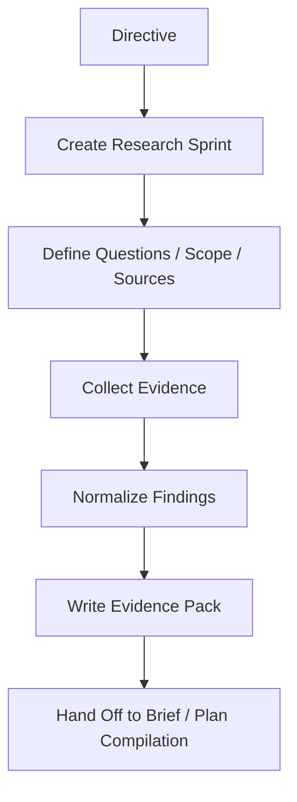

# 03 Research Sprint Spec

## Purpose

- 定义 Research Sprint 的最小协议。
- 保证调研工作是有边界、可复用、可审计的输入层工作。
- 避免用户目标直接跳过调研进入 Task。

## Scope

- Research Sprint 用于形成 `Evidence Pack`，不直接作为运行态任务约束。
- 本文不定义具体搜索工具，只定义结果约束。

## Definitions

- `Research Sprint`：围绕一个规划问题的有边界调研单元。
- `Research Question`：本轮调研要回答的问题。
- `Source Set`：允许读取的资料集合。
- `Evidence Pack`：Research Sprint 的标准输出对象。

## Rules

### Research Sprint Minimum Fields

- `research_sprint_id`
- `objective`
- `questions`
- `scope`
- `source_budget`
- `allowed_sources`
- `stop_condition`
- `output_contract`

### Research Discipline

- 调研必须有问题边界。
- 调研必须有来源边界。
- 调研必须记录证据，不得只记录结论。
- 调研输出必须先进入 `Evidence Pack`，不得直接写成 Task。
- Research Sprint 完成不等于 Plan 可直接执行，仍需编译。

### Stop Rule

- 已回答核心问题时停止。
- 达到 `source_budget` 时停止。
- 发现需求冲突时停止并升级。
- 发现设计边界不清时停止并写 `Issue`。

## Protocol Steps

1. Orchestrator 基于 `Directive` 创建 `ResearchRequested`。
2. 定义调研问题、范围、来源边界和输出契约。
3. 执行调研并记录原始证据。
4. 汇总为 `Evidence Pack`。
5. 标记未解决问题、候选方案、风险和建议。
6. 将 `Evidence Pack` 送入 Brief / Plan 编译链。

## State / Schema

```yaml
research_sprint_id: rs_20260410_01
objective: 澄清认证系统的参考实现与约束边界
questions:
  - 同类系统如何处理 session 与 token 刷新
  - 本项目的最小认证能力边界是什么
scope:
  domain: auth
  depth: bounded
source_budget:
  max_primary_sources: 6
  max_repo_examples: 3
allowed_sources:
  - official_docs
  - existing_repo_examples
stop_condition:
  - core_questions_answered
  - budget_exhausted
output_contract: evidence_pack
status: completed
```

## Mermaid Diagram

### Research Sprint Flow



## Anti-patterns

- 一边调研一边直接写执行任务。
- 调研没有问题边界，变成全仓或全网漫游。
- 只留下总结，不保留来源与证据。
- 把未经编译的研究结论直接当运行态约束。

## Acceptance Criteria

- 任一 Research Sprint 都能说明其问题边界与停止条件。
- 任一结论都能回溯到来源证据。
- 任一调研结果都能进入 `Evidence Pack`，而不是散落在对话里。
