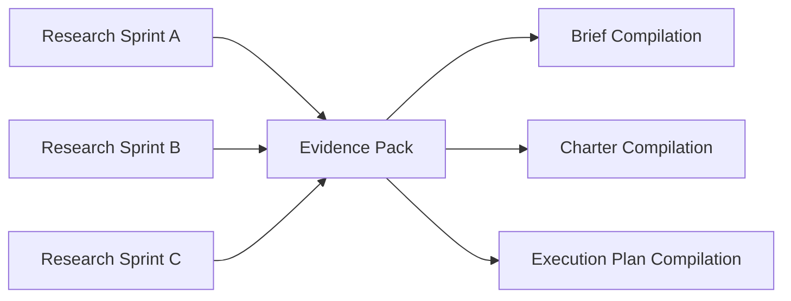

# 04 Evidence Pack Spec

## Purpose

- 定义调研结果的标准载体。
- 保证 Brief、Charter、Execution Plan 的编译输入结构化。
- 隔离“证据”与“运行态约束”。

## Scope

- `Evidence Pack` 只承载经整理的证据、候选方案、风险与开放问题。
- 只有被编译进入 Brief / Charter / Execution Plan 的内容，才成为运行态事实。

## Definitions

- `Claim`：一条可检验的陈述。
- `Evidence Ref`：支撑 Claim 的来源引用。
- `Confidence`：对 Claim 的可信度评估。
- `Extracted Requirement Candidate`：由证据抽取出的候选需求或约束。

## Rules

### Evidence Pack Minimum Fields

- `evidence_pack_id`
- `research_sprint_refs`
- `claims`
- `evidence_refs`
- `options`
- `risks`
- `open_questions`
- `requirement_candidates`
- `validation_candidates`

### Evidence Discipline

- 每条 `Claim` 必须附带 `Evidence Ref`。
- 每条 `Claim` 必须声明 `confidence`。
- 候选要求必须标记为 `candidate`，不得直接视为最终要求。
- `Evidence Pack` 可以影响 Plan 编译，但不得直接改写 Task 状态。

## Protocol Steps

1. 收集多个 `Research Sprint` 输出。
2. 去重并整理为 `Claim` 列表。
3. 归纳候选方案、风险、未决问题。
4. 从证据中抽取 requirement candidates 与 validation candidates。
5. 将 `Evidence Pack` 送入 Brief / Plan 编译。

## State / Schema

```yaml
evidence_pack_id: ep_20260410_01
research_sprint_refs:
  - rs_20260410_01
claims:
  - claim_id: clm_auth_01
    statement: token 刷新逻辑必须与权限校验解耦
    confidence: high
    evidence_refs:
      - src_auth_ref_01
options:
  - separate_refresh_service
  - in_gateway_refresh
risks:
  - auth_boundary_unclear
open_questions:
  - 是否需要多租户权限模型
requirement_candidates:
  - auth_session_refresh
validation_candidates:
  - auth_integration_test
```

## Mermaid Diagram

### Evidence Pack as Compilation Input



## Anti-patterns

- 只有观点，没有来源。
- 证据与结论混写，无法区分。
- 未经编译就把 evidence candidate 当成 Task 约束。
- 开放问题不记录，直接用默认假设推进。

## Acceptance Criteria

- 任一 `Claim` 都能回到 `Evidence Ref`。
- 任一候选需求都能区分“已采纳”与“未采纳”。
- 编译链能明确说明哪些内容从 `Evidence Pack` 被提升为运行态约束。
