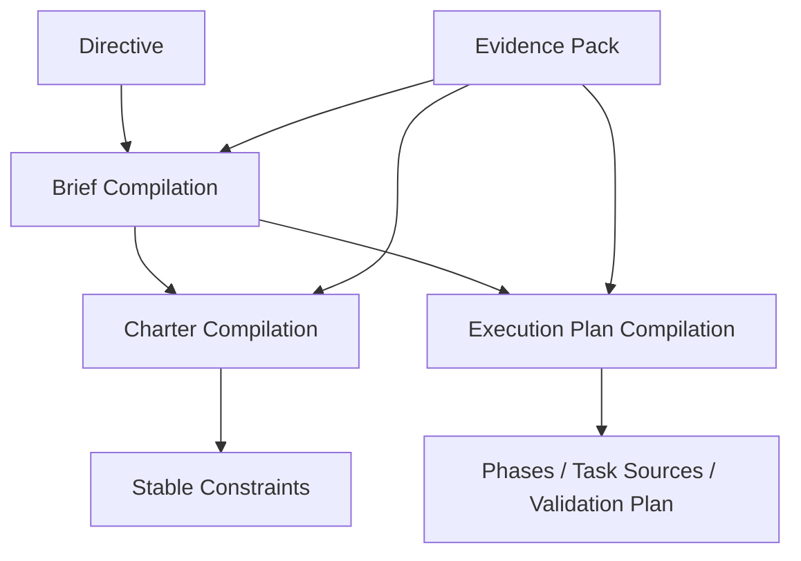

# 05 Plan Compilation Protocol

## Purpose

- 定义从 `Directive / Evidence Pack` 到 `Brief / Charter / Execution Plan` 的编译协议。
- 保证稳定层与演进层分离。
- 提取可执行的 acceptance 与 validation 约束。

## Scope

- 本文覆盖规划层编译，不覆盖运行时调度。
- `Execution Plan` 的版本修订协议见状态模型分卷。
- 项目首轮初始化见 `./07-Project-Bootstrap-Protocol.md`。
- vNext 从一句输入扩展到 `Product Spec / Task Graph / Run Contract` 的总流水线见 `./09-Input-to-Spec-and-TaskGraph-Pipeline.md`。
- Requirement Ledger 见 `./08-Requirement-Ledger-and-Coverage-Model.md`。

## Definitions

- `Compilation`：将输入对象转换为下游结构化对象的过程。
- `Stable Layer`：`Charter`。
- `Evolving Layer`：`Execution Plan`。
- `Product Spec`：在 vNext 中统一目标、范围、不变量与成功标准的规划总包；当前 MVP 中其职责主要由 `Brief + Charter` 共同承担。
- `Acceptance Extraction`：从规划结果中抽取任务级验收条件。
- `Validation Extraction`：从规划结果中抽取验证方法。

## Rules

### Compilation Inputs

- `Directive`
- `Brief` 或 `Brief Draft`
- `Evidence Pack`
- 既有 `Charter`
- 当前 `Execution Plan` 及其 revision chain

### Stable vs Evolving

- 项目目标、不可违反约束、术语定义、架构原则进入 `Charter`。
- 阶段划分、执行次序、任务来源、恢复策略进入 `Execution Plan`。
- 调研中尚未证实的内容不得进入 `Charter`。
- 仅对当前运行有效的排序、优先级、补丁路径应进入 `Execution Plan`，不得进入 `Charter`。
- 面向人阅读的长设计文档应从 `Brief / Charter / Execution Plan / Requirement Ledger` 编译为 `Project Dossier / Project Book`，不得直接作为运行时事实源。

### Extraction Rule

- 每个计划阶段都必须抽取 `acceptance criteria`。
- 每个候选任务都必须抽取 `validation plan`。
- 未能抽取验证方法的工作不得直接编译为 ready task。

## Protocol Steps

1. 整理 `Directive` 与 `Evidence Pack`。
2. 编译 `Brief`，统一目标、约束、场景、范围。
3. 提升稳定边界到 `Charter`。
4. 编译阶段、里程碑、任务来源到 `Execution Plan`。
5. 对每个阶段抽取 acceptance criteria。
6. 对每类工作抽取 validation plan。
7. 生成 Requirement Ledger 初稿并建立与 task graph 的映射。
8. 写出新的 `Execution Plan` 或 `plan_revision`。

## State / Schema

```yaml
brief:
  objective: 构建具备认证能力的服务框架
  scope:
    include:
      - auth
      - permission model
    exclude:
      - mobile ui
charter:
  invariants:
    - state_externalized
    - worker_disposable
    - no_unreviewed_architecture_change
execution_plan:
  phases:
    - phase_auth_foundation
    - phase_auth_integration
  acceptance_criteria:
    - auth_request_flow_verified
  validation_plan:
    - unit_tests
    - integration_tests
```

## Mermaid Diagram

### Planning Compilation Chain



## Anti-patterns

- 用一份 Plan 同时承载稳定原则和临时排序。
- 未经 Brief 整理就直接从证据生成 Task。
- 没有 acceptance criteria 就派发执行。
- 把研究文档中的开放问题直接写进 `Charter`。

## Acceptance Criteria

- 读者能明确区分 `Charter` 与 `Execution Plan` 的边界。
- 任一任务来源都能追溯到 `Directive / Brief / Evidence Pack / Plan Revision`。
- 任一阶段都能找到 acceptance 与 validation 提取结果。
