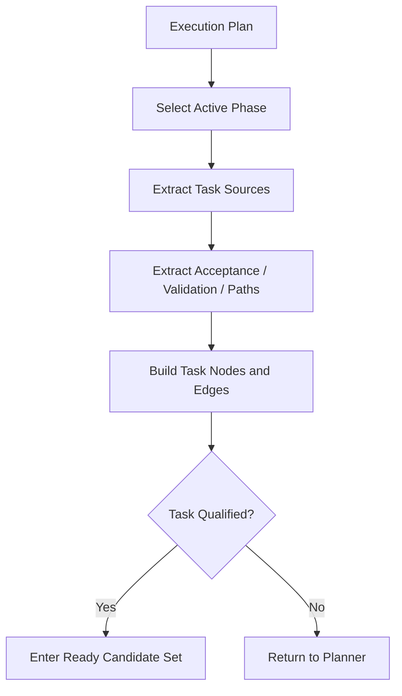

# 06 Task Graph Compilation

## Purpose

- 定义如何从 `Execution Plan` 编译出 `Task Graph`。
- 约束哪些内容必须进入 `Task`，哪些内容只能保留在研究或规划层。
- 保证 Task 可调度、可验证、可恢复。

## Scope

- 本文只描述编译协议，不描述运行中派发细节。
- 任务图运行语义见状态模型分卷。

## Definitions

- `Task Source`：Execution Plan 中可生成任务的工作项。
- `Task Graph Compilation`：将阶段工作项转成 `Task` 节点与边的过程。
- `Task Qualification`：判断某个编译结果是否满足任务准入规则。

## Rules

### What Must Enter Task

- 明确 objective
- 明确 scope
- 明确 constraints
- 明确 allowed / forbidden paths
- 明确 done criteria
- 明确 validation method
- 明确 output expectation
- 明确 escalation rule
- 明确 dependencies 与 blockers

### What Must Not Stay Only in Research Docs

以下内容若已被采纳，必须进入 `Execution Plan` 或 `Task`，不能只留在研究文档：

- 被采纳的实现边界
- 被采纳的验证方法
- 被采纳的任务依赖
- 被采纳的关键风险处置

### What Must Not Become Runtime Constraint Directly

以下内容只允许留在研究文档或 Evidence Pack，不能直接变成运行态约束：

- 未证实猜测
- 候选方案列表
- 未采纳架构分支
- 未做决策的开放问题

## Protocol Steps

1. 从 `Execution Plan` 读取当前 active phase。
2. 找出阶段中的 task sources。
3. 为每个 task source 抽取 objective、scope、constraints、validation。
4. 为每个 Task 生成依赖、路径锁、升级规则。
5. 运行 `Task Qualification`。
6. 合格的 Task 进入 `draft -> ready` 候选流，不合格的返回 Planner 修补。

## Mermaid Diagram

### Task Graph Compilation Flow

## Anti-patterns

- 把一整段 phase 文字直接当 Task。
- 只生成任务标题，不生成边界字段。
- 未抽取 validation plan 就让任务 ready。
- 将研究中的候选方案原样塞进运行态任务。

## Acceptance Criteria

- 任一生成的 Task 都有明确字段和依赖关系。
- 任一不合格任务都能说明缺了什么字段或约束。
- 任一运行态约束都能追溯到被采纳的规划结果，而不是研究噪声。
