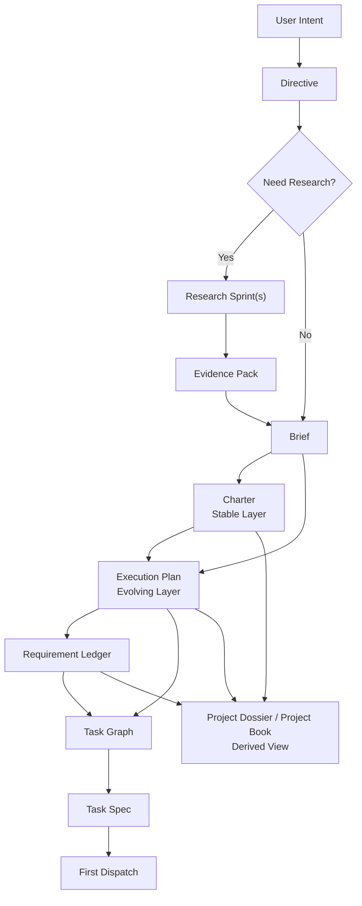
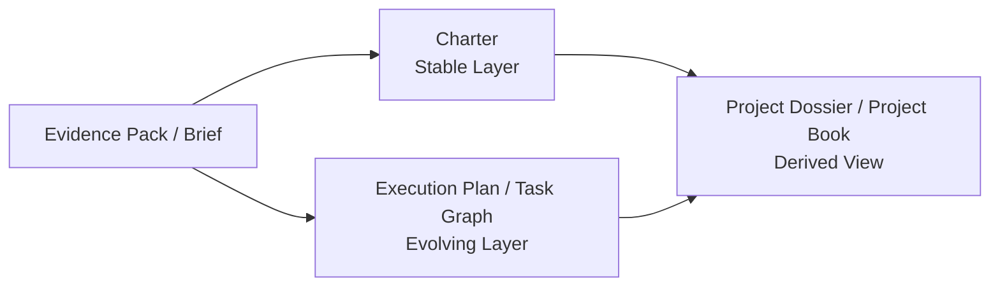

# 07 Project Bootstrap Protocol

## Purpose

- 定义“用户一句目标输入后，Hive 如何进行首轮项目初始化”。
- 把 `User Intent -> Directive -> Research Sprint -> Evidence Pack -> Brief -> Charter -> Execution Plan -> Task Graph -> Task Spec -> First Dispatch` 编译链收敛为可实现协议。
- 明确稳定层、演进层、派生视图之间的边界，避免“长文档即真相源”的漂移。
- 本文是 MVP bootstrap 视角；vNext 的通用规划流水线见 `09-Input-to-Spec-and-TaskGraph-Pipeline.md`。

## Scope

- 本文覆盖项目 bootstrap 的首轮闭环。
- 本文不定义运行中所有重规划细节；运行时纠偏见 `../07-reliability/07-Runtime-Directive-Handling.md`。
- vNext 中 `Task Spec` 将进一步标准化为角色感知的 `Run Contract`；见 `../05-execution/15-Agent-Role-Topology-and-Run-Contract.md`。
- Research Sprint、Evidence Pack、Brief、Charter、Execution Plan 的对象细节仍以各自文档为准。
- Requirement Ledger 的覆盖判断见 `./08-Requirement-Ledger-and-Coverage-Model.md`。
- `Project Dossier / Project Book` 的编译细节见 `./11-Project-Dossier-Compilation-Protocol.md`。

## Definitions

- `User Intent`：用户输入的一句话目标或项目启动意图。
- `Project Bootstrap`：从初始输入到首批 `TaskSpec` 可被派发的初始化流程。
- `Stable Layer`：跨多轮执行仍应保持稳定的项目约束层，例如 `Charter`。
- `Evolving Layer`：会随着执行和新输入不断修订的层，例如 `Execution Plan`、`TaskGraph`、Requirement Ledger 状态。
- `Project Dossier / Project Book`：从结构化对象编译出的长文档派生视图，服务人类阅读与沟通。
- `First Dispatch`：首轮 bootstrap 完成后，第一批可以被外部执行器消费的 `TaskSpec` 派发动作。

## Rules

### Bootstrap 总规则

1. 用户输入不能直接生成任务文件，也不能直接改任务文件。
2. 项目初始化必须先形成 `Directive`，再决定研究、规划与派发路径。
3. 未经 Brief / Charter / Execution Plan / TaskGraph 编译的工作，不得直接进入执行。
4. `Project Dossier / Project Book` 只能是从结构化对象导出的长文档，不得反向作为运行时事实源。
5. 多 Worker 并行是设计方向，但首轮 bootstrap 的目标是生成可验证的 task graph，而不是默认越多 worker 越好。

### 稳定层 vs 演进层

| 层级 | 典型对象 | 用途 | 变更规则 |
|---|---|---|---|
| 输入层 | `Directive`、`Research Sprint`、`Evidence Pack` | 记录需求与证据 | 可追加，不直接成为运行态约束 |
| 稳定层 | `Brief`、`Charter` | 固化项目目标、边界、术语、不变量 | 只在新证据足够时谨慎修订 |
| 演进层 | `Execution Plan`、`PlanRevision`、`TaskGraph`、`TaskSpec`、Requirement Ledger 状态 | 驱动当前执行与后续迭代 | 允许频繁修订与 supersede |
| 派生视图 | `Project Dossier / Project Book` | 面向人阅读的长文档、汇报、设计总览 | 可随时重新编译，不是事实源 |

### 何时必须先 research

满足任一条件时，bootstrap 必须先创建 `Research Sprint`：

- 用户目标涉及新领域、不熟悉技术栈或外部系统依赖。
- 需求中包含明显未定义的关键术语、范围边界或成功标准。
- 计划依赖外部规则、第三方 API、标准或合规条件。
- 用户只给出方向，没有给出足够可执行约束。
- 同类能力的现有实现路径存在多个候选方案，需要先做方案筛选。

### 何时可以直接进入 planning

满足全部条件时，可以跳过先行 research，直接编译 planning：

- 用户目标已经足够具体。
- 成功标准和验证方式基本明确。
- 当前仓库或既有知识中已经有足够上下文。
- 不存在关键未知外部依赖。
- 项目边界与术语已在既有 `Charter` 或同类项目模板中稳定存在。

### Project Dossier / Project Book 规则

- 它是从 `Brief`、`Charter`、`Execution Plan`、Requirement Ledger、开放 `Issue` 等结构化对象编译出的派生视图。
- 它面向人类阅读、跨轮审阅和项目对外说明。
- 它可以像一本长设计文档，但不是运行时事实源。
- 运行时必须回到结构化对象，而不是去解析长文档段落来做调度。

## Protocol Steps

1. 接收 `User Intent`，通过 `Input Gateway` 写入 raw input record。
2. `Directive Intake` 生成 `Directive`，并执行 bootstrap 级 impact analysis。
3. 判断是：
   - `research_first`
   - `planning_direct`
4. 若为 `research_first`：
   - 创建一个或多个 `Research Sprint`
   - 产出 `Evidence Pack`
5. 编译 `Brief`：
   - 统一目标、范围、术语、约束、非目标、成功标准
6. 编译 `Charter`：
   - 固化稳定边界、不变量、架构限制、工作约束
7. 编译 `Execution Plan`：
   - 形成阶段、里程碑、工作线、优先级、replan hooks
8. 编译 Requirement Ledger：
   - 把需求、能力项、验收与验证方法落成可追踪账本
9. 编译 `Task Graph`：
   - 形成依赖关系、冲突关系、候选任务集合
10. 编译 `Task Spec`：
   - 形成首批可派发的执行单元
11. 由 `Scheduler` 选出 ready task，进入 `First Dispatch`
12. 可选地编译 `Project Dossier / Project Book` 供人类阅读，但不参与事实写回

## State / Schema

```yaml
project_bootstrap_result:
  bootstrap_mode: research_first
  source_directive_id: dir_20260410_01
  research_sprint_ids:
    - rs_20260410_01
  evidence_pack_ids:
    - ep_20260410_01
  brief_id: brief_20260410_01
  charter_id: charter_main
  execution_plan_id: plan_main
  plan_revision_id: plan_rev_01
  requirement_ledger_id: req_ledger_main
  task_graph_id: tg_20260410_01
  first_task_spec_ids:
    - task_bootstrap_01
    - task_research_synthesis_01
  dossier_ref: docs/project-book/project-main.md
stable_layer:
  - brief_20260410_01
  - charter_main
evolving_layer:
  - plan_rev_01
  - req_ledger_main
  - tg_20260410_01
  - task_bootstrap_01
derived_views:
  - dossier_ref
```

## Mermaid Diagram

### 项目 bootstrap 编译链图



### 稳定层 / 演进层 / 派生视图关系图



## Anti-patterns

- 用户一句话输入后直接生成执行任务，不做 `Directive` 和 bootstrap 编译。
- 先写一份很长的设计文档，再从长文档里人工摘任务，当长文档是事实源。
- 不做 research 判断，所有项目一律先研究，或一律跳过研究。
- 让 Worker 自己决定项目 bootstrap 应该产出哪些对象。
- 把 `Execution Plan` 当作稳定宪章，导致每次小变更都动到项目边界。

## Acceptance Criteria

- 读者能明确知道首轮项目初始化从一句用户目标到 First Dispatch 的完整链路。
- 读者能明确区分稳定层、演进层和派生视图。
- 读者能明确判断何时必须先 research，何时可以直接 planning。
- 读者能明确知道 `Project Dossier / Project Book` 的正确定位：可读，但不是运行时事实源。
