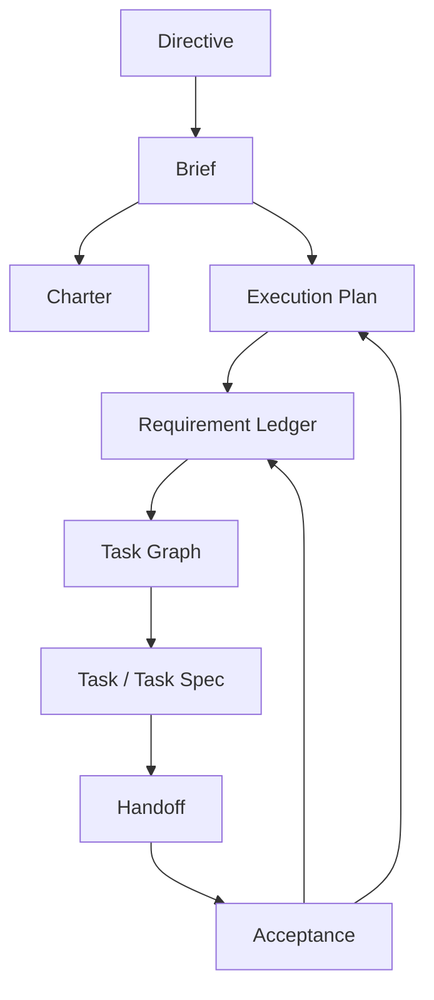

# 08 Requirement Ledger and Coverage Model

## Purpose

- 引入 `Requirement Ledger / Feature Coverage Ledger`，避免执行器过早宣布项目完成。
- 给 Hive 一个可持续回答“还有哪些能力未完成”的结构化对象模型。
- 将需求、能力项、验收、验证、覆盖证据与运行态任务连接起来。

## Scope

- 本文定义 Requirement Ledger 的概念、字段、状态与更新规则。
- 本文不替代 `Brief`、`Charter`、`Execution Plan`、`TaskGraph`，而是作为它们之间的覆盖追踪层。
- 首轮 bootstrap 中 ledger 的生成见 `./07-Project-Bootstrap-Protocol.md`。

## Definitions

- `Requirement Ledger`：对需求项、能力项和完成度进行可追踪记录的账本。
- `Requirement Entry`：账本中的单条需求或能力项。
- `Coverage Evidence`：支撑某条需求已被实现、验证或验收的证据引用。
- `Feature Coverage Ledger`：强调能力项覆盖情况时的 Requirement Ledger 视角。
- `Completion Claim`：执行器或 task 对“已完成”的声明；只有在 ledger 与 acceptance 更新后才可视为项目级完成事实。

## Rules

### Ledger 总规则

1. 任何项目级“完成”判断都必须经过 Requirement Ledger，而不是只看单个 `Task` 或单个 `AgentRun`。
2. Requirement Ledger 中的条目不能被随意删除；若失效，只能 `superseded`、`cancelled` 或 `archived`。
3. `Brief` 提供需求来源与范围，`Charter` 提供稳定约束，`Execution Plan` 提供工作编排，`TaskGraph` 提供执行路径，Requirement Ledger 提供覆盖状态。
4. Worker 不得直接声称“项目完成”；Worker 只能提交 handoff 与 coverage evidence。

### Requirement Entry 最小字段

每条需求 / 能力项至少必须有：

- `requirement_id`
- `description`
- `source`
- `acceptance`
- `validation`
- `status`
- `coverage_evidence`

推荐补充字段：

- `priority`
- `scope_tags`
- `derived_from_requirement_ids`
- `planned_task_ids`
- `covered_by_task_ids`
- `accepted_by_acceptance_ids`
- `superseded_by_requirement_id`

### 推荐状态

- `captured`
- `clarified`
- `planned`
- `in_progress`
- `covered`
- `validated`
- `accepted`
- `blocked`
- `superseded`
- `cancelled`
- `archived`

### 状态推进规则

- `captured -> clarified`
  - 需求描述、来源和成功标准足够清楚
- `clarified -> planned`
  - 已进入 `Execution Plan` 或 `TaskGraph`
- `planned -> in_progress`
  - 至少有一个对应 task 已进入执行
- `in_progress -> covered`
  - 有实现或产物证据，但尚未完成验证
- `covered -> validated`
  - 验证方法已执行并有结果
- `validated -> accepted`
  - 验收通过且证据完整
- 任意状态 -> `blocked`
  - 存在 blocker 或关键证据缺失

### 更新与保留规则

- Ledger 允许增量更新，不允许静默删除历史条目。
- 需求发生变化时，应创建新的 requirement entry 或 supersede 旧条目，而不是覆盖历史描述。
- `coverage_evidence` 必须保留 artifact refs、validation refs、acceptance refs 或 handoff refs。
- 如果 requirement 被取消，仍需保留取消原因和来源。

## Protocol Steps

1. 从 `Directive`、`Brief` 和现有项目上下文中抽取初始需求项。
2. 生成 Requirement Ledger 初稿，并为每条需求标注来源、验收与验证方法。
3. `Execution Plan` 将需求映射到阶段与工作线。
4. `TaskGraph` 将需求映射到具体 task 节点与依赖关系。
5. Worker 执行任务后提交 handoff 与覆盖证据。
6. `Acceptance Engine` 更新 requirement entry 的 `covered / validated / accepted / blocked` 状态。
7. `Reconcile` 基于 Requirement Ledger 判断是否仍有未完成能力、是否需要 followup task、是否允许项目级完成。

## State / Schema

```yaml
requirement_ledger:
  ledger_id: req_ledger_main
  entries:
    - requirement_id: req_auth_login_01
      description: 用户可完成基础登录
      source:
        type: directive
        ref: dir_20260410_01
      acceptance:
        - login_flow_demoable
        - error_states_defined
      validation:
        - integration_test:auth_login
        - manual_smoke:login
      status: validated
      coverage_evidence:
        artifacts:
          - artifacts/run_01/login-demo.md
        validations:
          - validation_20260410_01
        acceptances:
          - acceptance_20260410_01
      planned_task_ids:
        - task_auth_backend_01
        - task_auth_ui_01
      covered_by_task_ids:
        - task_auth_backend_01
        - task_auth_ui_01
```

## Mermaid Diagram

### Requirement Ledger 与 Plan / Task / Acceptance 的关系图



## Anti-patterns

- 只看任务都完成了，就宣布项目完成，不看需求覆盖。
- 覆盖证据只写“已完成”，不保留 artifact / validation / acceptance refs。
- 需求一变就直接覆盖旧条目，丢失历史。
- Requirement Ledger 与 `Execution Plan`、`TaskGraph` 脱节，变成孤立清单。

## Acceptance Criteria

- 读者能明确知道 Requirement Ledger 如何支撑“还有哪些能力未完成”的判断。
- 每条需求至少具备 required fields，并能链接到 task、handoff、acceptance 和 coverage evidence。
- Ledger 更新是增量、可追溯、不可随意删除。
- 项目级完成不再依赖执行器的自由完成声明，而依赖 ledger + acceptance 的收敛状态。
