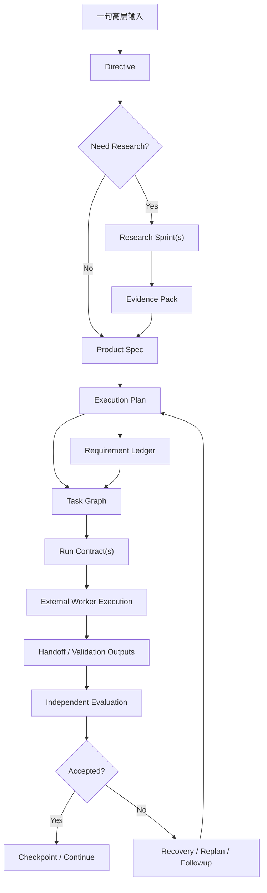

# 09 Input to Spec and TaskGraph Pipeline

## Purpose

- 定义“用户一句高层输入如何被扩展成设计书、执行文档、task graph、run contract”的规划流水线。
- 明确 `Research Sprint`、`Evidence Pack`、`Product Spec`、`Execution Plan`、`Task Graph`、`Run Contract` 之间的关系。
- 说明哪些对象仍停留在协议层，哪些是下一阶段实现范围。

## Scope

- 本文覆盖 vNext 规划流水线。
- 本文不改变当前 MVP 的事实对象层级。
- 首轮 MVP bootstrap 入口仍见 `07-Project-Bootstrap-Protocol.md`。
- 当前 `Research Sprint`、`Evidence Pack`、`Requirement Ledger` 等基本语义仍以既有文档为准。
- 面向人阅读的 `Project Dossier / Project Book` 编译协议见 `11-Project-Dossier-Compilation-Protocol.md`。

## Definitions

- `Steering Input`：用户一句高层目标，或运行中的补充方向与约束。
- `Directive`：经 intake 结构化后的控制平面输入对象。
- `Research Sprint`：围绕规划问题的有边界调研单元。
- `Evidence Pack`：Research Sprint 的标准化证据输出。
- `Product Spec`：vNext 规划总包，统一目标、范围、不变量、关键约束、非目标、成功标准。当前 MVP 中该角色主要由 `Brief + Charter` 共同承担。
- `Execution Plan`：面向执行的阶段、工作线、里程碑、优先级和重规划钩子。
- `Task Graph`：从 `Execution Plan` 编译出来的任务节点、依赖边和冲突关系。
- `Run Contract`：面向单个外部 worker 的标准化派发包。

## Rules

### 总规则

1. 用户一句话不能直接扔给 execution worker。
2. 任何执行都必须先经过 `Directive`。
3. 若存在关键未知、外部依赖、方案分歧或成功标准不清，必须先做 `Research Sprint`。
4. `Evidence Pack` 只能作为编译输入，不能直接成为运行态约束。
5. `Product Spec` 和 `Execution Plan` 必须先把目标、约束、done 标准结构化，才能编译出 `Task Graph` 和 `Run Contract`。
6. `Run Contract` 必须是小步、可验证、可回收、可接力的工作单元，不能让 worker “一口气做完整项目”。

### 对象关系

| 对象 | 作用 | 上游输入 | 下游输出 |
|---|---|---|---|
| `Directive` | 把用户输入结构化并触发影响分析 | raw input | research / planning request |
| `Research Sprint` | 回答边界问题与方案问题 | directive、open questions | evidence fragments |
| `Evidence Pack` | 归一化 claims、evidence、options、risks、open questions | one or more research sprints | spec / plan compilation input |
| `Product Spec` | 统一目标、范围、约束、非目标、成功标准 | directive、evidence pack、existing charter | execution package baseline |
| `Execution Plan` | 形成阶段、工作线、优先级、里程碑、replan hooks | product spec | task sources |
| `Task Graph` | 形成任务节点、依赖、锁范围、阻塞关系 | execution plan、ledger | ready candidate set |
| `Run Contract` | 形成单次 worker 执行契约 | task graph node、role、constraints、evidence refs | dispatch input |

### 协议层对象 vs 下一阶段实现范围

| 对象 | 当前 MVP 状态 | 下一阶段实现范围 | 不变约束 |
|---|---|---|---|
| `Directive` | 已是 authoritative runtime object | 保持为 authoritative object | 仍通过 object state 读取当前事实 |
| `Research Sprint` | 协议层对象，可由 fixture / 引用输入替代 | 增加 durable compiled artifact 或轻量持久化 | 不直接决定 task 完成 |
| `Evidence Pack` | 协议层对象，可由引用输入替代 | 增加 durable artifact / compiled object | 不直接成为运行态约束 |
| `Product Spec` | 当前主要由 `Brief + Charter` 承担语义 | 新增为 durable compiled planning artifact | 不替代 `PlanRevision / Task` 当前事实 |
| `Execution Plan` | 当前更多折叠进 `PlanRevision` 语义 | 增加更明确的 compiled artifact / revision linkage | 当前事实仍由对象表决定 |
| `Task Graph` | 当前主要折叠进 `Phase / Task / dependency fields` | 可增加 durable graph artifact 或 read model | runtime truth 仍读 `Task` |
| `Run Contract` | 当前主要折叠进 `Task` / `TaskSpec` 字段 | 增加 durable compiled artifact，并绑定 `DispatchIntent` | `launch_run` 仍只写 side effect token |

### Product Spec 规则

- `Product Spec` 不是营销文案，也不是任意长文档。
- 它必须明确：
  - objective
  - scope include / exclude
  - invariants
  - success criteria
  - accepted assumptions
  - unresolved questions
- 当前 MVP 若未将其持久化为一等对象，可由 `Brief + Charter` 的编译投影承担同等职责。

### Project Dossier / Project Book 规则

- `Project Dossier / Project Book` 是从 `Product Spec / Execution Plan / Requirement Ledger / Evidence Pack / Handoff summary` 编译出来的派生视图。
- 它可以很长，适合作为人类阅读和阶段汇报文档。
- 它不能替代 `Product Spec`、`Task Graph`、`Run Contract` 或 runtime truth。
- scheduler、acceptance、recovery 必须读取结构化对象，而不是回读 dossier 文本。

### Run Contract 进入派发前的最小条件

- objective 明确
- inputs 明确
- evidence to read 明确
- scope 与路径边界明确
- done criteria 明确
- validation method 明确
- escalation rule 明确
- timeout / heartbeat expectation 明确
- handoff requirements 明确

## Protocol Steps

1. 接收 `Steering Input`，形成 `Directive`。
2. 判断是否需要先做 `Research Sprint`。
3. 若需要 research：
   - 定义研究问题、来源边界、停止条件
   - 并行运行多个独立 research workers
   - 汇总为 `Evidence Pack`
4. 编译 `Product Spec`：
   - 统一目标、范围、不变量、成功标准、非目标
5. 编译 `Execution Plan`：
   - 形成阶段、工作线、里程碑、优先级、replan hooks
6. 编译 / 更新 Requirement Ledger：
   - 把需求、能力项、验收、验证方法结构化
7. 编译 `Task Graph`：
   - 形成任务节点、依赖关系、阻塞关系、冲突范围
8. 编译 `Run Contract`：
   - 为 Planner / Research / Execution / Evaluator 不同角色生成标准契约
9. 可选地编译 `Project Dossier / Project Book` 供人类阅读，但不参与 runtime 决策。
10. 由 Orchestrator 基于 ready set 派发下一批 contracts。
11. workers 写回 handoff、artifacts、validation outputs；Evaluator 与 Recovery 再决定 acceptance、followup、replan、checkpoint。

## Mermaid

### 一句话输入到执行闭环

## Anti-patterns

- 用户一句话直接进入 execution worker。
- 只做 research，不把 evidence 编译成 spec / plan。
- 只写一份长文档，不形成 `Task Graph` 和 `Run Contract`。
- 把 `Project Dossier / Project Book` 当作调度输入，而不是人类可读派生视图。
- 让 worker 自己从模糊目标自由扩写成项目计划并直接开始执行。
- 把未采纳的候选方案直接塞进运行态约束。

## Acceptance Criteria

- 读者能明确看到“一句话输入 -> spec -> task graph -> run contract”的完整链路。
- 读者能明确知道 Research Sprint、Evidence Pack、Product Spec、Execution Plan、Task Graph、Run Contract 的关系。
- 读者能明确知道哪些对象仍是协议层对象，哪些是下一阶段实现范围。
