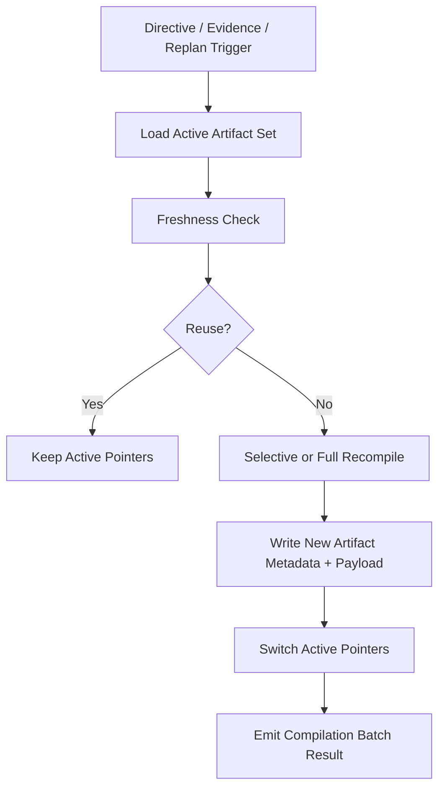

# 12 Compilation Lifecycle and Freshness Protocol

## Purpose

- 定义 vNext planning artifacts 的编译顺序、freshness 判定、失效条件与重编译策略。
- 把“什么时候复用、什么时候 supersede、什么时候必须全量重编译”从隐含理解提升为正式协议。
- 让 `Directive -> Evidence -> Product Spec -> Execution Package -> Task Graph -> Run Contract -> Dossier / Scaffold` 这条链具备实现前可执行的 lifecycle 规则。

## Scope

- 本文覆盖 compiled planning artifacts 的 lifecycle，不替代对象状态机或 dispatch 运行协议。
- compiled artifact 的对象范围见 `../03-state-model/08-vNext-Compiled-Artifact-Package.md`。
- 当前 MVP 的 `PlanRevision`、`Task`、`DispatchIntent` 仍是 authoritative runtime anchors。

## Definitions

- `Compilation Batch`：由一次 planning / replan 动作触发的一组编译输出。
- `Fresh`：artifact 与其上游 source refs、active revision、relevant checkpoint 仍一致，可继续复用。
- `Stale`：artifact 的上游关键输入已变化，不能再作为当前 canonical output。
- `Selective Recompile`：只重编译受影响的后续 artifacts，而不是整链全量重做。
- `Active Artifact Set`：当前活跃 `PlanRevision` / `DispatchIntent` 所绑定的 canonical artifacts 集。
- `Invalidation Trigger`：导致某类 artifact 必须重新评估 freshness 的事件或状态变化。

## Rules

### Canonical Compile Order

建议的编译顺序：

1. `ResearchSprintArtifact`
2. `EvidencePackArtifact`
3. `ProductSpecArtifact`
4. `ExecutionPackageArtifact`
5. `TaskGraphArtifact`
6. `RunContractArtifact`
7. `SessionScaffoldArtifact`
8. `ProjectDossierArtifact`

规则：

- 上游 artifact 未稳定前，下游不得被标记为 canonical active output。
- `ProjectDossierArtifact` 与 `SessionScaffoldArtifact` 都是下游派生层，但 `SessionScaffoldArtifact` 更接近 dispatch critical path，优先级高于 dossier。

### Compilation Batch Rule

每次 planning / replan 至少应有一个 `Compilation Batch` 记录：

- `compilation_batch_id`
- `trigger_ref`
- `input_refs`
- `output_refs`
- `target_plan_revision_id`
- `status`
- `compiled_at`

规则：

- 一个 batch 可以失败，但失败的输出不得切换 active pointer。
- 一个 batch 可以是 selective recompile。
- batch 本身是 lineage / 审计对象，不是 runtime truth。

### Freshness Rule

artifact freshness 至少要检查以下维度：

| Artifact | Freshness 关键条件 |
|---|---|
| `EvidencePackArtifact` | 绑定的 research inputs 未新增关键证据，directive scope 未变 |
| `ProductSpecArtifact` | active directive set 与 accepted assumptions 未变化 |
| `ExecutionPackageArtifact` | spec、ledger mapping、current plan base 未变化 |
| `TaskGraphArtifact` | execution package、dependencies、conflict rules、accepted task sources 未变化 |
| `RunContractArtifact` | 目标 task、task graph node、constraints、evidence refs、path scope 未变化 |
| `SessionScaffoldArtifact` | checkpoint / handoff / task spec / workspace binding 仍匹配 |
| `ProjectDossierArtifact` | active plan revision、ledger summary、checkpoint summary 未超过 freshness threshold |

### Invalidation Trigger Matrix

以下变化会触发 artifact freshness 重新评估：

| Trigger | 最低失效范围 |
|---|---|
| 新 `Directive` 改变目标或约束 | `ProductSpecArtifact` 及其下游全部 |
| 新 `EvidencePackArtifact` 改变已采纳 claims | `ProductSpecArtifact` 及其下游全部 |
| 仅新增 benchmark evidence，但未被采纳 | 最多使 `EvidencePackArtifact` 和 dossier summary 变 stale |
| `PlanRevision` supersede | `ExecutionPackageArtifact`、`TaskGraphArtifact`、下游全部 |
| 某个 `Task` 被 supersede / cancelled | 相关 `TaskGraphArtifact` 与受影响 `RunContractArtifact` |
| `DispatchIntent` 变更 workspace 或 executor profile | 相关 `RunContractArtifact` 与 `SessionScaffoldArtifact` |
| 新 `Checkpoint` / `Handoff` 写出 | `SessionScaffoldArtifact`、`ProjectDossierArtifact` |
| 单次 heartbeat | 默认不使任何 planning artifact stale |

### Reuse vs Supersede vs Rebuild Rule

对每类 artifact，编译器必须明确选择以下结果之一：

- `reuse`
  - 当前 artifact 仍 fresh，active pointer 不变
- `supersede`
  - 旧 artifact 进入 superseded，新 artifact 接管 active pointer
- `rebuild_downstream_only`
  - 当前层可复用，但下游必须重编译
- `block_and_escalate`
  - 上游输入冲突或缺失，禁止继续生成 canonical 下游输出

### Selective Recompile Rule

默认允许 selective recompile，但必须遵守：

- 不得跳过已知失效的中间层直接重建更下游层。
- 若 `ProductSpecArtifact` 变 stale，则 `ExecutionPackageArtifact / TaskGraphArtifact / RunContractArtifact` 必须至少重新 freshness-check。
- 若只是 `Checkpoint / Handoff` 变化，通常只需刷新 `SessionScaffoldArtifact` 与 `ProjectDossierArtifact`。

### Active Pointer Update Rule

更新 active pointer 时必须遵守：

- pointer 切换只在新 artifact metadata row 与 payload ref durable 后发生。
- pointer 切换失败时，不得留下“active pointer 已变但 payload 不存在”的状态。
- pointer 切换应尽量批量与相关 `PlanRevision / DispatchIntent` change-set 对齐。

### Dispatch Freshness Gate

`RunContractArtifact` 进入派发前至少必须确认：

- 仍绑定当前 canonical `Task`
- 仍绑定当前 active `PlanRevision`
- 相关 `TaskGraphArtifact` 未 stale
- relevant evidence refs 未被 superseded 为冲突版本
- `SessionScaffoldArtifact` 已与当前 checkpoint / workspace binding 对齐

若任一项不满足：

- 不得直接派发旧 contract
- 必须先 selective recompile 或进入 recovery / planning backlog

### Dossier and Scaffold Special Rule

- `ProjectDossierArtifact` 允许有受控延迟，不要求每次 task 微小变动都重编译。
- `SessionScaffoldArtifact` 处于执行 critical path，要求比 dossier 更严格的新鲜度。
- dossier stale 主要影响人类阅读。
- scaffold stale 可能直接影响新 session 定向，因此 stale threshold 更短。

### Failure and Partial Compile Rule

- 编译过程若中途失败，失败层之后的 outputs 一律不得标记为 canonical。
- partial compile 可留下 debug artifact，但必须标记 `failed` 或 `non_canonical`。
- planning 编译器不得因为 dossier 失败而阻塞 run contract 编译。
- 但 run contract 编译失败必须阻塞对应 dispatch。

## Protocol Steps

1. `Directive`、new evidence、replan 或 recovery 触发 compilation batch。
2. 读取 current active pointers 与上游 source refs。
3. 对目标 artifact set 做 freshness-check。
4. 判定：
   - reuse
   - selective recompile
   - full downstream recompile
   - block and escalate
5. 按 canonical compile order 生成新 artifacts。
6. durable 写入 metadata row 与 payload ref。
7. 更新 `PlanRevision` / `DispatchIntent` 上的 active pointers。
8. 写 compilation batch 结果与必要 outbox events。

## State / Schema

```yaml
compilation_batch:
  compilation_batch_id: compile_20260411_07
  trigger_ref: dir_20260411_08
  target_plan_revision_id: plan_rev_16
  input_refs:
    - dir_20260411_08
    - ep_20260411_04
    - plan_rev_15
  output_refs:
    - spec_20260411_03
    - exec_pkg_20260411_03
    - tg_20260411_03
    - rc_20260411_09
  status: compiled
freshness_check_result:
  artifact_ref: rc_20260411_08
  is_fresh: false
  invalidation_triggers:
    - task_superseded
    - workspace_binding_changed
  required_action: supersede
```

## Mermaid Diagram



## Anti-patterns

- 上游 artifact 已 stale，却继续复用旧 run contract 派发。
- 任何一点变化都全量重编译整条链，导致成本过高且噪声过大。
- dossier 编译失败就阻塞 execution critical path。
- 没有 compilation batch lineage，导致无法解释为什么某个 artifact 被替换。

## Acceptance Criteria

- 读者能明确知道 vNext compiled artifacts 的编译顺序与 freshness 规则。
- 任一 artifact stale 时都能说明由哪个 trigger 触发、需要重编译到哪一层。
- `RunContractArtifact` 与 `SessionScaffoldArtifact` 进入派发前有清晰 freshness gate。
- 编译失败不会把半成品错误切成 active output。
