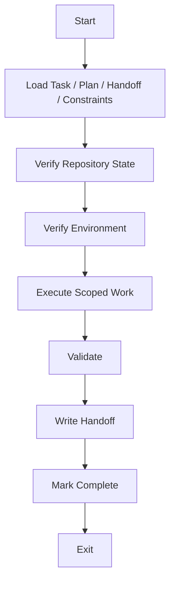

# 00 Agent Session Protocol

## Purpose

- 约束 Worker Session 生命周期。
- 保证 Worker 可替换、可审计、可恢复。

## Rules

### Session Reconstruction Protocol

- Worker 不允许直接执行 Task。
- Worker 必须先完成 Session START。
- START 未完成前，禁止执行写操作。
- Worker 不允许跳过 session reconstruction protocol。

### Session START

1. Load task spec
2. Load relevant plan sections
3. Load latest handoff
4. Load constraints
5. Verify repository state
6. Verify environment
7. Confirm done criteria

规则：

- 必须确认 Task scope、allowed paths、forbidden paths。
- 必须确认当前仓库状态、工作目录、依赖、命令入口可用。
- 任一步骤缺失时，Session 必须停止并上报阻塞。

### Session EXECUTION

1. Execute only scoped changes
2. Do not modify unrelated modules
3. Do not change architecture
4. Do not introduce new dependencies
5. Do not redefine requirements

规则：

- 只允许修改 Task scope 内对象。
- 不得顺手修复未授权问题。
- 不得修改 Plan、Requirement、全局约束。
- 如发现必须新增依赖，必须退出并升级。

### Session VALIDATION

必须执行：

- Run tests
- Run lint
- Run build
- Validate requirements coverage

规则：

- Validation 必须覆盖 done criteria。
- 仓库不存在对应机制时，Handoff 必须写明 `not_applicable`、原因、证据。
- Validation 未完成时，不得声明完成。

### Session HANDOFF

必须写：

- Files modified
- Decisions made
- Deviations from plan
- Assumptions
- Risks
- Remaining issues

规则：

- Handoff 必须引用 validation 结果。
- Handoff 必须包含可追溯的 artifact 或日志位置。
- Handoff 不得省略失败、偏差、未决风险。

### Session EXIT

- Mark task complete
- Write handoff
- Clear context
- Exit Worker

规则：

- 此处 `Mark task complete` 表示写入 completion claim，不等于最终验收通过。
- Worker 退出前不得保留未落盘状态。
- Worker 不等待后续人工对话继续执行。

## Protocol Steps

1. 完成 Session START，确认 Task、Plan、Handoff、Constraints、仓库状态、环境、done criteria。
2. 进入 Session EXECUTION，只执行 scope 内改动。
3. 完成 Session VALIDATION，收集 tests、lint、build、requirements coverage 证据。
4. 写入 Session HANDOFF，记录文件、决策、偏差、假设、风险、剩余问题。
5. 执行 Session EXIT，写入完成声明、清理上下文、退出 Worker。

## Mermaid Diagram

### Worker Session Lifecycle

## Anti-patterns

- 未重建上下文就直接开始改动。
- 全仓库漫游式搜索后再决定做什么。
- 修改无关模块或顺手改架构。
- 不做验证直接提交 Handoff。
- 退出前不写总结、不保留证据。

## Acceptance Criteria

- 每个 Worker Session 都有 START、EXECUTION、VALIDATION、HANDOFF、EXIT 记录。
- 每个 Handoff 都能回溯到 Task spec、Plan 引用、验证结果。
- Worker Session 可被杀掉并由新 Session 依据外部状态重建。
