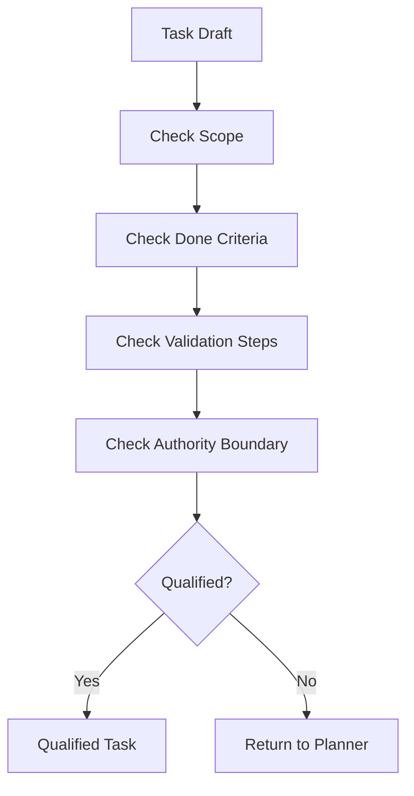

# 01 任务准入规则

## Purpose

- 约束进入 Worker 队列的 Task 形状。
- 保证 Task 可独立执行、可验证、可恢复。

## Rules

### Admission Checklist

任务必须同时满足：

1. 单一目标
2. 范围有边界
3. 输入引用清晰
4. 输出预期清晰
5. 完成标准明确
6. 验收标准明确
7. 扫描边界明确
8. 不承载未决架构决策
9. 可独立执行
10. 可安全重试或重派

### Task Schema Requirements

Task 必须包含：

- Objective
- Scope
- Constraints
- Relevant plan references
- Allowed paths
- Forbidden paths
- Done criteria
- Validation steps
- Output expectations
- Escalation rule

### Task Quality Requirements

Task 必须满足：

- Independently executable
- Incrementally verifiable
- Recoverable
- Scoped

规则：

- Worker 必须能在不依赖隐式上下文的情况下启动。
- Task 必须能在单次或少量 session 中产出可验证结果。
- Task 中断后，新的 Worker 必须能基于外部状态恢复。

### Task Prohibitions

Task 不得：

- Require full repo scan
- Modify architecture
- Redefine requirements
- Modify Plan
- Introduce major dependencies

规则：

- 若必须读取仓库，必须限定模块、目录或查询范围。
- 若 Task 需要架构裁决，必须回退到规划或决策流程。

## Protocol Steps

1. 生成 Task Draft。
2. 检查 scope 与 authority boundary。
3. 检查 done criteria。
4. 检查 validation steps。
5. 检查 required fields 是否完整。
6. 合格则入队，不合格则退回 Planner。

## Mermaid Diagram

### Task Admission Decision Flow

## Anti-patterns

- “顺手把这一大块都做了”
- “先扫描整个仓库再决定怎么干”
- “执行中再补 scope、限制和验收方式”
- “把需求澄清、架构设计、代码实现放进同一个 Task”
- “Task 完成只能靠人工读总结判断”

## Acceptance Criteria

- 缺少任何必填协议字段的 Task 不得入队。
- 未定义 allowed paths、forbidden paths、validation steps 的 Task 必须退回。
- 需要全仓扫描、修改架构或重定义需求的 Task 必须退回。
- 只有满足独立执行、增量验证、可恢复三项条件的 Task 才能派发。
