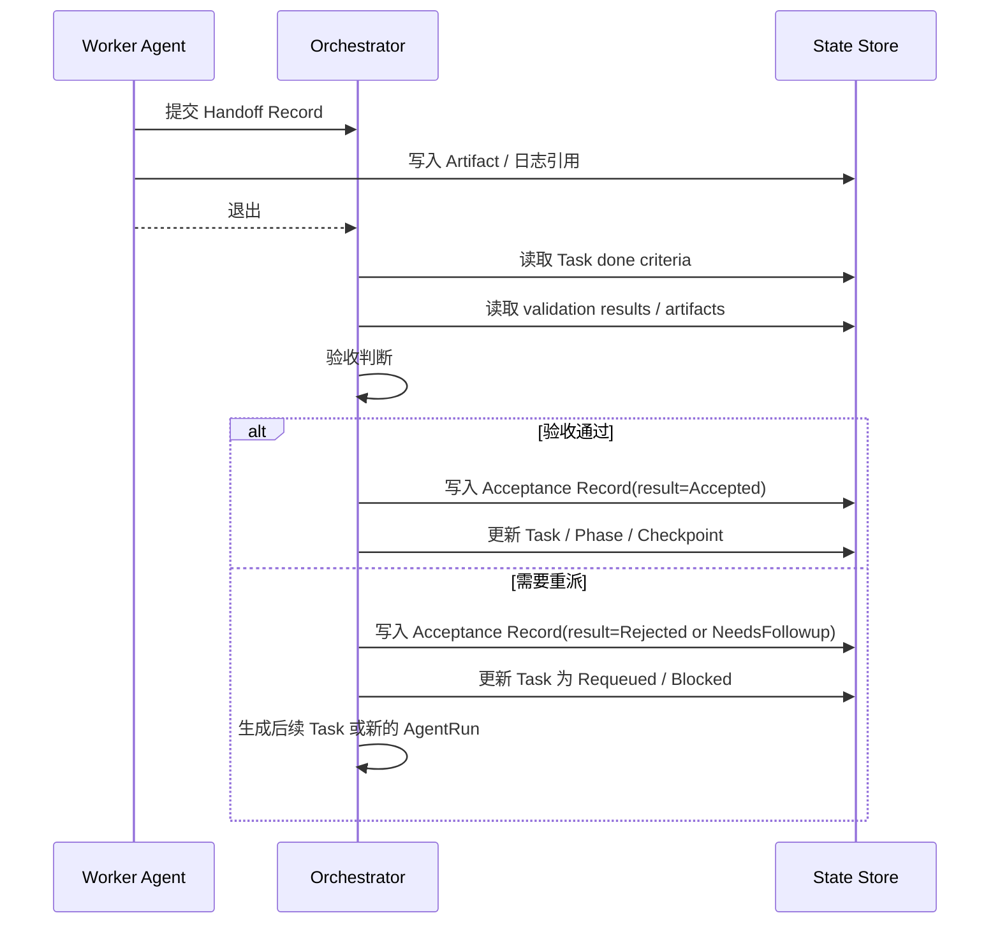

# 03 Handoff 记录规范

## 定位

Handoff 是 Worker 退出前提交给 Orchestrator 的结构化交接包，不是最终项目真相。

## 提交流向

`Worker -> Handoff Record / Artifact -> Orchestrator -> Acceptance -> 状态更新`

## 交接与验收时序图

## 必填字段

- task_id
- run_id
- objective_echo
- self_report_result
- files_modified
- artifact_refs
- summary
- deviations_from_plan
- assumptions_made
- validation_results
- unresolved_questions
- suggested_next_steps

## 目的

- 防止“静默偏航”
- 保障接力可读性
- 支持审计与回滚

## Orchestrator 验收动作

- 校验 done criteria 与 validation_results
- 判断任务进入 Accepted、Requeued、Blocked 或 Cancelled
- 必要时生成新的 Task、Issue 或 Decision
- 更新 Task、AgentRun、Checkpoint 等相关状态
