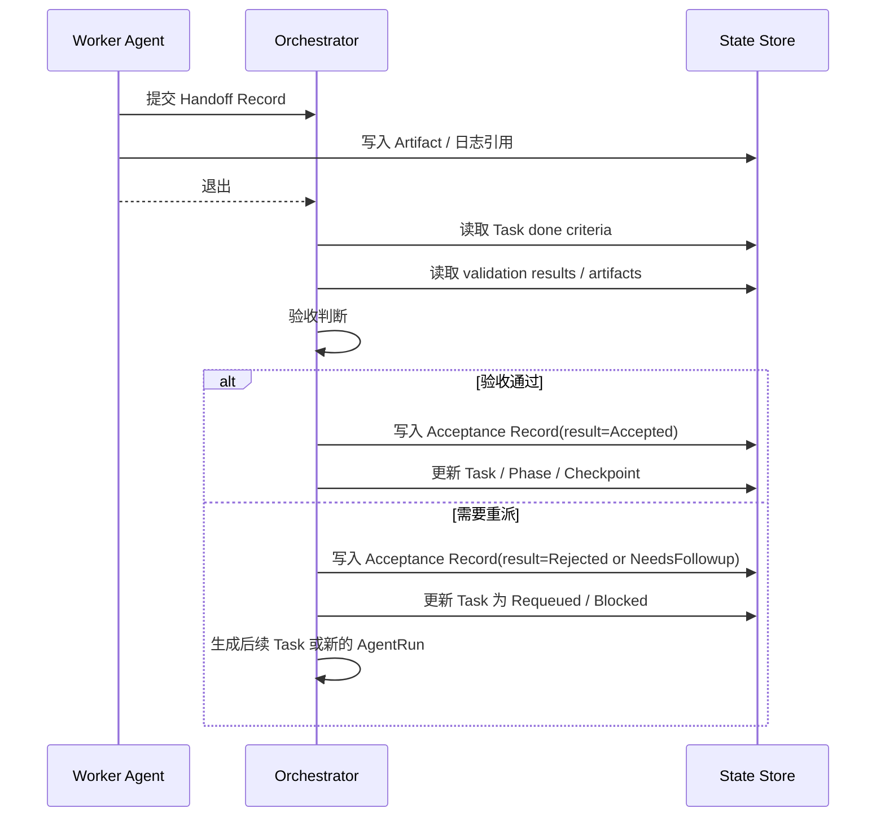

# 03 Handoff 记录规范

## Purpose

- 约束 Worker 退出时的交接包格式。
- 保证验收、重派、恢复都基于结构化输出。

## Rules

### Handoff Definition

- Handoff 是 Worker 退出前提交给 Orchestrator 的结构化交接包。
- Handoff 不是最终项目真相。

### Submission Flow

`Worker -> Handoff Record / Artifact -> Orchestrator -> Acceptance -> 状态更新`

### Handoff Sequence

### Required Fields

- task_id
- run_id
- objective_echo
- self_report_result
- files_modified
- artifact_refs
- summary
- deviations_from_plan
- assumptions_made
- validation_results
- unresolved_questions
- suggested_next_steps

### Acceptance Actions

- 校验 done criteria 与 validation_results
- 判断任务进入 Accepted、Requeued、Blocked 或 Cancelled
- 必要时生成新的 Task、Issue 或 Decision
- 更新 Task、AgentRun、Checkpoint 等相关状态

## Anti-patterns

- Worker 退出不写 Handoff。
- Handoff 不包含 validation 结果或 artifact 引用。
- 只写成功结论，不写偏差、风险和未决问题。
- 未验收就把 Handoff 当成最终完成记录。

## Acceptance Criteria

- 每个退出的 Worker 都必须产出可解析的 Handoff。
- 每个 Handoff 都必须能支持验收、重派或恢复。
- 没有必填字段的 Handoff 不得进入 Acceptance。
