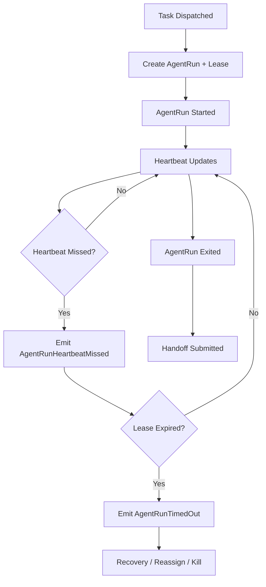

# 04 AgentRun Lease and Heartbeat Protocol

## Purpose

- 定义 `AgentRun` 的租约、心跳、超时与回收协议。
- 保证 Worker 可丢弃，但运行状态可观测、可恢复。
- 明确 `AgentRun` 与 `Task` 的边界。

## Scope

- 本文只约束运行实例，不定义任务验收结果。
- `Task` 是否完成由 Acceptance 决定，不由 `AgentRun` 自行决定。

## Definitions

- `Lease`：一次 `AgentRun` 的时效性授权。
- `Heartbeat`：运行实例仍然活跃的显式信号。
- `Heartbeat Missed`：在允许窗口内未收到心跳。
- `Timed Out`：租约失效且未恢复。
- `Stale Run`：状态未知、需要回收或核实的运行实例。

## Rules

### Lease Minimum Fields

- `run_id`
- `task_id`
- `lease_started_at`
- `lease_expires_at`
- `heartbeat_interval_sec`
- `last_heartbeat_at`
- `timeout_policy`
- `recovery_policy`

### Lease Discipline

- 任一 `AgentRun` 派发时必须创建 lease。
- lease 不存在时，不得把 run 视为活跃执行。
- `last_heartbeat_at` 必须单向前进，不得回写旧值。
- `AgentRun` 超时只说明运行实例失效，不说明任务失败完成。

### Heartbeat Rule

- 心跳必须由执行器适配层或运行监控层显式写出。
- 丢失一次心跳只产生 `AgentRunHeartbeatMissed`，不得立即判定任务失败。
- 超过租约窗口后，必须触发 `AgentRunTimedOut`。

## Protocol Steps

1. `TaskDispatched` 时创建 `AgentRun` 与 lease。
2. 执行器启动成功后写 `AgentRunStarted`。
3. 运行中持续写 `heartbeat`。
4. 若心跳超出阈值，写 `AgentRunHeartbeatMissed`。
5. 若租约到期仍未恢复，写 `AgentRunTimedOut`。
6. `Orchestrator` 根据策略选择 `retry / reassign / recover / kill`。
7. 若 run 正常结束，写 `AgentRunExited` 并进入 `HandoffSubmitted` 流。

## State / Schema

```yaml
run_id: run_codex_003
task_id: task_auth_backend_07
executor_name: codex
status: running
lease:
  lease_started_at: 2026-04-10T12:00:00Z
  lease_expires_at: 2026-04-10T12:30:00Z
  heartbeat_interval_sec: 60
  last_heartbeat_at: 2026-04-10T12:05:00Z
  timeout_policy: mark_timed_out_then_recover
  recovery_policy: reassign_if_no_handoff
```

## Mermaid Diagram

### AgentRun Lease Flow



## Anti-patterns

- 不建 lease，靠人工猜测 run 是否还活着。
- 心跳丢失后静默等待，不触发恢复。
- 把 `AgentRunTimedOut` 直接写成 `Task completed`。
- 运行状态只存于终端输出，不写结构化字段。

## Acceptance Criteria

- 任一活跃 `AgentRun` 都能找到 lease 字段与最后心跳时间。
- 任一超时都能找到对应的事件、时间和恢复动作。
- 任一 `AgentRun` 的结束都不会直接被误判为 Task 完成。
