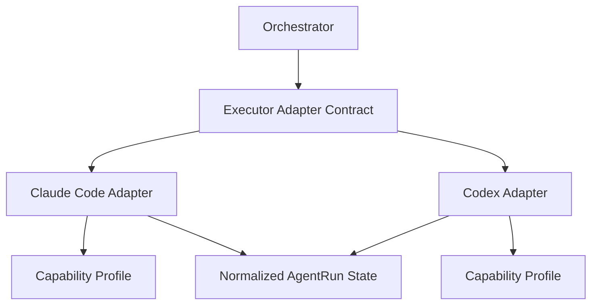

# 05 Executor Adapter Contract

## Purpose

- 定义 Hive 与外部执行器之间的统一适配契约。
- 屏蔽 Claude Code、Codex 等执行器的能力差异。
- 保证 Orchestrator 面向协议调度，而不是面向某个单一工具特性编排。

## Scope

- 本文定义抽象契约，不定义某个执行器的具体实现。
- 执行器是外部可替换组件，不是 Hive 内核。

## Definitions

- `Executor Adapter`：屏蔽具体执行器差异的协议层。
- `Capability Profile`：某个执行器支持的能力集合。
- `Workspace Model`：执行器运行所依赖的工作区隔离方式。
- `Exit Status Normalization`：把执行器原生退出结果映射成 Hive 标准状态。

## Rules

### Capability Profile

适配器必须暴露最小能力画像：

- `executor_name`
- `supports_restore_run`
- `supports_soft_cancel`
- `supports_hard_kill`
- `supports_worktree`
- `supports_sandbox`
- `supports_tool_introspection`
- `supports_parallel_runs`
- `heartbeat_model`
- `approval_model`
- `tool_availability_model`

### Adapter Surface

适配器必须至少实现：

- `get_capability_profile()`
- `launch_run(...)`
- `restore_run(...)`
- `cancel_run(...)`
- `kill_run(...)`
- `collect_logs(...)`
- `collect_artifacts(...)`
- `poll_run(...)`

### Adapter Discipline

- Hive 不能假设所有执行器支持相同上下文长度。
- Hive 不能假设所有执行器支持相同权限模型。
- Hive 不能假设所有执行器支持相同并发模型。
- Hive 不能假设所有执行器都能恢复旧 session。
- 适配器必须把原生退出状态归一为 Hive 标准状态。

### Exit Status Normalization

标准退出状态建议：

- `succeeded`
- `failed`
- `blocked`
- `timed_out`
- `cancelled`
- `killed`
- `unknown`

### Retryability Semantics

- `timed_out` 默认可重试。
- `killed` 需结合原因判断是否可重试。
- `failed` 需结合失败类型判断是否可重试。
- `blocked` 默认不自动重试，应先解决 blocker。

## Protocol Steps

1. Orchestrator 读取执行器 `Capability Profile`。
2. 根据 Task 约束选择可用执行器。
3. 调用 `launch_run(...)` 或 `restore_run(...)`。
4. 运行中通过 `poll_run(...)`、heartbeat、日志采集维持观察。
5. 结束后调用 `collect_logs(...)` 与 `collect_artifacts(...)`。
6. 将执行器原生状态映射为 Hive 标准状态。

## State / Schema

```yaml
executor_name: codex
capability_profile:
  supports_restore_run: true
  supports_soft_cancel: true
  supports_hard_kill: true
  supports_worktree: true
  supports_sandbox: true
  supports_tool_introspection: true
  supports_parallel_runs: true
  heartbeat_model: adapter_reported
  approval_model: tool_or_policy_gated
  tool_availability_model: dynamic
normalized_exit_status_map:
  completed: succeeded
  timeout: timed_out
  interrupted: cancelled
  fatal: failed
```

## Mermaid Diagram

### Executor Adapter Abstraction



## Anti-patterns

- 在调度层直接写死某个执行器私有能力。
- 用单一 prompt 假设所有执行器行为一致。
- 直接把原生退出码当 Hive 任务状态。
- 适配器不暴露能力边界，导致调度层盲调度。

## Acceptance Criteria

- 读者能明确看到 Hive 对执行器差异的抽象边界。
- 任一执行器都能映射为统一的 `Capability Profile` 与标准退出状态。
- 任一派发动作都能先判断能力匹配，而不是事后失败。
