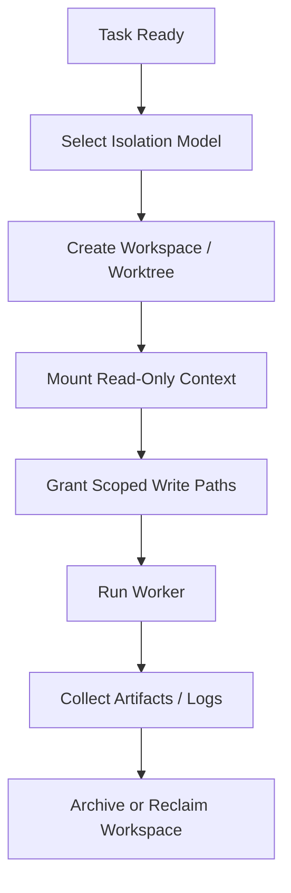

# 06 Workspace Isolation Model

## Purpose

- 定义 `AgentRun` 的工作区隔离方式。
- 保证多个 Worker 并发时不相互污染。
- 为恢复、回放、冲突分析提供稳定边界。

## Scope

- 本文覆盖工作区、只读上下文、产物输出与最小隔离规则。
- 路径锁语义见下一章。

## Definitions

- `Workspace`：一次 `AgentRun` 可见的运行目录。
- `Isolated Workspace`：与其他 run 隔离的独立工作区。
- `Shared Read-Only Context`：允许多个 run 共享读取但禁止写入的上下文。
- `Artifact Output Path`：Worker 产出物的归档路径。

## Rules

### Workspace Rule

- 默认每个 `AgentRun` 必须拥有独立 workspace。
- 同一 workspace 默认不得被多个活跃 `AgentRun` 共享写入。
- 共享上下文只允许只读挂载。
- 任务未声明写路径时，不得派发写权限执行。

### Isolation Options

允许的隔离模型：

- 独立目录
- 独立 git worktree
- 独立 sandbox
- 共享 repo + 强路径锁

默认推荐：

- 写任务使用独立 workspace 或独立 worktree
- 纯只读任务可使用共享只读上下文

### Artifact Discipline

- 所有产物必须写到 `artifacts/` 或对象引用的稳定路径。
- workspace 内的临时文件不得作为唯一事实来源。
- 需要恢复的日志、补丁、测试结果必须可外部引用。

## Protocol Steps

1. Orchestrator 根据 Task 类型选择隔离模型。
2. 创建 workspace 并绑定 `task_id`、`run_id`。
3. 挂载允许的只读上下文与写路径。
4. 执行结束后收集 artifacts 与 logs。
5. 回收或归档 workspace。

## Mermaid Diagram

### Workspace Isolation Flow

## Anti-patterns

- 所有 Worker 直接共享同一可写工作区。
- 只靠 Git 分支区分运行实例，不做目录或锁隔离。
- 恢复所需日志只留在临时 workspace。
- 不区分只读上下文和可写路径。

## Acceptance Criteria

- 任一活跃 `AgentRun` 都能定位到其 workspace 与隔离模型。
- 任一并发写任务都能证明其写路径未与其他 run 冲突。
- 任一恢复流程都能在 workspace 回收后仍读取关键 artifacts。
