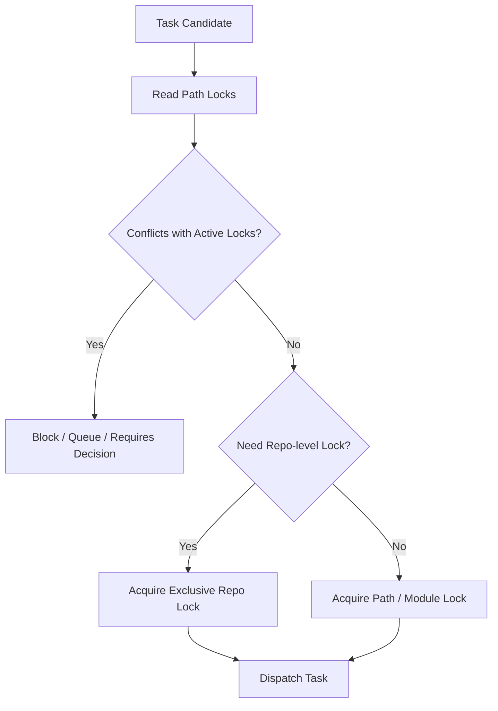

# 07 Path Locking and Conflict Policy

## Purpose

- 定义仓库级、模块级、路径级冲突控制规则。
- 约束多个 `AgentRun` 如何安全并发进入同一仓库。
- 防止 Worker 互相踩改动。

## Scope

- 本文覆盖调度前冲突检测与锁语义。
- 不覆盖底层锁实现细节。

## Definitions

- `Repo-level Lock`：整个仓库的排他锁。
- `Module-level Lock`：某个模块或目录子树的锁。
- `Path Lock`：精确到路径模式的读写锁。
- `Read Lock`：允许共享读取。
- `Write Lock`：排他写入。

## Rules

### Lock Granularity

- 优先使用 `path lock`。
- 路径粒度不足时升级到 `module-level lock`。
- 跨仓库大改动或全局迁移时才允许 `repo-level lock`。

### Conflict Policy

以下情况不得并发派发：

- 两个 Task 持有重叠 `write lock`
- 一个 Task 需要 `repo-level lock`，另一个仍在仓库内写入
- 两个 Task 被标记为 `mutually-exclusive`
- 任务依赖尚未满足

以下情况允许并发：

- 只读上下文共享
- 路径完全不重叠的写任务
- 一个写任务与多个只读任务，且只读任务不依赖未提交中间状态

### Lock Lifecycle

- 派发前申请锁。
- `AgentRun` 启动成功后锁进入 active。
- run 结束、超时或 killed 后必须释放或转入 recovery hold。
- 锁释放失败必须写出 `Issue`。

## Protocol Steps

1. 读取 Task 的 `allowed_paths`、`forbidden_paths`、`path_locks`。
2. 计算与活跃 `AgentRun` 的冲突集合。
3. 申请所需锁。
4. 申请失败则进入 `blocked` 或 `queued`。
5. 申请成功才允许派发。
6. run 结束后显式释放锁。

## Mermaid Diagram

### Path Lock Decision Flow

## Anti-patterns

- 让多个 Worker 同时修改同一模块而不加锁。
- 所有任务都上 repo-level lock，导致系统失去并发。
- 锁只存在内存里，恢复后无法判断冲突。
- 锁释放失败后继续派发新任务。

## Acceptance Criteria

- 任一并发派发都能说明其锁模型。
- 任一路径冲突都能在派发前被发现。
- 任一超时或 kill 的 run 都能触发锁释放或 recovery hold。
