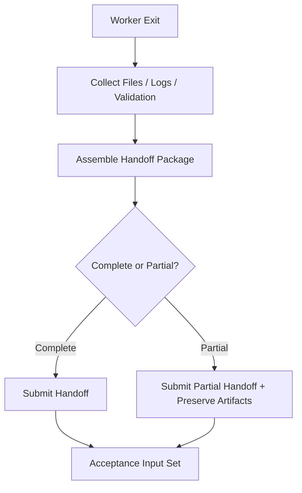

# 08 Handoff Artifact Contract

## Purpose

- 定义 Worker 退出时必须留下的结构化产物。
- 保证下游验收、恢复、重派都能读取稳定证据。
- 区分完整 handoff 与 partial handoff。

## Scope

- 本文覆盖 handoff package、artifact 命名、引用与保留规则。
- Task 是否 accepted 由 Acceptance Engine 决定。

## Definitions

- `Handoff Package`：Worker 退出时提交的结构化交接包。
- `Partial Handoff`：任务未完成，但已有可回收产物的交接包。
- `Artifact State`：某个产物的类型、路径、可读性、完整性状态。
- `Evidence Artifact`：用于验收的测试结果、日志、补丁、截图、报告等。

## Rules

### Handoff Minimum Content

- `handoff_id`
- `task_id`
- `run_id`
- `result_claim`
- `modified_files`
- `artifact_refs`
- `validation_results`
- `decisions_made`
- `deviations_from_plan`
- `assumptions`
- `risks`
- `remaining_issues`

### Artifact Retention Rule

以下产物必须保留并可引用：

- 结构化 handoff 记录
- 日志摘要与原始日志引用
- 测试结果
- 关键命令输出
- 补丁或变更引用
- 失败时的 issue 记录

### Partial Handoff Rule

- `Partial Handoff` 必须显式标记为 partial。
- partial handoff 可被回收为 artifact，不得默认视为 accepted completion。
- 若 run 被 supersede、timed_out、killed，但已有有价值产物，仍应尝试写 partial handoff。

## Protocol Steps

1. Worker 停止前收集变更、日志、验证结果与风险。
2. 组装 `Handoff Package`。
3. 将强制保留产物写入稳定位置。
4. 提交 `HandoffSubmitted`。
5. 等待 Acceptance Engine 处理。

## State / Schema

```yaml
handoff_id: handoff_20260410_03
task_id: task_auth_backend_07
run_id: run_codex_003
result_claim: partial
modified_files:
  - services/auth/session.py
artifact_refs:
  - artifact_logs_003
  - artifact_test_003
validation_results:
  tests: failed
  lint: passed
decisions_made:
  - isolate_refresh_token_logic
deviations_from_plan:
  - paused before integration wiring
assumptions:
  - existing auth middleware remains stable
risks:
  - integration tests still missing
remaining_issues:
  - issue_auth_timeout_01
```

## Mermaid Diagram

### Handoff Package Contract



## Anti-patterns

- 只写一句总结，不写 artifacts。
- 测试失败但不附测试结果。
- Worker 被 kill 后直接丢弃中间产物。
- partial handoff 不做标记，导致误验收。

## Acceptance Criteria

- 任一 `Handoff` 都能定位到 `run_id`、`task_id` 与 artifact refs。
- 任一验收结论都能回到具体 evidence artifacts。
- 任一失败或中断 run 都能尽量保留 partial handoff 或 issue 记录。
