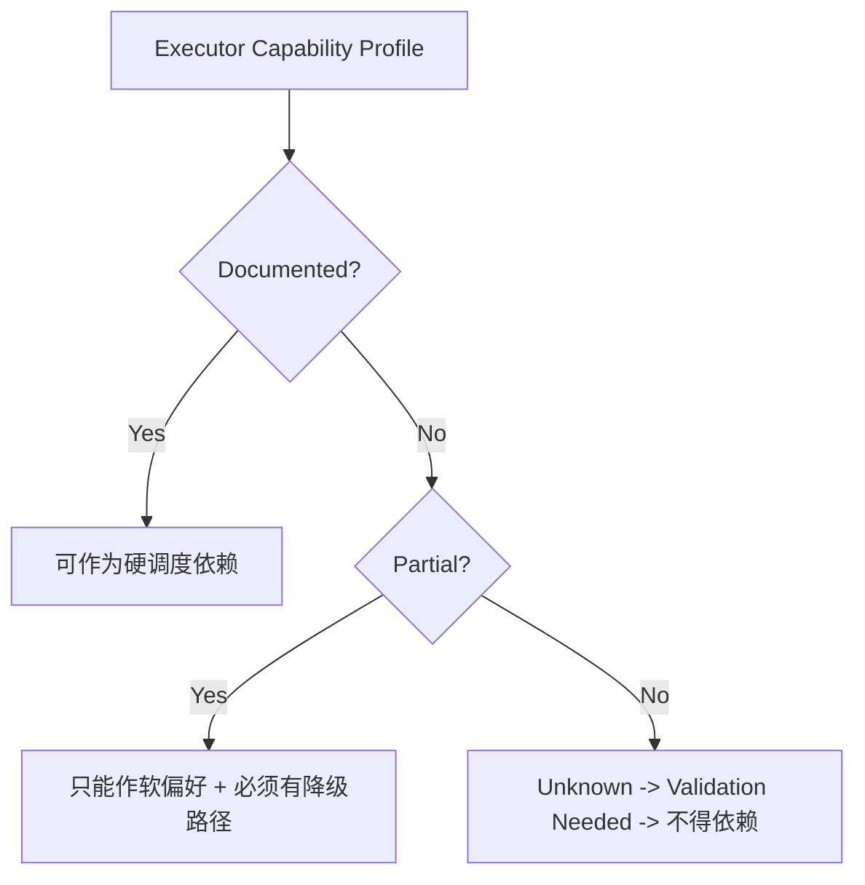

# 09 Executor Capability Matrix

## Purpose

- 比较 Claude Code 与 Codex 作为 Hive 外部执行器时，调度层真正关心的能力维度。
- 把执行器选择收敛成协议选择矩阵，而不是产品宣传页。
- 约束 Scheduler 与 Adapter 只能依赖被文档或实验验证过的能力。

## Scope

- 本文只定义 Hive 关心的能力维度和保守使用规则。
- 本文不试图穷举厂商实现细节；未知项必须明确标记。
- 具体验证方式见 `./12-Executor-Validation-Plan.md`。
- Worker session continuity 与 bootstrap 见 `./10-Worker-Session-Bootstrap-Checklist.md`。

## Definitions

- `Documented`：有足够文档证据支持调度层依赖。
- `Partial`：能力存在，但语义不完整或边界不够硬。
- `Unknown`：当前没有足够证据，不能作为硬依赖。
- `Validation Needed`：必须通过 conformance / spike 验证后才能被关键路径依赖。

## Rules

### Capability Consumption Rule

1. Scheduler 只能把 `Documented` 能力当作硬依赖。
2. `Partial` 只能作为软偏好，必须设计降级路径。
3. `Unknown` 能力不得写进 recovery、session continuity 或 dispatch 核心路径。
4. Adapter 必须向控制平面暴露能力画像，而不是让 Orchestrator 直接猜执行器特性。

### 调度层真正关心的维度

- `restore_session`
- `soft_cancel`
- `hard_kill`
- `sandbox`
- `parallel_runs`
- `tool_introspection`
- `approval_model`
- `heartbeat_model`
- `artifact_collection`
- `workspace_isolation`

### 设计立场

- 这些维度服务于调度决策、恢复设计和风险评估。
- 它们不是“哪个产品更强”的宣传项。
- 多执行器是 Hive 的设计方向，但其价值要靠 capability contract 和后续实验验证，而不是先验成立。

## Protocol Steps

1. Adapter 暴露 normalized capability profile。
2. Scheduler 在 `prepare_dispatch` 前读取 capability profile。
3. 若某项能力仅为 `Partial / Unknown`，调度层必须选择保守路径。
4. `Validation Needed` 的能力只能在实验或 conformance 通过后提升为硬依赖。
5. capability 变化必须能回写到 executor profile，而不是散落在 prompt 假设中。

## State / Schema

```yaml
executor_capability_profile:
  executor_name: codex
  restore_session: partial
  soft_cancel: unknown
  hard_kill: unknown
  sandbox: documented
  parallel_runs: documented
  tool_introspection: partial
  approval_model: documented
  heartbeat_model: unknown
  artifact_collection: documented
  workspace_isolation: documented
  validation_needed:
    - hard_kill_fidelity
    - live_run_restore_fidelity
```

## Mermaid Diagram

### Capability 消费规则



## Capability Matrix

| 维度 | Claude Code | Codex | Hive 设计含义 |
|---|---|---|---|
| `restore_session` | `partial` | `partial` | 只能依赖“可重建上下文”，不能依赖 live run fidelity |
| `soft_cancel` | `unknown` | `unknown` | 取消策略必须允许退化为 `finish_current_step` 或 recovery |
| `hard_kill` | `unknown` | `unknown` | kill 必须经 adapter 封装，失败时进入 recovery |
| `sandbox` | `documented` | `documented` | 权限与副作用边界必须进入 executor profile |
| `parallel_runs` | `partial` | `documented` | 并发能力必须被 capability gate 限制，不得默认无限并发 |
| `tool_introspection` | `documented` | `partial` | Hive 需要在 launch 前知道工具与权限边界 |
| `approval_model` | `documented` | `documented` | approval 差异必须映射成 policy fields |
| `heartbeat_model` | `unknown` | `unknown` | 首版必须由 host-side lease monitor 兜底 |
| `artifact_collection` | `partial` | `documented` | artifact refs 必须统一成 Hive 自己的 contract |
| `workspace_isolation` | `partial` | `documented` | 对隔离不硬的执行器，必须由 Hive 提供外部工作区策略 |

## Design Notes

### 选择建议

- 首版执行器选择时，应优先选择：
  - sandbox 语义清晰
  - workspace isolation 可控
  - artifact collection 可稳定归一
- 对 `restore_session`、`soft_cancel`、`hard_kill`、`heartbeat_model`，首版都不应写成硬依赖。

### 对调度与恢复的直接影响

- `restore_session != 可恢复执行实例`
- `parallel_runs != 必然允许多任务并行派发`
- `artifact_collection` 再强，也不等于 `Handoff`、`Acceptance` 可以省略
- `approval_model` 和 `sandbox` 必须进入 task dispatch policy，否则执行结果不可预测

## Anti-patterns

- 把厂商体验描述直接当成 Hive 的协议保证。
- 用 `unknown` 能力设计核心恢复路径。
- 只因为“支持并行”就默认多 worker 更优。
- 忽略 workspace isolation 差异，导致路径锁和执行隔离失真。

## Acceptance Criteria

- 读者能明确知道 Hive 在选择执行器时真正关心哪些能力维度。
- Claude Code 与 Codex 的能力差异被表达为协议矩阵，而不是宣传比较。
- `Partial / Unknown` 项都明确不能被当作硬依赖。
- Scheduler 与 Adapter 的职责边界清楚：一个消费能力画像，一个暴露能力画像。
