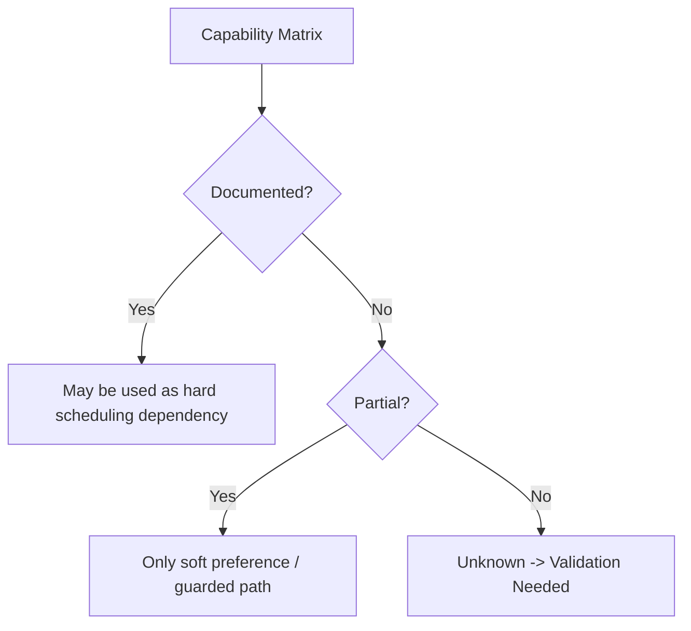

# 09 Executor Capability Matrix

## Purpose

- 将执行器适配契约进一步收敛为可比对的能力矩阵。
- 明确 Claude Code 与 Codex 的已知能力、未知项和验证需求。
- 约束 Scheduler 只能依赖“已确认能力”，不能依赖想象中的能力。

## Scope

- 本文是架构假设矩阵，不是产品宣传页。
- 本文只记录当前可用公开资料与明确 unknown。

## Definitions

- `Documented`：官方资料明确说明。
- `Partial`：官方资料只覆盖部分语义。
- `Unknown`：公开资料未明确说明。
- `Validation Needed`：必须通过实验验证后才能被调度层依赖。

## Rules

### Capability Consumption Rule

- Scheduler 只能把 `Documented` 能力当作硬能力。
- `Partial` 只能作为软偏好，不得作为关键恢复路径前提。
- `Unknown` 能力不得写进 hard dependency。
- adapter 必须把 `Documented / Partial / Unknown` 连同证据来源暴露给调度层。

### Matrix Reading Rule

- `supports_* = yes` 仅表示“文档证据足够支持调度层依赖”。
- `partial` 表示“存在相关能力，但语义不完整”。
- `unknown` 表示“不得依赖，需要实验验证”。

## Capability Matrix

| Capability | Claude Code | Codex | 架构含义 |
|---|---|---|---|
| `supports_restore_run` | `unknown` | `partial`：文档显示跨 CLI / IDE / app 保持 session history 与 cloud task continuity，但 live run restore 语义不完整 | 恢复流程默认按“可重建上下文 + 重派”设计，不能依赖原 run 恢复 |
| `supports_soft_cancel` | `unknown`：公开资料未给出统一 run 级 soft cancel 语义 | `unknown`：公开资料未给出统一 run 级 soft cancel 语义 | 调度层应优先设计 `finish_current_step`，并允许退化为 hard kill |
| `supports_hard_kill` | `unknown` | `unknown` | kill 只能经 adapter 封装，失败时必须进入 recovery |
| `supports_parallel_runs` | `partial`：subagents 文档明确并行子代理，但跨独立仓库 / 工作区并发依赖外部启动器 | `yes`：官方明确 app 支持 multiple agents in parallel | Scheduler 必须按 executor profile 判断并发上限 |
| `supports_workspace_isolation` | `partial`：文档明确写权限受工作目录限制，但独立 worktree 不是通用默认语义 | `yes`：官方明确 app / cloud task 使用 isolated sandbox，app 支持 worktrees | 对 Claude Code 默认需要外部编排器提供隔离 |
| `supports_tool_introspection` | `yes`：文档明确 tools / disallowedTools / MCP scoping | `partial`：Codex docs 明确 skills、MCP、web search、approval modes；细粒度 tool introspection 语义需验证 | adapter 需要把工具集标准化 |
| `heartbeat source` | `unknown` | `unknown` | v1 必须由 host-side lease monitor 主导，不能依赖 executor 内建 heartbeat |
| `approval / permission model` | `yes`：只读默认、显式批准、hooks allow/deny/ask documented | `yes`：三档 approval mode、workspace / network boundary documented | Scheduler 必须把权限模式映射为 policy fields |
| `tool availability model` | `yes`：可通过 tools / MCP / subagent scope 控制 | `partial`：skills、MCP、web search documented，但不同 surface 差异需验证 | adapter 应暴露运行前可用工具清单与动态限制 |
| `artifact collection model` | `partial`：GitHub Actions / runner 产物可用，但统一 artifact contract 未见完整官方语义 | `yes`：官方明确任务附带 citations、terminal logs、test results，cloud 可附截图 | Hive 仍需统一 artifact refs，不直接依赖原生格式 |
| `log collection model` | `partial`：CI runner logs 明确，交互式 CLI 原始日志 API 语义未明 | `yes`：官方明确 terminal logs with each task | Log Store 仍需 adapter 标准化 |
| `resume semantics` | `partial`：persistent memory / session continuity 存在线索，但 run fidelity unknown | `partial`：session history continuity documented，cloud task reopen documented | 只能当“上下文连续性”，不能当“执行实例恢复” |
| `failure surface` | `documented`：permission denial、sandbox boundary、tool restrictions、runner / API failures | `documented`：approval denial、sandbox / network restriction、environment setup failure、cloud / local mode mismatch | Recovery policy 必须把失败面分类归一化 |
| `known unknowns` | 高：restore、heartbeat、kill fidelity、workspace isolation depth | 中高：restore fidelity、soft cancel semantics、tool introspection granularity | 这些项必须先实验验证再写成 hard dependency |

## Normalized Profile Recommendation

```yaml
executor_name: claude_code
evidence_basis:
  supports_parallel_runs: documented_partial
  supports_workspace_isolation: documented_partial
  heartbeat_source: unknown
unsafe_to_assume:
  - restore_run_fidelity
  - hard_kill_fidelity
  - built_in_heartbeat
```

## Mermaid Diagram

### Capability Consumption Rule



## Sources Baseline

- Claude Code Security: <https://docs.anthropic.com/s/claude-code-security>
- Claude Code Subagents: <https://docs.anthropic.com/en/docs/claude-code/sub-agents>
- Claude Code GitHub Actions: <https://docs.anthropic.com/en/docs/claude-code/github-actions>
- Introducing the Codex app: <https://openai.com/index/introducing-the-codex-app/>
- Introducing upgrades to Codex: <https://openai.com/index/introducing-upgrades-to-codex/>

## Anti-patterns

- 把 `unknown` 能力写进恢复核心路径。
- 用单一 executor profile 假设 Claude Code 与 Codex 行为一致。
- 将“产品体验上可继续”误当成“run 级 restore 已有硬保证”。
- 把并行能力当成必然更优，而不结合 lock / conflict policy。

## Acceptance Criteria

- 读者能明确区分已知能力、部分能力和未知能力。
- Scheduler 可以据此做保守派发，而不是过度依赖 executor 魔法。
- 未知项都明确标记了 `Validation Needed`。
