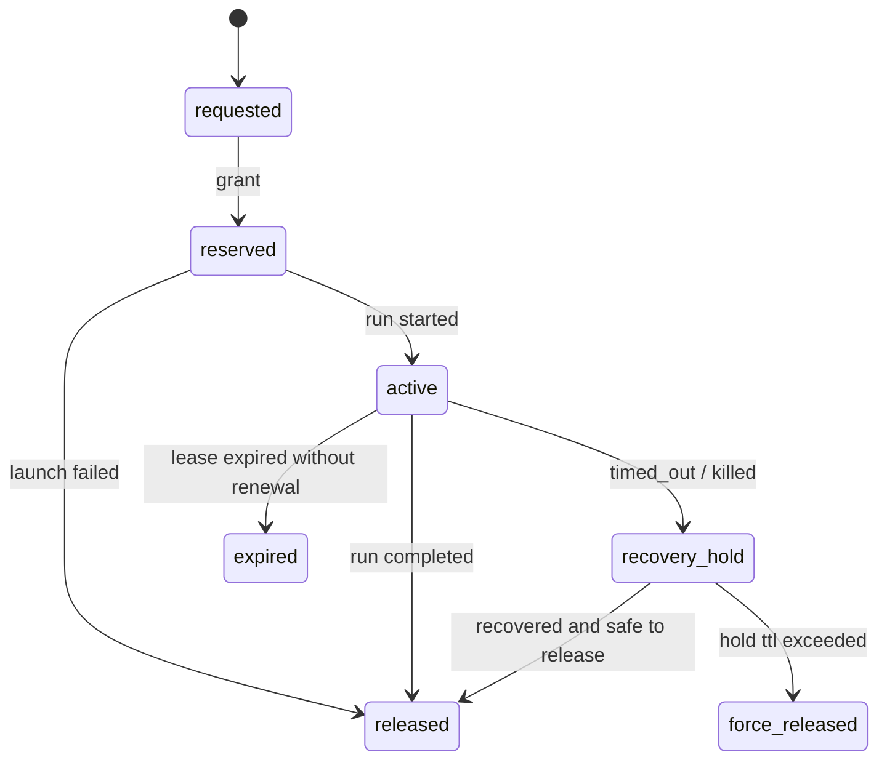
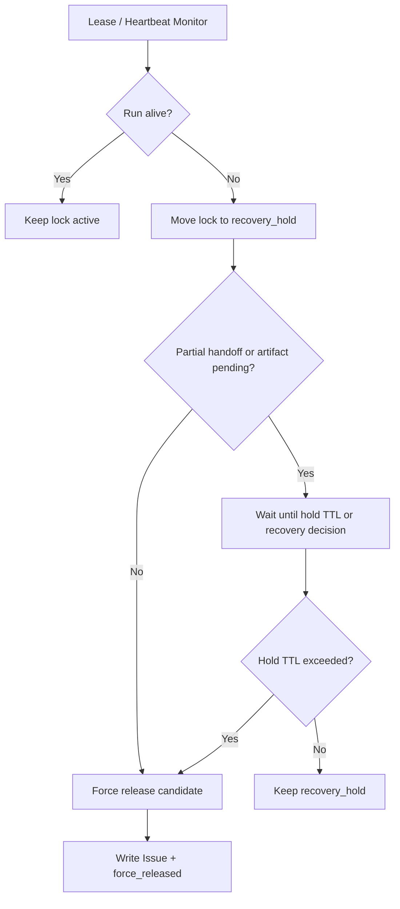

# 10 Lock Manager and Stale Lock Recovery

## Purpose

- 将路径锁规则收敛为统一的控制平面组件设计。
- 定义 lock object、锁生命周期、stale lock 判定与回收协议。
- 保证锁不只是规则，而是可持久化、可恢复、可审计的运行时对象。

## Scope

- 本文覆盖 repo / module / path lock 的统一表示。
- 本文不描述底层数据库锁实现，只描述控制平面语义。

## Definitions

- `Lock Manager`：控制平面中的统一锁服务。
- `Lock Object`：一个可持久化的锁状态对象。
- `Recovery Hold`：run 异常后为保护中间状态而暂不释放的锁。
- `Stale Lock`：其 owner run 已失效、丢失或超出 lease，但锁仍未释放。

## Rules

### Lock Manager Discipline

- Lock Manager 属于控制平面，不属于 Worker 能力。
- 锁不得只存在内存。
- Worker 不得自行申请、续约或释放最终锁状态。
- 所有锁状态变更必须写入对象状态与事件。

### Unified Lock Representation

- `scope_type`: `repo` / `module` / `path`
- `mode`: `read` / `write`
- `owner_task_id`
- `owner_run_id`
- `resource_ref`
- `status`
- `lease_expires_at`
- `last_renewed_at`
- `recovery_hold_until`
- `conflict_with`

### Lock States

- `requested`
- `reserved`
- `active`
- `recovery_hold`
- `released`
- `force_released`
- `expired`

### Stale Lock Rule

以下任一条件满足，可判定为 stale lock：

- owner `AgentRun` 已 `timed_out`
- owner `AgentRun` 已 `killed`
- owner `AgentRun` 不存在且无法恢复
- `last_renewed_at` 超出锁 lease 窗口
- `recovery_hold_until` 已过期但仍未释放

### Recovery Hold Rule

- run `timed_out` 或 `killed` 后，锁默认先进入 `recovery_hold`。
- `recovery_hold` 期间不得重新派发冲突写任务。
- Recovery Coordinator 必须在 hold TTL 内决定：
  - restore and continue
  - collect partial handoff then release
  - force release and reassign

### Force Release Rule

满足以下条件时允许 `force_release`：

- 无活跃 run
- 无待采集 handoff / artifact
- hold TTL 已过
- 已写 Issue 或审计说明

### Deadlock and Long-held Lock Governance

- 调度层不得增量逐把获取锁；必须一次性提交完整锁集合。
- Lock Manager 必须按统一顺序排序锁请求，避免循环等待。
- 超过最大持有阈值的 active lock 必须升级为 Issue。
- repo-level write lock 需要更高门槛与更短 TTL。

## Protocol Steps

1. Scheduler 生成完整锁请求集合。
2. Lock Manager 做冲突检查与排序。
3. 在 change-set 中写 `requested -> reserved`。
4. run 启动成功后写 `reserved -> active`。
5. 运行中按 lease 续约。
6. run 正常结束后写 `active -> released`。
7. run 异常时写 `active -> recovery_hold`。
8. Recovery Coordinator 在 hold TTL 内决定恢复或 `force_release`。

## State / Schema

```yaml
lock_id: lock_auth_write_07
scope_type: path
resource_ref:
  repo: hive-service
  path_pattern: services/auth/**
mode: write
owner_task_id: task_auth_backend_07
owner_run_id: run_codex_003
status: active
lease_expires_at: 2026-04-10T12:30:00Z
last_renewed_at: 2026-04-10T12:05:00Z
recovery_hold_until: null
conflict_with: []
```

## Mermaid Diagram

### Lock Lifecycle



### Stale Lock Recovery Flow



## Task / Issue Impact

- 短暂锁冲突可使 Task 进入 `queued` 或保留 `ready` 但不可派发。
- 持续锁冲突必须使 Task 进入 `blocked`，并创建 `Issue(type=lock_conflict)`。
- stale lock 与 force release 必须写入 Checkpoint 摘要。

## Checkpoint / Recovery Relationship

- Checkpoint 至少记录：
  - active lock summary
  - recovery hold summary
  - stale lock issue refs
- Recovery Reconciliation 必须读取 lock objects，而不是仅从 active run 反推锁。

## Anti-patterns

- 让 Worker 通过本地文件或进程锁自管全局冲突。
- run 超时后立即释放写锁，忽略中间产物回收。
- 锁只在内存中存在，进程重启后全部丢失。
- 长期占锁但不生成 Issue。

## Acceptance Criteria

- 任一活跃锁都能定位 owner task、owner run、scope、mode、lease。
- 任一 stale lock 都能被 Recovery Coordinator 发现并处理。
- 任一 force release 都必须有审计记录和对应 Issue。
- 死锁与长期占锁都有明确治理策略。
