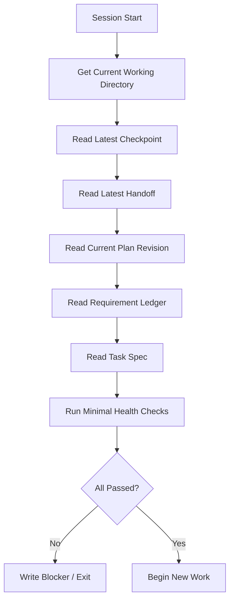

# 10 Worker Session Bootstrap Checklist

## Purpose

- 定义 Worker 每次新 session 启动时必须先做什么，再做什么。
- 把跨 context window 的 session continuity 收敛成可执行的协议化 checklist。
- 防止外部执行器在没完成 “get bearings” 前直接开工。

## Scope

- 本文覆盖外部执行器 session 的 bootstrap 阶段。
- 本文不替代完整执行协议；完整 session 生命周期见 `00-Agent-Session-Protocol.md`。
- Context reset 前后如何恢复见 `../07-reliability/09-Context-Reset-and-Session-Continuity.md`。
- session scaffold artifact set 的定义见 `16-Executor-Session-Scaffold-Profile.md`。

## Definitions

- `Get Bearings`：Worker 在真正开始工作前，对当前状态进行最小而完整的定向确认。
- `Bootstrap Checklist`：每次新 session 启动时必须完成的固定顺序检查表。
- `Session Continuity`：即使上下文被清空或 worker 被替换，仍能基于外部状态恢复工作连续性。
- `Bootstrap Record`：记录本次 session 已读取哪些状态对象、是否通过健康检查的结构化记录。

## Rules

### 总规则

1. Worker 在未完成 bootstrap checklist 前，禁止开始新工作。
2. Worker 不拥有项目真相；它只能从外部状态中恢复定向。
3. Worker 必须先 `get bearings`，再执行 task，不得靠模糊上下文猜测当前状态。
4. 若 checklist 任一步失败，Worker 必须停止执行并上报 blocker，而不是继续试探式工作。

### 必做检查项

每次新 session 启动时必须按顺序完成：

1. 获取当前工作目录
2. 读取最近 `Checkpoint`
3. 读取最近 `Handoff`
4. 读取当前 `PlanRevision`
5. 读取 Requirement Ledger
6. 读取当前 `TaskSpec`
7. 做最小健康检查
8. 只有全部通过后，才能开始新工作

### 最小健康检查规则

最小健康检查至少包括：

- 当前工作目录是否与 `workspace_ref` 匹配
- 仓库 / worktree 是否可访问
- 当前 task 的 allowed paths / forbidden paths 是否可确定
- 必要命令入口是否存在
- 当前 task 引用的 plan revision、checkpoint、ledger 是否可读

### Continuity 规则

- 连续性来自 `Checkpoint`、`PlanRevision`、Requirement Ledger、`TaskSpec`、最近 `Handoff` 和当前 workspace，而不是来自上一轮对话。
- 如果 checkpoint 与 task spec 不一致，必须停止并上报 recovery / re-assignment 风险。
- 如果最新 handoff 已经表明本任务完成或 superseded，新的 worker session 不得继续原路径工作。

## Protocol Steps

1. Worker 启动后，读取 `workspace_ref` 并确认当前工作目录。
2. 读取最近 `Checkpoint`，确认 active directive、plan revision、open tasks、active issues。
3. 读取最近 `Handoff`，确认上一个 run 的未完成项、偏差、风险和 artifact refs。
4. 读取当前 `PlanRevision`，确认当前任务属于哪个 revision，是否已 superseded。
5. 读取 Requirement Ledger，确认本任务覆盖的是哪些 requirement，当前覆盖状态如何。
6. 读取 `TaskSpec`，确认 objective、scope、constraints、allowed paths、validation、done criteria。
7. 执行最小健康检查；若失败则写 issue / blocker 并退出。
8. 仅在上述步骤全部完成后，才进入实际执行阶段。

## State / Schema

```yaml
worker_session_bootstrap_record:
  session_id: worker_session_20260410_01
  run_id: run_codex_004
  workspace_ref: workspaces/run_codex_004
  cwd_checked: true
  latest_checkpoint_id: checkpoint_20260410_03
  latest_handoff_id: handoff_20260410_02
  active_plan_revision_id: plan_rev_12
  requirement_ledger_id: req_ledger_main
  task_id: task_auth_backend_07
  task_spec_checked: true
  health_checks:
    workspace_accessible: true
    repo_state_readable: true
    command_entrypoints_available: true
    allowed_paths_resolved: true
  bootstrap_status: ready_to_execute
```

## Mermaid Diagram

### Worker session bootstrap 流程图



## Anti-patterns

- 刚启动 session 就直接看代码、改文件、跑命令。
- 只看 `TaskSpec`，不看最新 checkpoint 与 handoff。
- 把上次对话残留当成连续性来源。
- 发现 task 已 superseded 仍继续工作。
- 健康检查失败后继续“先试试看”。

## Acceptance Criteria

- 任一 worker session 都能证明自己完成了 get bearings。
- Worker 在开始工作前一定已经读取 checkpoint、handoff、plan revision、requirement ledger、task spec。
- bootstrap checklist 能解释跨 context window 的连续性如何恢复。
- 若状态不一致，Worker 会停下并上报，而不是继续盲做。
