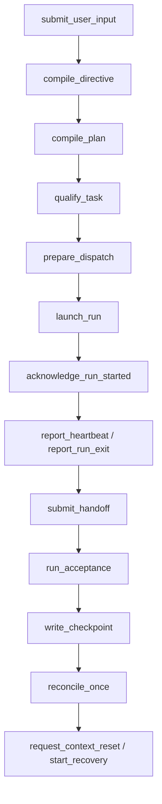

# 11 Control Plane API Contract

## Purpose

- 定义控制平面的最小 command contract。
- 让实现方可以基于文档直接设计接口层，而不再依赖口头补语义。
- 统一 command 的前置条件、副作用、事件输出与幂等语义。

## Scope

- 本文定义 command contract，不绑定 HTTP / gRPC / CLI 传输层。
- 所有 command 的枚举、事件名与标识符需服从 `../03-state-model/06-Canonical-Enums-and-Identifiers.md`。
- 首版 command 读写对象最小集见 `../03-state-model/07-MVP-Object-Package.md`。
- command carrier、ChangeSet 与对象字段的 canonical schema 以 `../08-appendix/11-Schema-Catalog.md` 为准。
- 具体 handler ownership 与 sync / async 执行方式见 `./14-Command-Handler-Blueprint.md`。
- 端到端命令收敛场景见 `../07-reliability/09-End-to-End-Sequence-Scenarios.md`。

## Definitions

- `Command`：由控制平面组件调用的有意图操作。
- `Command Result`：command 的结构化执行结果，不等同于最终业务成功。
- `Idempotent Command`：重复执行不会造成额外状态副作用。

## Rules

### Command Envelope

所有 command 建议共享最小 envelope：

```yaml
command_name: submit_user_input
command_id: cmd_20260410_001
idempotency_key: input:user:20260410:001
issued_at: 2026-04-10T10:00:00Z
issuer_ref: orchestrator/main
correlation_id: corr_project_bootstrap_01
payload: {}
```

### Command Discipline

- command 必须声明 `idempotency_key`。
- command 不得直接越过 authoritative state 修改外部执行器状态。
- command 失败时必须返回明确 failure mode，不得仅返回自由文本。
- command 的 emitted events 必须来自 canonical event registry。

## Command Catalog

### `submit_user_input(...)`

- Purpose
  - 接收用户输入并创建原始 intake 记录。
- Input Schema
  - `source`
  - `content`
  - `conversation_ref`
  - `received_at`
- Preconditions
  - 输入非空
  - source 已注册
- Side Effects
  - 写入 raw input record
  - 生成 intake correlation
- Emitted Events
  - `UserInputReceived`
- Failure Modes
  - 重复输入去重失败
  - 输入无效
- Idempotency
  - 以 `source + content hash + received_at bucket` 去重

### `compile_directive(...)`

- Purpose
  - 将 raw input 结构化为 `Directive` 并触发 impact analysis。
- Input Schema
  - `raw_input_ref`
  - `current_plan_revision_id`
  - `active_phase_id`
  - `open_task_ids`
- Preconditions
  - `UserInputReceived` 已存在
- Side Effects
  - 写 `Directive`
  - 更新 directive status 为 `assessing` 或 `applied`
- Emitted Events
  - `RuntimeDirectiveCreated`
- Failure Modes
  - 输入不可解析
  - 影响范围无法确定
- Idempotency
  - 同一 `raw_input_ref` 只能生成一个 canonical directive

### `compile_plan(...)`

- Purpose
  - 基于 `Directive / Evidence Pack / current plan` 生成新的 `Execution Plan` 或 `plan_revision`。
- Input Schema
  - `directive_id`
  - `evidence_pack_refs`
  - `current_plan_revision_id`
- Preconditions
  - directive status 不为 `archived`
- Side Effects
  - 写 `Plan Revision`
  - 可能写 `Task` drafts
- Emitted Events
  - `PlanCompiled`
  - `PlanRevised`
  - `TaskCreated`
- Failure Modes
  - charter 冲突
  - 规划输入不完整
- Idempotency
  - 相同 `directive_id + plan base revision` 只产生一个有效 revision

### `qualify_task(...)`

- Purpose
  - 验证 Task 是否满足入队与 ready 条件。
- Input Schema
  - `task_id`
  - `plan_revision_id`
  - `phase_id`
- Preconditions
  - task status = `draft`
- Side Effects
  - `Task.draft -> ready` 或写回 planner issue
- Emitted Events
  - `TaskQualified`
  - `TaskBlocked`（若不合格且需显式阻塞）
- Failure Modes
  - 必填字段缺失
  - authority boundary 非法
- Idempotency
  - 对同一 `task_id` 重复调用应产生相同资格结论

### `prepare_dispatch(...)`

- Purpose
  - 为 ready task 生成 dispatch intent、预留锁、创建 `AgentRun(created)`。
- Input Schema
  - `task_id`
  - `executor_profile_ref`
  - `workspace_plan`
  - `lock_request_set`
- Preconditions
  - task status = `ready`
  - 无 blocker
  - dependencies satisfied
- Side Effects
  - `Task.ready -> dispatching`
  - `Lock.requested -> reserved`
  - `AgentRun.status = created`
  - 写 `DispatchIntent`
- Emitted Events
  - `DispatchPrepared`
  - `LockAcquired`
- Failure Modes
  - lock conflict
  - executor capability mismatch
  - duplicate dispatch intent
- Idempotency
  - 同一 `task_id + current plan_revision_id` 同时只允许一个 active dispatch intent

### `launch_run(...)`

- Purpose
  - 通过 adapter 启动外部执行器运行实例。
- Input Schema
  - `dispatch_intent_id`
  - `run_id`
  - `executor_name`
  - `workspace_ref`
- Preconditions
  - `DispatchPrepared` 已 durable
  - lock status = `reserved`
  - run status = `created`
- Side Effects
  - 调用 executor adapter
  - 分配 external side effect token
- Emitted Events
  - 无立即 emitted event；成功后由 `acknowledge_run_started(...)` 处理
- Failure Modes
  - adapter unavailable
  - workspace creation failure
  - launch timeout
- Idempotency
  - 对同一 `dispatch_intent_id` 重复调用必须返回同一 external side effect token 或明确告知已启动

### `acknowledge_run_started(...)`

- Purpose
  - 把 adapter 的启动确认写回 authoritative state。
- Input Schema
  - `run_id`
  - `adapter_run_ref`
  - `started_at`
- Preconditions
  - run status = `created` 或 `starting`
  - 对应 dispatch intent 存在
- Side Effects
  - `AgentRun -> running`
  - `Task.dispatching -> dispatched`
  - `Lock.reserved -> active`
- Emitted Events
  - `AgentRunStarted`
  - `TaskDispatched`
  - `LockAcquired`
- Failure Modes
  - run 不存在
  - duplicate ack
  - dispatch intent 已失效
- Idempotency
  - 同一 `run_id` 的重复 ack 不得重复推进状态

### `report_heartbeat(...)`

- Purpose
  - 记录运行实例存活信号。
- Input Schema
  - `run_id`
  - `reported_at`
  - `source`
- Preconditions
  - run status = `running`
- Side Effects
  - 更新 `last_heartbeat_at`
- Emitted Events
  - `AgentRunHeartbeatReported`
- Failure Modes
  - run 不在 running
  - heartbeat 时间回拨
- Idempotency
  - 相同 `run_id + reported_at` 视为同一 heartbeat

### `report_run_exit(...)`

- Purpose
  - 记录外部执行器运行结束。
- Input Schema
  - `run_id`
  - `exit_status`
  - `exited_at`
  - `log_refs`
- Preconditions
  - run status = `running` 或 `starting`
- Side Effects
  - `AgentRun -> exited` 或 `start_failed`
  - 释放或保持 recovery hold 由后续协议决定
- Emitted Events
  - `AgentRunExited`
  - `AgentRunStartFailed`（若启动阶段失败）
- Failure Modes
  - run 不存在
  - exit status 非 canonical
- Idempotency
  - 同一 `run_id + exited_at` 的重复上报不得生成多次退出事件

### `submit_handoff(...)`

- Purpose
  - 提交结构化 Handoff Package。
- Input Schema
  - `run_id`
  - `task_id`
  - `result_claim`
  - `artifact_refs`
  - `validation_results`
- Preconditions
  - run 已退出或明确中断
- Side Effects
  - 写 `Handoff`
  - `Task.dispatched -> awaiting_acceptance`
- Emitted Events
  - `HandoffSubmitted`
- Failure Modes
  - handoff 必填字段缺失
  - artifact refs 无法解析
- Idempotency
  - 同一 `run_id` 默认只接受一个 canonical final handoff；partial handoff 需显式版本号

### `run_acceptance(...)`

- Purpose
  - 运行 Acceptance Engine，生成验收结果。
- Input Schema
  - `task_id`
  - `handoff_id`
  - `acceptance_policy_ref`
- Preconditions
  - handoff status = `submitted` 或 `ingested`
- Side Effects
  - 写 `Acceptance`
  - 更新 Task next state
  - 可能创建 Issue / followup task
- Emitted Events
  - `AcceptancePassed`
  - `AcceptanceRejected`
  - `AcceptanceNeedsFollowup`
  - `AcceptancePartiallyAccepted`
- Failure Modes
  - evidence 缺失
  - handoff / task 不匹配
- Idempotency
  - 同一 `handoff_id + acceptance_policy_ref` 只能产生一个最终 acceptance result

### `write_checkpoint(...)`

- Purpose
  - 写出恢复快照。
- Input Schema
  - `active_phase_id`
  - `plan_revision_id`
  - `event_log_cursor`
  - `open_object_summary`
- Preconditions
  - authoritative state 已稳定
- Side Effects
  - 写 `Checkpoint`
  - supersede 旧 checkpoint
- Emitted Events
  - `CheckpointWritten`
- Failure Modes
  - event cursor 未知
  - open object summary 不完整
- Idempotency
  - 同一 `event_log_cursor + plan_revision_id` 不得生成重复的有效 checkpoint

### `start_recovery(...)`

- Purpose
  - 在 timeout、stale lock、replay anomaly 等情况下启动 recovery 流。
- Input Schema
  - `recovery_reason`
  - `related_object_refs`
  - `latest_checkpoint_id`
- Preconditions
  - 存在明确 anomaly 或 failure signal
- Side Effects
  - 写 recovery action
  - 可能创建 Issue
  - 可能冻结 lock 或 task 派发
- Emitted Events
  - `RecoveryStarted`
- Failure Modes
  - recovery reason 非 canonical
  - checkpoint 缺失
- Idempotency
  - 同一 anomaly correlation 不得并发启动多个等价 recovery flow

### `reconcile_once(...)`

- Purpose
  - 执行一次完整 Orchestrator control cycle。
- Input Schema
  - `checkpoint_id`
  - `event_cursor`
  - `scheduler_capacity`
- Preconditions
  - authoritative state 可读
- Side Effects
  - 处理事件、验收、恢复、调度、写 checkpoint
- Emitted Events
  - 多事件；最少可能包含 `CheckpointWritten`
- Failure Modes
  - state / event divergence
  - change-set 提交失败
- Idempotency
  - 对同一 `event_cursor window` 重跑必须具备幂等消费语义

### `request_context_reset(...)`

- Purpose
  - 请求结束当前控制上下文并在下轮从外部状态重建。
- Input Schema
  - `reason`
  - `checkpoint_id`
  - `next_event_cursor`
- Preconditions
  - recovery baseline 可写
- Side Effects
  - 写 reset request marker
  - 当前 control cycle 结束
- Emitted Events
  - `ContextResetRequested`
- Failure Modes
  - checkpoint 不可用
  - 未处理高优先级 blocker
- Idempotency
  - 同一 `checkpoint_id + reason` 的重复 request 不得生成多次 reset side effect

## Mermaid Diagram

### Control Plane Command Surface



## Anti-patterns

- command 只有名字，没有前置条件和副作用。
- command 失败只返回“请稍后重试”之类自由文本。
- launch 和状态提交顺序没有约束。
- 把幂等语义留到实现时再猜。

## Acceptance Criteria

- 实现方可据此设计内部 service API、CLI command 或 job handler。
- 每个 command 都有输入、前置条件、副作用、事件输出、失败模式、幂等语义。
- command surface 与 canonical registry 保持一致。
