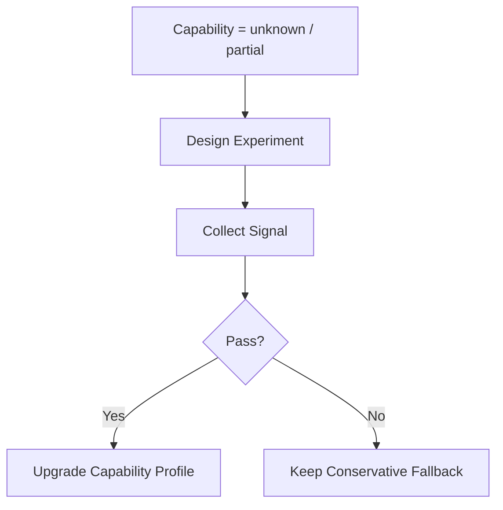

# 12 Executor Validation and Experiment Backlog

## Purpose

- 把仍不能靠纯设计关闭的问题收敛为统一的 experiment backlog。
- 约束哪些 adapter / operator 能力在验证前不得作为 hard dependency。
- 为实现仓提供唯一的真实环境验证清单，避免仓库中散落多个“待 spike”表述。

## Scope

- 本文只定义实验问题、方法、判定标准与架构后果。
- 本文不声称这些能力已经被验证。
- 首适配器选择见 `./13-First-Executor-Profile.md`。
- Codex host-side fallback 基线见 `./17-Codex-First-Adapter-Fallback-Profile.md`。
- 本文覆盖当前设计包中所有 remaining experiments 的 canonical backlog。

## Definitions

- `Experiment Backlog`：在真实 adapter / runtime 环境中执行、用于决定能力是否可升级为 hard dependency 的实验清单。
- `Hard Dependency`：调度层可默认依赖、无需 fallback 的能力。
- `Fallback Baseline`：在实验未通过前，控制平面必须采用的保守路径。

## Rules

### Experiment Discipline

- `unknown` 或 `partial` 能力不得在验证前进入 hard dependency。
- 每项实验都必须有可观测信号。
- 实验结果必须能回写到 capability matrix。
- 本文之外不再保留独立的“待 ADR / spike”实验清单；旧文档如需引用，一律指向本文。
- 实验失败不是设计缺陷；失败的默认处理是保持 fallback，而不是继续抽象扩概念。

### 设计完成边界

当前设计仓在以下意义上视为完成：

- truth hierarchy、compiled artifact durable 形态、compilation transaction boundary、Codex fallback、最小实现切片都已收口；
- 剩余未闭口项只剩真实环境能力验证；
- 下一步应进入实现仓与真实 adapter 实验，而不是继续增加概念层。

## Experiment Items

### 1. Callback Fidelity

- 问题
  - adapter callback 是否可靠、可重复、可去重，且不会系统性丢失关键生命周期信号？
- 为什么重要
  - 影响控制平面是否可以把 callback 作为增强信号使用，以及 callback 与 poll 的统一封装策略。
- 实验方法
  - 在真实 long-running run 上记录完整时间线，刻意制造网络抖动、宿主重启、重复上报与延迟上报，比较 callback 到达序列与 poll 观察序列。
- 可观测信号
  - callback 到达率
  - callback 重复率
  - callback 延迟分布
  - callback 与 poll 的状态一致性
- Pass / Fail 判定
  - Pass：callback 可保留为加速 reconcile 的增强信号。
  - Fail：继续坚持 `poll-first, callback-optional`。
- 架构后果
  - 无论 pass 还是 fail，callback 都不升级为唯一事实源；若 fail，则不得在关键路径依赖 callback。

### 2. Delayed Exit Event Handling

- 问题
  - 迟到的 exit / completion 信号到达时，控制平面能否稳定识别其属于旧 run 历史，而不污染当前 active run？
- 为什么重要
  - 影响 timeout、launch ambiguity、reassign 后的状态收敛与 duplicate dispatch 防护。
- 实验方法
  - 让 run 超时后进入 `rehydrate + reassign`，随后人为触发旧 run 的迟到 exit / handoff / callback，观察状态机与锁状态是否保持正确。
- 可观测信号
  - 旧 run 迟到信号是否被正确归档
  - 当前 active run 是否未被覆盖
  - lock / task 状态是否保持单调正确
- Pass / Fail 判定
  - Pass：可把 delayed exit 作为普通迟到事实处理。
  - Fail：需要更严格的 stale-run correlation gate 和迟到事件隔离逻辑。
- 架构后果
  - 在通过前，迟到 exit 一律只允许更新旧 run 历史，不允许直接推动当前 task 到最终完成。

### 3. Restore Fidelity

- 问题
  - `restore_run(...)` 是否真能恢复同一 run 的执行上下文、workspace 绑定和 lineage，而不是仅仅重新附着到某个会话？
- 为什么重要
  - 影响 `restore_run` 能否从 best-effort probe 升级为可依赖恢复路径。
- 实验方法
  - 构造中断 run，在不同中断点执行 restore，核对 restored session 是否仍绑定原 `task / dispatch_intent / workspace / artifact chain`。
- 可观测信号
  - 恢复后 workspace 一致性
  - run correlation 一致性
  - 日志与 artifact lineage 连续性
- Pass / Fail 判定
  - Pass：可提升 `supports_restore_run`。
  - Fail：继续按 `rehydrate + reassign` 设计。
- 架构后果
  - fail 时 `restore_run` 继续只作为 probe，恢复主路径维持 `rehydrate + reassign`。

### 4. Soft Cancel Fidelity

- 问题
  - `cancel_run(...)` 是否稳定表示“请求有序停止”，且能在可接受时间内收敛到可观测退出或 partial handoff？
- 为什么重要
  - 影响 supersession、manual stop、interrupt pause/cancel 的保守路径是否可以变得更优雅。
- 实验方法
  - 对进行中的读写任务发出 cancel 请求，观测退出延迟、partial handoff 完整度、日志尾部和最终 poll 状态。
- 可观测信号
  - cancel 到 exit 的延迟
  - partial handoff 存在率
  - poll 状态与日志尾部的一致性
- Pass / Fail 判定
  - Pass：可暴露 soft cancel。
  - Fail：停止请求继续只表示“请求已发出”，host-side 必须保留 recovery hold。
- 架构后果
  - fail 时 `soft_cancel` 不升级为 hard dependency。

### 5. Hard Kill Fidelity

- 问题
  - `kill_run(...)` 是否能在高风险场景下足够快地终止运行，并形成可判定的 live/dead 结果？
- 为什么重要
  - 影响越界写入、错误面扩散、superseded run 紧急止损的处理质量。
- 实验方法
  - 对高风险写任务发出 kill，请求后持续做 poll、日志抓取和 workspace 观察，测定停止收敛时间与残余写入风险。
- 可观测信号
  - kill 到停止可判定的延迟
  - kill 后残余写入是否继续发生
  - 日志 / poll / workspace 三者的一致性
- Pass / Fail 判定
  - Pass：可把 hard kill 作为高风险场景的可依赖止损手段。
  - Fail：kill 后仍必须走长一些的 liveness probe + recovery hold。
- 架构后果
  - fail 时不得把 kill 结果直接等价成 run 已死。

### 6. Heartbeat Observability

- 问题
  - host-side 是否能基于 poll、日志时间戳、artifact 更新时间稳定推导 run liveness？
- 为什么重要
  - 影响 lease monitor、timeout 判定与 recovery 触发条件。
- 实验方法
  - 在长时任务、短时任务、空闲任务、卡住任务上记录 poll/log/artifact 三路信号，统计误判率与检测延迟。
- 可观测信号
  - 活跃 run 的误判超时率
  - 真超时 run 的检测延迟
  - 三路信号是否可稳定排序
- Pass / Fail 判定
  - Pass：可固化 host-side heartbeat threshold。
  - Fail：需要更保守 timeout 策略和更长 recovery probe。
- 架构后果
  - 在通过前，heartbeat 继续是 host-side 推导信号，而不是 adapter 内建事实。

### 7. Operator Command Transport Form

- 问题
  - operator 命令应通过什么 transport 进入 single-writer gate，才能与 API 请求、callback 和 runtime jobs 保持同一提交语义？
- 为什么重要
  - 影响手工 stop、manual recovery、manual requeue、context reset request 的一致性与审计性。
- 实验方法
  - 在实现仓原型中分别试验：
    - API 命令入口
    - CLI / admin command 入口
    - runtime inbox / journal 入口
  - 比较幂等键、审计记录、single-writer 排队语义和失败恢复路径。
- 可观测信号
  - operator 命令是否有统一 command envelope
  - 是否能稳定生成 change-set / outbox / audit trail
  - 是否会绕过 single-writer gate
- Pass / Fail 判定
  - Pass：确定一个 canonical operator command transport，其他形式只做 façade。
  - Fail：需要在实现仓继续收紧 operator path，禁止多入口直写。
- 架构后果
  - 在通过前，设计只保留“operator 命令必须经 single-writer gate”这一约束，不预设具体传输形态。

## Mermaid Diagram

### Experiment Dependency Rule

## Anti-patterns

- 在 capability matrix 中把 unknown 写成 yes。
- 没有实验方法就把能力当 roadmap 假设。
- 实验失败后不回写架构后果。
- 在多个文档各写一份“待 spike”清单，导致实现方无法判断 canonical backlog。

## Acceptance Criteria

- remaining experiments 已被统一收口为单一 canonical backlog。
- 每个实验项都明确了问题、为什么重要、实验方法、可观测信号、pass / fail 判定、架构后果。
- 验证完成前，hard dependency 边界明确，且下一步动作清楚指向实现仓实验。
