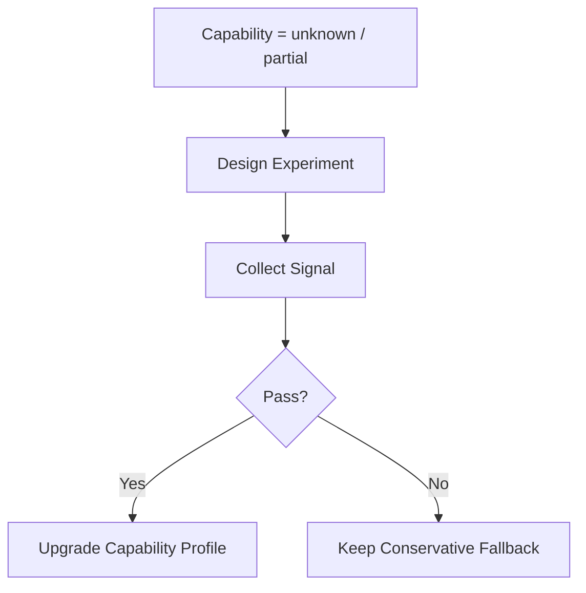

# 12 Executor Validation Plan

## Purpose

- 把执行器未知项转成明确的实验验证计划。
- 约束哪些 executor 能力在验证前不得作为 hard dependency。
- 为 Claude Code / Codex 适配落地提供实验 backlog。

## Scope

- 本文只定义验证问题、方法与判定标准。
- 本文不声称这些能力已经被验证。
- MVP 的首适配器选择见 `./13-First-Executor-Profile.md`。

## Rules

### Validation Discipline

- `unknown` 或 `partial` 能力不得在验证前进入 hard dependency。
- 每项实验都必须有可观测信号。
- 实验结果必须能回写到 capability matrix。

## Validation Items

### 1. Claude Code restore fidelity

- Question
  - Claude Code 是否支持在 Hive 需要的粒度上恢复已有 run，而不只是继续会话上下文？
- Why It Matters
  - 影响 `restore_run(...)` 是否能成为 recovery hard path。
- Expected Signal
  - 同一 run 可被重新附着，且不丢失执行上下文与工作区关联。
- Experiment Method
  - 创建中途停止的 long-running run，尝试通过 adapter 恢复，并对比 restored run 是否仍绑定原 workspace、原 artifact chain。
- Pass / Fail Interpretation
  - Pass：可将 `supports_restore_run` 升级到 documented internal capability。
  - Fail：继续采用 `rehydrate + reassign`。
- Architecture Consequence if Unsupported
  - `restore_run(...)` 只能作为 best-effort，不得作为默认 recovery 路径。

### 2. Claude Code hard kill / soft cancel semantics

- Question
  - Claude Code 是否存在可区分的 soft cancel 与 hard kill run 级语义？
- Why It Matters
  - 影响 supersession、timeout、manual stop 的行为收敛。
- Expected Signal
  - 可以观察到“完成当前步骤再停”和“立即停止”两种不同结果。
- Experiment Method
  - 对运行中的 write task 分别执行 candidate soft cancel 与 forced termination，比较 artifact completeness、logs、exit status。
- Pass / Fail Interpretation
  - Pass：adapter 可暴露两种能力。
  - Fail：统一退化为 hard stop + partial handoff recovery。
- Architecture Consequence if Unsupported
  - `finish_current_step` 只能由策略层模拟，不由 executor 原生提供。

### 3. Claude Code workspace isolation depth

- Question
  - Claude Code 的写权限隔离是否能稳定限制在预期 workspace / path scope 内？
- Why It Matters
  - 影响 path lock 与多 run 并发安全。
- Expected Signal
  - run 无法越过 adapter 赋予的 workspace boundary 写入其他路径。
- Experiment Method
  - 在多 workspace / worktree 场景下做越界写尝试，观察是否被权限或环境阻止。
- Pass / Fail Interpretation
  - Pass：可把 workspace isolation 作为可靠能力。
  - Fail：必须依赖外部 sandbox / worktree。
- Architecture Consequence if Unsupported
  - Hive 不能把 Claude Code 直接放进共享写仓库。

### 4. Codex restore fidelity

- Question
  - Codex 的 session continuity 是否足以支持 Hive 所需的 run-level restore？
- Why It Matters
  - 影响 timeout / context reset 后是否能恢复原 run。
- Expected Signal
  - 重新打开或恢复后仍可定位同一 run、workspace、artifact context。
- Experiment Method
  - 在 app / CLI / cloud task 路径上分别测试中断恢复。
- Pass / Fail Interpretation
  - Pass：可提升 `supports_restore_run`。
  - Fail：继续按 `rehydrate + reassign` 设计。
- Architecture Consequence if Unsupported
  - 恢复流程不得依赖 resume fidelity。

### 5. Codex soft cancel semantics

- Question
  - Codex 是否提供可依赖的 soft cancel 语义？
- Why It Matters
  - 影响 directive supersession 与 graceful stop。
- Expected Signal
  - stop 后存在稳定的 partial handoff 与可区分 exit surface。
- Experiment Method
  - 对进行中的 run 执行 UI / CLI stop，并比较 exit log 与 artifact completeness。
- Pass / Fail Interpretation
  - Pass：可暴露 soft cancel。
  - Fail：统一按 hard stop 处理。
- Architecture Consequence if Unsupported
  - supersession 默认走 partial handoff 回收。

### 6. Codex heartbeat observability

- Question
  - Codex 是否提供足够稳定的内建 heartbeat 或 poll signal？
- Why It Matters
  - 影响 Lease / Heartbeat Monitor 是否可依赖 adapter 原生信号。
- Expected Signal
  - 可定期获取 run activity signal，且时间戳可比较。
- Experiment Method
  - 在长时 run 上持续 poll，记录 activity signal 的稳定性与延迟。
- Pass / Fail Interpretation
  - Pass：可把 heartbeat source 从 unknown 升级。
  - Fail：继续 host-side monitor。
- Architecture Consequence if Unsupported
  - `AgentRunHeartbeatReported` 只能来自 host / adapter wrapper。

### 7. Tool introspection granularity

- Question
  - 两类执行器是否都能稳定暴露运行前工具集与权限限制？
- Why It Matters
  - 影响 capability-based scheduling 与 command preflight。
- Expected Signal
  - adapter 能在 launch 前读取或构造明确 tool availability set。
- Experiment Method
  - 比较不同权限模式、MCP、network 配置下的可用工具集合。
- Pass / Fail Interpretation
  - Pass：Scheduler 可做更细粒度 capability match。
  - Fail：工具能力只能按 coarse profile 匹配。
- Architecture Consequence if Unsupported
  - 调度层不得把某个细粒度工具当 hard precondition。

### 8. Artifact / log collection normalization

- Question
  - 两类执行器能否稳定提取 logs、artifacts、screenshots、test outputs 并归一到 Hive artifact model？
- Why It Matters
  - 影响 Acceptance Engine 与 Recovery Coordinator 的输入稳定性。
- Expected Signal
  - 相同任务在不同执行器下都能生成统一的 `artifact_refs` 与 `log_refs`。
- Experiment Method
  - 对同一任务分别在 Claude Code / Codex 执行，比较 adapter 输出的 artifact package。
- Pass / Fail Interpretation
  - Pass：可统一 acceptance input set。
  - Fail：Acceptance Engine 需保留 executor-specific parsing layer。
- Architecture Consequence if Unsupported
  - schema catalog 需要允许 executor-specific metadata。

## Mermaid Diagram

### Validation Dependency Rule

## Anti-patterns

- 在 capability matrix 中把 unknown 写成 yes。
- 没有实验方法就把能力当 roadmap 假设。
- 实验失败后不回写架构后果。

## Acceptance Criteria

- 每个未知项都被转成了可执行验证问题。
- 每个验证项都明确了 pass / fail interpretation 与 architecture consequence。
- 验证完成前，hard dependency 边界明确。
